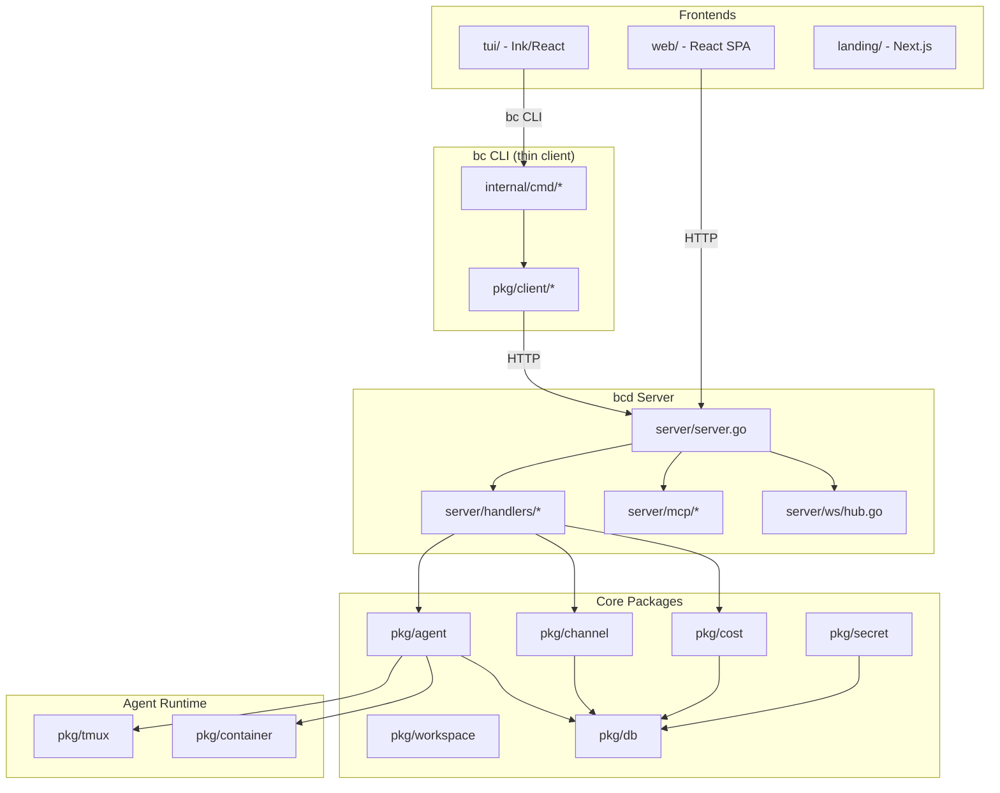

# Infrastructure & Open-Source Readiness Review

**Date:** 2026-03-21
**Repo:** gh-curious-otter/bc (fork of rpuneet/bc)
**Languages:** Go (~31K LOC), TypeScript/React (TUI + Web UI + Landing), Dockerfiles
**Open-Source Readiness Score:** 6/10

## Executive Summary

bc is a well-architected CLI-first AI agent orchestration system with solid foundations: clean Go package layout, comprehensive Makefile, CI pipeline with lint/test/build, structured logging via slog, strong crypto primitives (AES-256-GCM, PBKDF2-600k), and good test coverage (215 test files, 66.6% threshold). However, critical gaps block open-source release: **no LICENSE file**, hardcoded secrets in Docker images, no HTTP request body limits or rate limiting, Go version inconsistency across 6 configs, zero tests for key packages (client, container), and missing community files (CODE_OF_CONDUCT, issue templates).

## Critical Issues

| # | Issue | File/Location | Severity | Recommended Fix | GitHub Issue |
|---|-------|--------------|----------|-----------------|-------------|
| 1 | No LICENSE file | repo root | Critical | Add MIT LICENSE file (referenced in README + goreleaser) | #2055 |
| 2 | Hardcoded POSTGRES_PASSWORD | `docker/Dockerfile.bcdb:7` | Critical | Use runtime env var, add .env.example | #2051 |
| 3 | No secret scanning in CI | `.github/workflows/ci.yml` | Critical | Add gitleaks GitHub Action | #2056 |
| 4 | No HTTP request body size limits | `server/handlers/*.go` | High | Add `http.MaxBytesReader` middleware | #2052 |
| 5 | Go version inconsistency | 6 files | High | Standardize on Go 1.25.1 everywhere | #2057 |

## Major Improvements

| # | Issue | File/Location | Severity | Recommended Fix | GitHub Issue |
|---|-------|--------------|----------|-----------------|-------------|
| 6 | pkg/client has 0% test coverage | `pkg/client/` (9 files) | High | Add httptest-based unit tests | #2064 |
| 7 | pkg/container has 0% test coverage | `pkg/container/` (2 files) | High | Add unit tests for config/naming | #2065 |
| 8 | Docker base images unpinned | All Dockerfiles | High | Pin to specific version tags | #2066 |
| 9 | bcd container runs as root | `docker/Dockerfile.bcd` | High | Add USER directive | #2067 |
| 10 | 5 SQLite stores bypass pkg/db | channel, cron, tool, cost, queue | High | Migrate to db.Open() | #2076 |
| 11 | No rate limiting on API | `server/server.go` | Medium | Add token bucket middleware | #2053 |
| 12 | CORS wildcard on exposed server | `server/handlers/helpers.go:47` | Medium | Configurable origin allowlist | #2054 |
| 13 | No dependency audit in CI | `.github/workflows/ci.yml` | High | Add govulncheck step | #2058 |

## Minor Improvements & Polish

| # | Issue | File/Location | Severity | Recommended Fix | GitHub Issue |
|---|-------|--------------|----------|-----------------|-------------|
| 14 | No CODE_OF_CONDUCT.md | repo root | Medium | Add Contributor Covenant | #2068 |
| 15 | No GitHub issue/PR templates | `.github/` | Medium | Add bug_report, feature_request, PR template | #2069 |
| 16 | No .editorconfig | repo root | Low | Add with Go tab/TS 2-space settings | #2070 |
| 17 | No .env.example | repo root | Low | Document required env vars | #2055 |
| 18 | No HEALTHCHECK in Dockerfiles | `docker/Dockerfile.bcd` | Medium | Add curl-based health check | #2071 |
| 19 | No docker-compose.yml | repo root | Medium | Add for local dev stack | #2072 |
| 20 | Text-only logging (no JSON option) | `pkg/log/log.go` | Medium | Add --log-format flag | #2073 |
| 21 | No request logging middleware | `server/server.go` | Medium | Add latency/status logging | #2074 |
| 22 | No CI caching | `.github/workflows/ci.yml` | Low | Enable Go module + Bun cache | #2059 |

## What's Already Good

- **Clean package architecture**: `cmd/` → `internal/cmd/` → `pkg/` separation is textbook Go layout
- **Comprehensive Makefile**: 30+ targets covering build, test, lint, Docker, TUI, web, landing
- **Strong CI pipeline**: lint + test + coverage threshold + benchmark + TUI build/test + PR quality checks
- **Solid crypto**: AES-256-GCM encryption, PBKDF2 with 600k iterations (OWASP 2023), proper nonce handling
- **Agent name validation**: `IsValidAgentName()` prevents injection via agent names in file paths and shell commands
- **SQLite best practices in pkg/db**: WAL mode, foreign keys, busy timeout, connection pooling, mmap
- **GoReleaser config**: Multi-platform builds, Homebrew tap, signed checksums
- **Structured logging**: Uses `log/slog` throughout (not raw `fmt.Printf`)
- **Error handling discipline**: errcheck linter enabled, explicit error handling everywhere
- **Good test coverage**: 215 test files, table-driven patterns, integration test helpers
- **Security-conscious defaults**: bcd binds to 127.0.0.1 by default, secret values masked in doctor output
- **SECURITY.md**: Clear vulnerability reporting process with SLA timelines

## Action Plan

### Phase 1: Security & Secrets (Day 1)
1. Add LICENSE file (MIT) — **release blocker**
2. Remove hardcoded POSTGRES_PASSWORD from Dockerfile.bcdb
3. Add http.MaxBytesReader to all API handlers
4. Create .env.example

### Phase 2: CI/CD & Testing (Week 1)
1. Add gitleaks secret scanning to CI
2. Fix Go version across all workflows and Dockerfiles
3. Add govulncheck dependency audit
4. Add tests for pkg/client and pkg/container
5. Enable CI caching

### Phase 3: Documentation & DX (Week 2)
1. Add CODE_OF_CONDUCT.md
2. Add GitHub issue/PR templates
3. Add .editorconfig
4. Add docker-compose.yml for local dev
5. Update README Go version badge

### Phase 4: Observability (Week 3)
1. Add JSON logging option
2. Add request logging middleware
3. Add HEALTHCHECK to Dockerfiles
4. Add rate limiting middleware

### Phase 5: Code Quality (Week 4)
1. Migrate SQLite stores to pkg/db
2. Address existing issues #2026, #2029, #2031
3. Restrict CORS configuration

## Missing Files to Create

| File | Purpose |
|------|---------|
| `LICENSE` | MIT license (referenced but missing) |
| `CODE_OF_CONDUCT.md` | Contributor Covenant |
| `.editorconfig` | Consistent editor settings |
| `.env.example` | Document required environment variables |
| `docker-compose.yml` | Local development stack |
| `.github/ISSUE_TEMPLATE/bug_report.md` | Bug report template |
| `.github/ISSUE_TEMPLATE/feature_request.md` | Feature request template |
| `.github/ISSUE_TEMPLATE/config.yml` | Issue template config |
| `.github/pull_request_template.md` | PR template |

## Suggested CI Pipeline

```
┌─────────────┐     ┌──────────┐     ┌───────────┐     ┌──────────┐
│ Secret Scan │     │   Lint   │     │   Test    │     │   Audit  │
│ (gitleaks)  │     │(golangci)│     │(go test)  │     │(govuln)  │
└──────┬──────┘     └────┬─────┘     └─────┬─────┘     └────┬─────┘
       │                 │                  │                 │
       └────────────┬────┴──────────────────┴─────────────────┘
                    ▼
              ┌──────────┐
              │  Build   │
              │ (go build│
              │  + TUI)  │
              └────┬─────┘
                   │
         ┌─────────┴─────────┐
         ▼                   ▼
   ┌──────────┐       ┌──────────┐
   │  Docker  │       │ Release  │
   │  Build   │       │(goreleaser│
   │  + Scan  │       │  on tag) │
   └──────────┘       └──────────┘
```

## Architecture Diagram



## GitHub Issues Created

### Epics
| # | Epic | Priority |
|---|------|----------|
| #2044 | 🔒 Security & Secrets Hardening | Critical |
| #2045 | ⚙️ CI/CD Pipeline Hardening | Critical |
| #2046 | 🧪 Test Coverage & Quality | High |
| #2047 | 📖 Documentation & Developer Experience | High |
| #2048 | 📡 Observability & Operational Readiness | Medium |
| #2049 | 🏗️ Infrastructure & Deployment | High |
| #2050 | 🧹 Code Quality & Standards | Medium |

### Individual Issues — Security (#2044)
| # | Issue | Size | Priority |
|---|-------|------|----------|
| #2051 | Remove hardcoded POSTGRES_PASSWORD in Dockerfile.bcdb | S | Critical |
| #2052 | Add HTTP request body size limits to all API endpoints | M | High |
| #2056 | Add rate limiting to bcd API endpoints | M | Medium |
| #2058 | Restrict CORS when bcd is exposed beyond loopback | S | Medium |
| #2059 | Add .env.example with placeholder values | S | Low |
| #2076 | Add authentication middleware to bcd HTTP API | L | High |
| #2077 | Add request body size limits to all POST/PUT handlers | S | High |
| #2079 | Enforce RBAC permissions at API handler layer | M | High |
| #2088 | Remove --dangerously-skip-permissions from default config | S | High |

### Individual Issues — CI/CD (#2045)
| # | Issue | Size | Priority |
|---|-------|------|----------|
| #2053 | Add secret scanning to CI pipeline (gitleaks) | M | Critical |
| #2054 | Fix Go version inconsistency across CI workflows | S | High |
| #2055 | Add dependency audit step to CI | M | High |
| #2057 | Add Go module and Bun caching to CI | S | Low |

### Individual Issues — Testing (#2046)
| # | Issue | Size | Priority |
|---|-------|------|----------|
| #2060 | Add unit tests for pkg/client (0% coverage) | L | High |
| #2061 | Add unit tests for pkg/container (0% coverage) | M | High |

### Individual Issues — Documentation & DX (#2047)
| # | Issue | Size | Priority |
|---|-------|------|----------|
| #2062 | Add LICENSE file (MIT) | S | Critical |
| #2063 | Add CODE_OF_CONDUCT.md | S | Medium |
| #2067 | Add GitHub issue templates and PR template | S | Medium |
| #2069 | Add .editorconfig for consistent formatting | S | Low |

### Individual Issues — Observability (#2048)
| # | Issue | Size | Priority |
|---|-------|------|----------|
| #2078 | Add HEALTHCHECK to production Dockerfiles | S | Medium |
| #2082 | Add JSON structured logging option | M | Medium |
| #2086 | Add request logging middleware to bcd | S | Medium |
| #2087 | Make health check verify downstream dependencies | S | Medium |

### Individual Issues — Infrastructure (#2049)
| # | Issue | Size | Priority |
|---|-------|------|----------|
| #2074 | Pin Docker base images to specific versions | M | High |
| #2075 | Run bcd Docker container as non-root | S | High |
| #2081 | Add docker-compose.yml for local development | M | Medium |

### Individual Issues — Code Quality (#2050)
| # | Issue | Size | Priority |
|---|-------|------|----------|
| #2080 | Fix unbounded event log Read() — add LIMIT clause | S | High |
| #2083 | Add panic recovery middleware to prevent daemon crashes | S | High |
| #2084 | Add pagination to all list API endpoints | M | Medium |
| #2085 | Add request ID middleware for log correlation | S | Medium |
| #2089 | Consolidate SQLite stores to use pkg/db | M | High |

### Master Tracking Issue
**#2099 — 🚀 Open-Source Release Checklist**

---
*Generated by infrastructure review on 2026-03-21*
