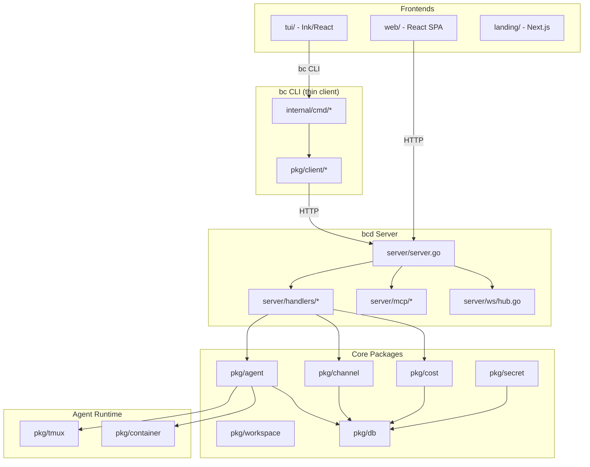

# Infrastructure & Open-Source Readiness Review

**Date:** 2026-03-21 (revised)
**Repo:** gh-curious-otter/bc
**Languages:** Go (~31K LOC), TypeScript/React (TUI + Web UI + Landing), Dockerfiles
**Issues reviewed:** 1,061 (128 open, 933 closed) | **PRs reviewed:** 23 infra-touching

## Executive Summary

bc is a well-architected CLI-first AI agent orchestration system with solid foundations: clean Go package layout, comprehensive Makefile, CI pipeline with lint/test/build, structured logging via slog, strong crypto primitives (AES-256-GCM, PBKDF2-600k), and good test coverage (215 test files, 60% threshold). The project went through a major server-first architecture pivot in mid-March (bcd daemon + web UI). It is pre-release, local-only by design, and built partly by its own AI agents.

**What works well:** 0 golangci-lint issues, fast CI (~90s for PRs), GoReleaser for releases, 11 Docker images, Cloudflare Pages for landing, GitHub Pages for docs.

**What's broken:** `scripts/install.sh` will 404, GoReleaser race condition deletes macOS assets, Windows build uses nonexistent `nosqlite` tag, Docker base image has wrong Go version, orphaned conflicting SQL schema.

## Issue Tracking Status

| Issue | Title | Status |
|-------|-------|--------|
| #2051 | Hardcoded POSTGRES_PASSWORD | NOT FIXED |
| #2052 | HTTP body size limits | NOT FIXED |
| #2053 | Secret scanning (gitleaks) | PARTIALLY -- added but non-blocking |
| #2054 | Go version inconsistency | PARTIALLY -- CI fixed, Dockerfile.base still 1.24.1 |
| #2055 | Dependency audit (govulncheck) | PARTIALLY -- added but non-blocking |
| #2056 | Rate limiting | NOT FIXED |
| #2057 | CI caching | CLOSED -- Go cache done |
| #2058 | CORS restriction | NOT FIXED |
| #2059 | .env.example | NOT FIXED |
| #2062 | LICENSE file | CLOSED (not_planned) -- licensing TBD |
| #2089 | SQLite stores bypass pkg/db | NOT FIXED -- 5 stores still direct |
| #2102 | Go stdlib vulns | NOT FIXED -- still on 1.25.1, need 1.25.8 |
| #2103 | Duplicate release job | CLOSED -- fixed in PR #2163 |
| #2104 | Cost store context.Background() | NOT FIXED -- 23 instances |

## Critical Issues

| # | Issue | File/Location | Severity | GitHub Issue |
|---|-------|--------------|----------|-------------|
| 1 | `scripts/install.sh` will 404 -- URL pattern doesn't match release archives | `scripts/install.sh:92` | BUG | NEW |
| 2 | GoReleaser `mode: replace` races with macOS job -- can delete assets | `.goreleaser.yml:113` | BUG | NEW |
| 3 | Windows `nosqlite` build tag doesn't exist in code | `.goreleaser.yml:55` | BUG | NEW |
| 4 | Hardcoded POSTGRES_PASSWORD | `docker/Dockerfile.bcdb:7` | Critical | #2051 |
| 5 | Docker base image Go 1.24.1, needs 1.25.1+ | `docker/Dockerfile.base:7` | Critical | #2054 |
| 6 | Orphaned `01-init.sql` conflicts with `init.sql` | `docker/bcdb/01-init.sql` | High | NEW |
| 7 | No HTTP request body size limits | `server/handlers/*.go` | High | #2052 |
| 8 | 7 Go stdlib CVEs (crypto/tls, net/url, os, x509) | `go.mod` | High | #2102 |

## Major Improvements

| # | Issue | File/Location | Severity | GitHub Issue |
|---|-------|--------------|----------|-----------------|
| 9 | `bcd` server never built in CI | `.github/workflows/ci.yml` | High | NEW |
| 10 | Web UI completely absent from CI | `web/` | High | NEW |
| 11 | `go generate` drift undetected in CI | `config/` | High | NEW |
| 12 | pkg/client has 0% test coverage | `pkg/client/` (9 files) | High | #2060 |
| 13 | pkg/container has 0% test coverage | `pkg/container/` (2 files) | High | #2061 |
| 14 | Docker base images unpinned (`oven/bun:latest` in 6 files) | `docker/Dockerfile.*` | High | #2074 |
| 15 | `.dockerignore` missing `.git/` -- bloated build context | `.dockerignore` | High | NEW |
| 16 | 5 SQLite stores bypass pkg/db with weaker settings | channel, cron, tool, cost, queue | High | #2089 |
| 17 | No rate limiting on API | `server/server.go` | Medium | #2056 |
| 18 | CORS wildcard on exposed server | `server/handlers/helpers.go:47` | Medium | #2058 |
| 19 | No dependency audit in CI | `.github/workflows/ci.yml` | High | #2055 |

## Minor Improvements

| # | Issue | File/Location | Severity | GitHub Issue |
|---|-------|--------------|----------|-------------|
| 20 | No HEALTHCHECK in any Dockerfile | `docker/Dockerfile.bcd` | Medium | #2078 |
| 21 | No docker-compose.yml | repo root | Medium | #2081 |
| 22 | Text-only logging (no JSON option) | `pkg/log/log.go` | Medium | #2082 |
| 23 | No request logging middleware | `server/server.go` | Medium | #2086 |
| 24 | No concurrency controls on CI | `.github/workflows/ci.yml` | Medium | NEW |
| 25 | No job timeouts in CI (default 6hr) | `.github/workflows/ci.yml` | Medium | NEW |
| 26 | Stale `scripts/homebrew/bc.rb` conflicts with goreleaser | `scripts/homebrew/bc.rb` | Low | NEW |
| 27 | Deprecated `Dockerfile.agent` still at root | `Dockerfile.agent` | Low | NEW |

## What's Already Good

- **Clean package architecture**: `cmd/` -> `internal/cmd/` -> `pkg/` separation is textbook Go layout
- **Comprehensive Makefile**: 30+ targets with self-documenting help
- **Fast CI pipeline**: lint + fast test + TUI + build in ~90s for PRs, full suite on main
- **Solid crypto**: AES-256-GCM encryption, PBKDF2 with 600k iterations, proper nonce handling
- **Agent name validation**: `IsValidAgentName()` prevents injection via agent names
- **SQLite best practices in pkg/db**: WAL mode, foreign keys, busy timeout, connection pooling, mmap
- **GoReleaser config**: Multi-platform builds, Homebrew tap, signed checksums
- **Structured logging**: Uses `log/slog` throughout (not raw `fmt.Printf`)
- **Error handling discipline**: errcheck linter enabled, 0 violations
- **215 test files** with table-driven patterns and integration test helpers
- **Security-conscious defaults**: bcd binds to 127.0.0.1, secret values masked in output
- **SECURITY.md**: Clear vulnerability reporting process with SLA timelines

## Action Plan

### Immediate (bugs that break things)
1. Fix `scripts/install.sh` URL pattern to match release archives
2. Fix GoReleaser `mode: replace` to `mode: append`
3. Remove Windows goreleaser build (nosqlite tag doesn't exist)
4. Update `Dockerfile.base` Go from 1.24.1 to 1.25.1
5. Delete orphaned `docker/bcdb/01-init.sql`

### Week 1 (CI/build gaps)
6. Add `bcd` build verification to CI
7. Add web UI build + lint to CI
8. Add `go generate` drift check
9. Add concurrency groups and job timeouts
10. Add `.git/` to `.dockerignore`

### Week 2 (security hardening)
11. Remove hardcoded POSTGRES_PASSWORD from Dockerfile.bcdb
12. Add `http.MaxBytesReader` to all API handlers
13. Upgrade Go to 1.25.8 (7 stdlib CVEs)
14. Add HEALTHCHECK to bcd and bcdb Dockerfiles
15. Remove `--dangerously-skip-permissions` from default config

### Week 3 (code quality)
16. Migrate 5 SQLite stores to pkg/db
17. Add context.Context to pkg/cost methods
18. Delete stale `scripts/homebrew/bc.rb` and deprecated `Dockerfile.agent`
19. Add `dependabot.yml`
20. Create docker-compose.yml for local dev

## Suggested CI Pipeline

```
┌─────────────┐     ┌──────────┐     ┌───────────┐     ┌──────────┐
│ Secret Scan │     │   Lint   │     │   Test    │     │   Audit  │
│ (gitleaks)  │     │(golangci)│     │(go test)  │     │(govuln)  │
└──────┬──────┘     └────┬─────┘     └─────┬─────┘     └────┬─────┘
       │                 │                  │                 │
       └────────────┬────┴──────────────────┴─────────────────┘
                    ▼
              ┌──────────┐
              │  Build   │
              │ (go build│
              │  + TUI)  │
              └────┬─────┘
                   │
         ┌─────────┴─────────┐
         ▼                   ▼
   ┌──────────┐       ┌──────────┐
   │  Docker  │       │ Release  │
   │  Build   │       │(goreleaser│
   │  + Scan  │       │  on tag) │
   └──────────┘       └──────────┘
```

## Architecture Diagram



## GitHub Issues Created

### Epics
| # | Epic | Priority |
|---|------|----------|
| #2044 | Security & Secrets Hardening | Critical |
| #2045 | CI/CD Pipeline Hardening | Critical |
| #2046 | Test Coverage & Quality | High |
| #2047 | Documentation & Developer Experience | High |
| #2048 | Observability & Operational Readiness | Medium |
| #2049 | Infrastructure & Deployment | High |
| #2050 | Code Quality & Standards | Medium |

### Master Tracking Issue
**#2099 -- Open-Source Release Checklist**

## Recurring Patterns (from 1,061 issues + 23 PRs)

1. **Go version drift** -- CI version fell behind go.mod 3 times. No automation.
2. **Coverage threshold instability** -- changed 3 times (80% -> 66.6% -> 60%). Root cause: E2E tests can't run in CI.
3. **Docker agent reliability** -- 4+ iterative fix PRs. Container lifecycle is complex.
4. **Lint accumulation** -- multiple cleanup waves (ESLint 2831->0, golangci-lint 115->0). Lint debt accumulates during fast feature sprints.
5. **Architecture pivots** -- major server-first pivot in March. Expect more infra churn as bcd stabilizes.

---
*Generated from automated audit of 1,061 issues, 23 infra PRs, 5 CI workflows, 11 Dockerfiles, and full build system on 2026-03-21.*
