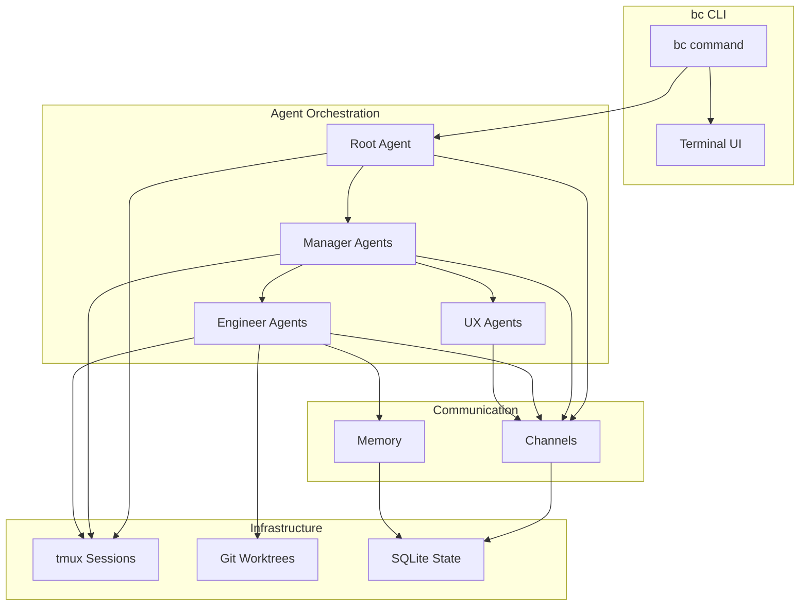
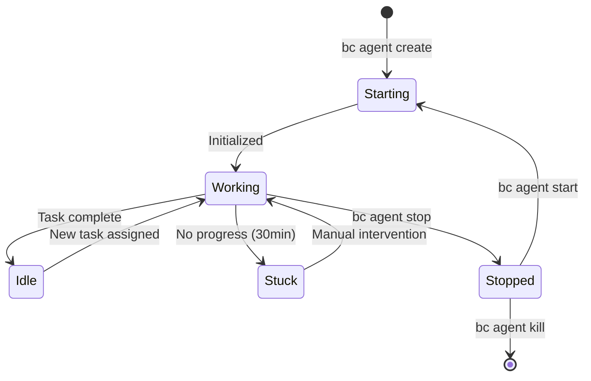
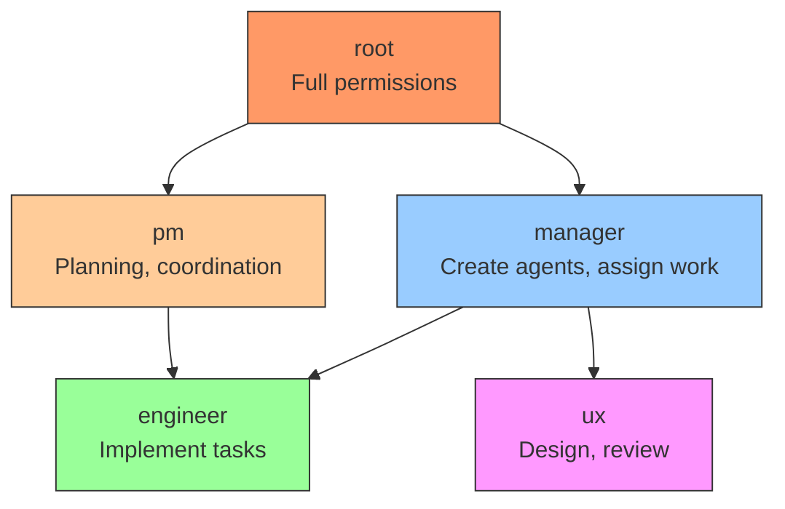
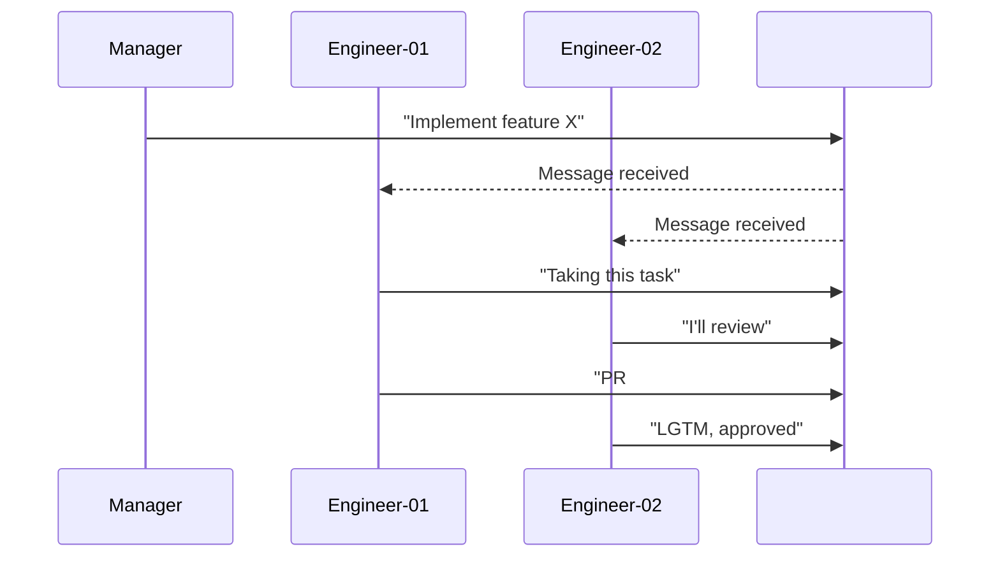
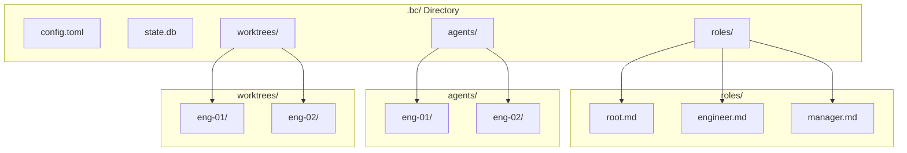
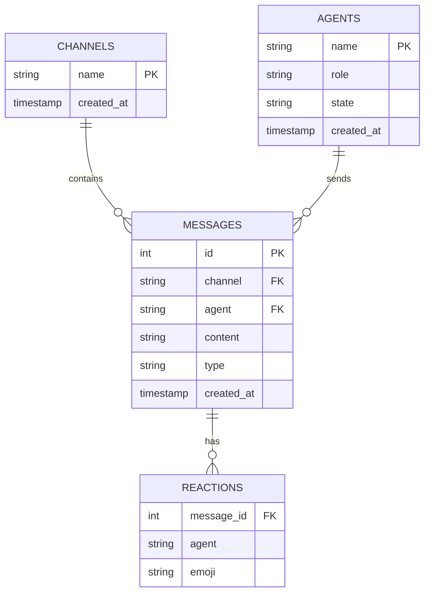
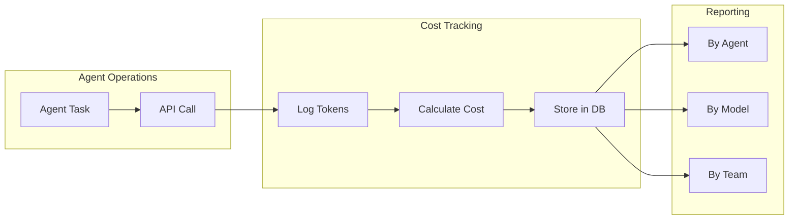
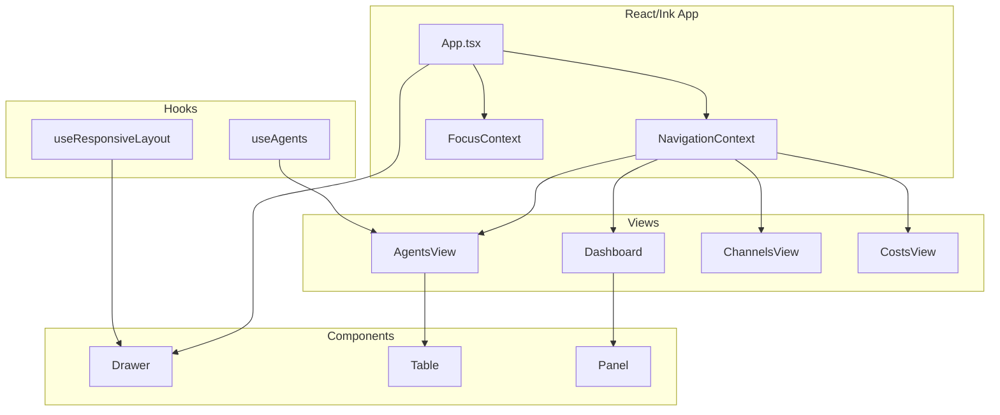

# bc Architecture

This document describes the core architecture of bc, the multi-agent orchestration CLI.

## Overview

bc enables coordinated AI agent teams with role-based hierarchy, channel communication, and isolated workspaces.

## Core Components

### 1. Agent Lifecycle

### 2. Role Hierarchy

### 3. Channel Communication

### 4. Workspace Structure

## Data Flow

### Message Storage (SQLite)

### Cost Tracking

## TUI Architecture

## See Also

- [CONTRIBUTING.md](../../CONTRIBUTING.md) - How to contribute
- [CLAUDE.md](../../.claude/CLAUDE.md) - Development guide
- [VISION.md](../../VISION.md) - Project vision
