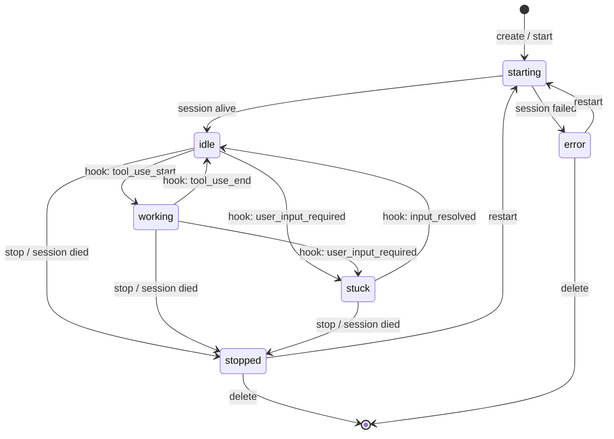
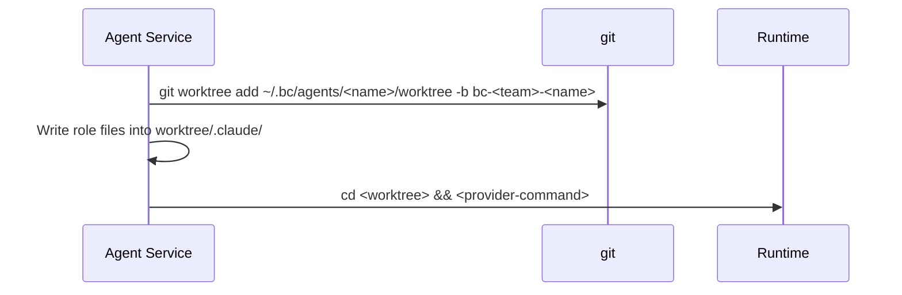
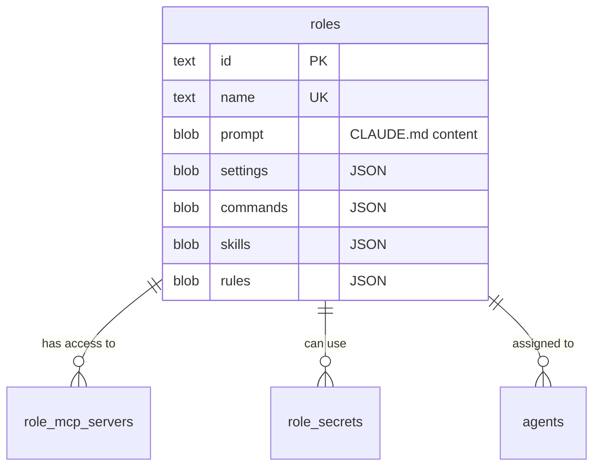

# Agent Architecture

## What is an Agent?

An AI coding assistant running in an isolated tmux session or Docker container with its own git worktree. Each agent has a role (defining its prompt and tool access), a workspace (git repo), and optionally belongs to teams.

## State Machine



| State | Meaning |
|-------|---------|
| starting | Session being created, provider launching |
| idle | Running, waiting for input |
| working | Actively using a tool (edit, search, bash) |
| stuck | Waiting for user input (permission prompt, question) |
| stopped | Session terminated |
| error | Failed to start or unrecoverable |

## Runtime Backends

### Tmux

Local tmux sessions. Named with random suffix to avoid collisions on restart:

```
bc-<random6>-<team>-<agent>
Example: bc-a3f2c1-backend-eng-01
```

| Operation | Implementation |
|-----------|---------------|
| Create | `tmux new-session -d -s <name> -x 200 -y 50` |
| Send | `tmux send-keys -l -- <text>` (literal, safe) |
| Read | `tmux capture-pane -p -t <name> -S -<lines>` |
| Log | `tmux pipe-pane -t <name> 'cat >> <logfile>'` |
| Stop | `tmux kill-session -t <name>` |

Messages >500 chars use `load-buffer` + `paste-buffer`.

### Docker

Isolated containers with tmux inside. Same naming:

```
bc-<random6>-<team>-<agent>
```

| Setting | Default |
|---------|---------|
| Image | `bc-agent-<tool>:latest` |
| CPUs | 2.0 |
| Memory | 2048 MB |
| Network | bridge |
| Volumes | workspace (rw), auth dir -> `/home/agent/.claude/` |

Communication: `docker exec ... tmux send-keys`.

## Worktree Management

bc creates and manages git worktrees for ALL providers uniformly. No provider uses its own worktree flag (avoids nesting).

### Flow



### Lifecycle

| Event | Worktree Action |
|-------|-----------------|
| Create | `git worktree add` from workspace repo |
| Restart | `cd <existing-worktree> && <command>` (persists) |
| Stop | Nothing — worktree stays |
| Delete | `git worktree remove --force` + `git branch -D` |

### Provider Commands

All started with `cd <worktree> && <command>`:

| Provider | Command |
|----------|---------|
| Claude | `claude` (no `-w` — bc owns worktree) |
| Gemini | `gemini` |
| Cursor | `cursor-agent --force --print` |
| Aider | `aider --yes` |
| Codex | `codex --full-auto` |

### Session Resume

On stop, bc captures Claude's UUID from output (`claude --resume <uuid>` pattern). On restart:

```
cd <worktree> && claude --resume <uuid>
```

Validation: `len == 36 && sessionID[8] == '-'`.

## Roles

Stored in `roles` table (SQLite). No markdown files on disk.



### Role Setup on Agent Create

1. Read role from DB
2. Write CLAUDE.md from `roles.prompt` -> auth dir
3. Write settings.json from `roles.settings` -> auth dir
4. Write .mcp.json from `role_mcp_servers` -> auth dir
5. Write command/skill/rule files from BLOBs -> worktree `.claude/`
6. Resolve `${secret:NAME}` in MCP env vars

### CRUD via API

| Method | Path | Action |
|--------|------|--------|
| POST | `/api/roles` | Create |
| GET | `/api/roles` | List |
| GET | `/api/roles/{id}` | Get with full prompt/settings |
| PUT | `/api/roles/{id}` | Update |
| DELETE | `/api/roles/{id}` | Delete (agents keep config) |

## Channel Auto-Enrollment

On creation with a team, agent joins:
1. `#all` (broadcast)
2. `#general`
3. Team-specific channels

## Message Delivery

Via `tmux send-keys` — the only mechanism to inject into a running Claude session.

Format: `[#channel @sender] message content`

On failure: logged, queued for retry. Agent receives missed messages via channel history on reconnect.
