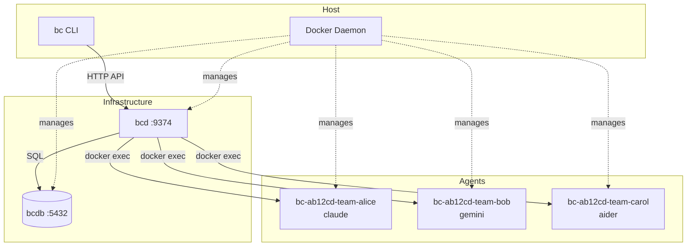
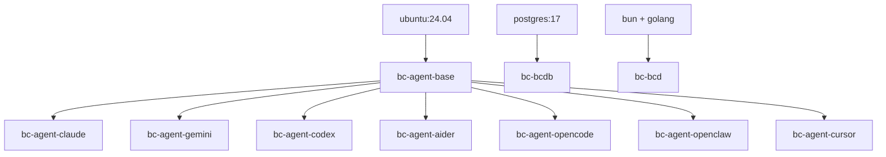
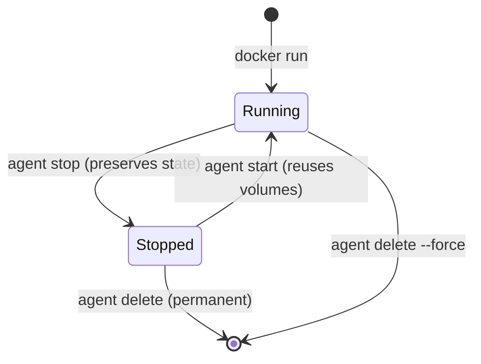

# Deployment Architecture

This document is the source of truth for how bc's infrastructure is deployed. It covers the full stack: the coordination daemon (bcd), the database (bcdb), agent containers, networking, volumes, and resource management.

## System Overview

bc deploys as three tiers of containers coordinated by the host's Docker daemon:

1. **bcd** -- coordination daemon serving the HTTP API and web UI
2. **bcdb** -- database for workspace state
3. **Agent containers** -- one per agent, each running a provider CLI inside tmux



## Docker Image Hierarchy

All agent images share a common base. Provider-specific images add only the CLI tool.



### Base Image (`docker/Dockerfile.base`)

| Component | Purpose |
|-----------|---------|
| Go 1.25.1 | Build tools, Go-based providers |
| Bun | JS runtime, TUI, Node compat |
| tmux | Session management inside containers |
| git, gh | Version control, GitHub CLI |
| gcc, libc6-dev | CGO (SQLite) |
| sqlite3, jq, curl | Utilities |

Runs as non-root user `agent` with `WORKDIR /workspace`.

### Container Naming

```
bc-<session-id-last6>-<team>-<agent>
```

Examples: `bc-a1b2c3-backend-alice`, `bc-a1b2c3-infra-bcdb`

### Container Lifecycle



## Volume Mounts

```mermaid
graph LR
    subgraph Host
        WS[workspace repo]
        AUTH[~/.bc/agents/alice/auth]
        SOCK[/var/run/docker.sock]
        PGDATA[bcdb-data volume]
    end

    subgraph Agent
        AWSP[/workspace]
        AAUTH[/home/agent/.claude]
    end

    subgraph bcd
        BWSP[/workspace]
        BSOCK[/var/run/docker.sock]
    end

    subgraph bcdb
        BPG[/var/lib/postgresql/data]
    end

    WS --> AWSP
    AUTH --> AAUTH
    WS --> BWSP
    SOCK --> BSOCK
    PGDATA --> BPG
```

| Mount | Purpose |
|-------|---------|
| Workspace repo -> `/workspace` | Agent's git worktree |
| `~/.bc/agents/<name>/auth` -> `/home/agent/.claude` | Persistent provider state |
| Docker socket -> bcd | Container management |
| Named volume -> bcdb | Database persistence |

## Network Topology

Default: **host networking** -- all containers share the host network namespace.

| Service | Port | Protocol |
|---------|------|----------|
| bcd | 9374 | HTTP (REST + SSE + MCP) |
| bcdb | 5432 | PostgreSQL |

## Resource Limits

| Resource | Default | Config Key |
|----------|---------|-----------|
| CPUs | 2.0 | `runtime.docker.cpus` |
| Memory | 2048 MB | `runtime.docker.memory_mb` |
| Network | host | `runtime.docker.network` |

## Health Checks

| Service | Method |
|---------|--------|
| bcd | `GET /health` -> `{"status":"ok"}` |
| bcdb | `pg_isready` |
| Agents | `docker inspect` + `docker exec tmux list-sessions` |

## Local Dev (tmux mode)

Set `runtime.backend = "tmux"` -- agents run as tmux sessions on the host. No Docker needed. SQLite for all storage.