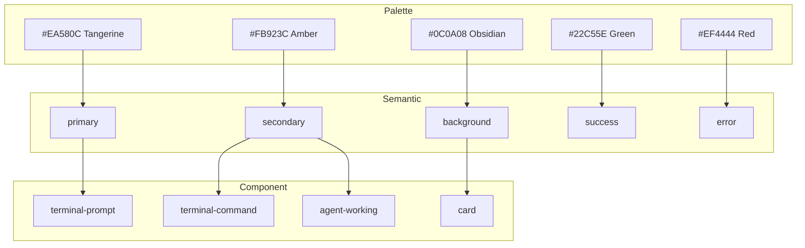
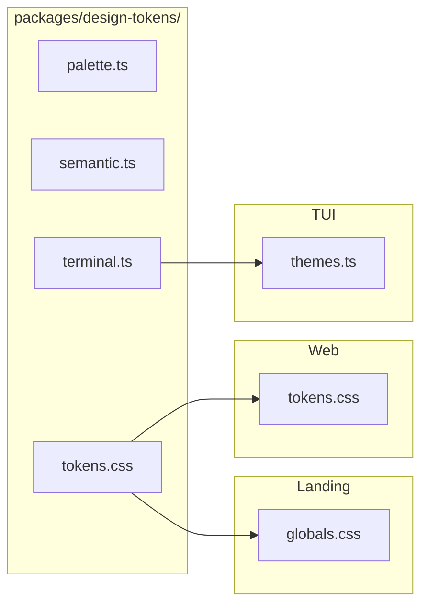
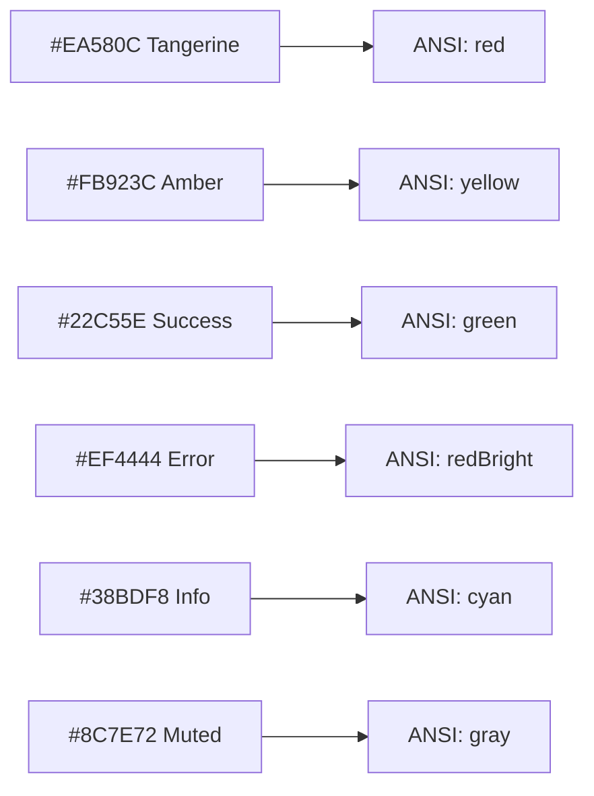

# bc Design System: Solar Flare

> Unified visual language for all three bc frontends: Landing, Web, and TUI.

**Tracking:** Epic #2154 | Shared tokens #2157 | Web migration #2158 | TUI alignment #2159 | Web light mode #2161

---

## 1. Overview

| Frontend | Stack | Color System | Status |
|----------|-------|-------------|--------|
| **Landing** | Next.js + Tailwind | Solar Flare CSS custom properties | Reference |
| **Web** | Vite + React + Tailwind | Cool blue/gray `--bc-*` tokens | Needs migration |
| **TUI** | React Ink | ANSI terminal color names | Needs alignment |

---

## 2. Solar Flare Palette

| Name | Hex | Usage |
|------|-----|-------|
| Obsidian Warm | `#0C0A08` | Dark backgrounds |
| Ember Dark | `#151210` | Muted surfaces (dark) |
| Umber | `#1E1A16` | Cards (dark), foreground (light) |
| Bark | `#2A2420` | Borders (dark) |
| Charcoal | `#5C524A` | Terminal comments |
| Sandstone Dark | `#8C7E72` | Muted foreground (dark) |
| Sandstone | `#78706A` | Muted foreground (light) |
| Linen | `#E5DDD4` | Borders (light) |
| Parchment | `#FBF7F2` | Light background |
| Warm White | `#F5F0EB` | Dark foreground |
| Tangerine | `#EA580C` | Primary brand |
| Amber Glow | `#FB923C` | Secondary, commands |
| Peach | `#FDBA74` | Accent highlights |
| Success Green | `#22C55E` | Success (dark/terminal) |
| Error Red | `#EF4444` | Error (dark/terminal) |
| Sky Blue | `#38BDF8` | Info (dark) |

### Dark Mode Tokens

| Token | Hex |
|-------|-----|
| background | `#0C0A08` |
| foreground | `#F5F0EB` |
| primary | `#EA580C` |
| secondary | `#FB923C` |
| muted | `#151210` |
| muted-foreground | `#8C7E72` |
| border | `#2A2420` |
| card | `#1E1A16` |
| success | `#22C55E` |
| warning | `#FB923C` |
| error | `#EF4444` |
| info | `#38BDF8` |

### Light Mode Tokens

| Token | Hex |
|-------|-----|
| background | `#FBF7F2` |
| foreground | `#1E1A16` |
| primary | `#EA580C` |
| muted | `#F0EBE5` |
| muted-foreground | `#78706A` |
| border | `#E5DDD4` |
| card | `#FFFFFF` |
| success | `#16A34A` |
| error | `#DC2626` |
| info | `#0EA5E9` |

### Terminal Palette (always dark)

| Token | Hex |
|-------|-----|
| terminal-bg | `#0C0A08` |
| terminal-text | `#F5F0EB` |
| terminal-prompt | `#EA580C` |
| terminal-success | `#22C55E` |
| terminal-error | `#EF4444` |
| terminal-command | `#FB923C` |
| terminal-comment | `#5C524A` |

---

## 3. Token Hierarchy

## 4. Token Distribution

---

## 5. Typography

| Role | Font | Weight |
|------|------|--------|
| Body | Inter | 400, 500 |
| Heading | Space Grotesk | 300-700 |
| Code | Space Mono | 400, 700 |

## 6. Component Patterns

- **Border radius:** `0.75rem` (12px)
- **Shadows (dark):** `0 1px 4px rgba(0,0,0,0.4)`
- **Glass:** `backdrop-filter: blur(10px)` + semi-transparent bg
- **Focus:** `outline: 2px solid var(--ring); outline-offset: 2px`
- **Touch targets:** min 44x44px

---

## 7. Terminal Color Mapping

| Solar Flare | Hex | ANSI 16 |
|-------------|-----|---------|
| Primary | `#EA580C` | `red` |
| Secondary | `#FB923C` | `yellow` |
| Accent | `#FDBA74` | `yellowBright` |
| Success | `#22C55E` | `green` |
| Error | `#EF4444` | `redBright` |
| Info | `#38BDF8` | `cyan` |
| Muted | `#8C7E72` | `gray` |
| Text | `#F5F0EB` | `white` |

Ink supports hex on truecolor terminals. Use hex with ANSI fallback.

---

## 8. Per-Frontend Gap

### Web (`web/src/theme/tokens.css`)

| Token | Current | Target |
|-------|---------|--------|
| `--bc-bg` | `#0f1117` | `#0C0A08` |
| `--bc-surface` | `#1a1d27` | `#1E1A16` |
| `--bc-border` | `#2a2d3a` | `#2A2420` |
| `--bc-text` | `#e2e4e9` | `#F5F0EB` |
| `--bc-accent` | `#60a5fa` (blue) | `#EA580C` (tangerine) |

### TUI (`tui/src/theme/themes.ts`)

| Token | Current | Target ANSI | Target Hex |
|-------|---------|-------------|------------|
| primary | `cyan` | `red` | `#EA580C` |
| accent | `magenta` | `yellow` | `#FB923C` |
| selection | `cyan` | `red` | `#EA580C` |
| headerTitle | `cyan` | `red` | `#EA580C` |

---

## 9. Migration Plan

1. **Phase 1:** Create `packages/design-tokens/` with palette, semantic, terminal, CSS exports (#2157)
2. **Phase 2:** Landing `globals.css` imports from shared package
3. **Phase 3:** Web migration -- replace tokens.css values, add light mode (#2158, #2161)
4. **Phase 4:** TUI alignment -- update themes.ts, migrate 40+ hardcoded colors (#2159, #2137)
5. **Phase 5:** Visual regression tests, WCAG contrast verification

---

## Appendix: Contrast Ratios

| Pair | Ratio | WCAG AA? |
|------|-------|----------|
| Warm White on Obsidian | 16.4:1 | Yes |
| Sandstone Dark on Obsidian | 5.2:1 | Yes |
| Umber on Parchment | 13.8:1 | Yes |
| Tangerine on Obsidian | 4.3:1 | Borderline (large text only) |
| Tangerine on Parchment | 3.8:1 | No (large text only) |

Primary (Tangerine) falls slightly below 4.5:1. Use for headings and buttons (3:1 threshold) not body text.
