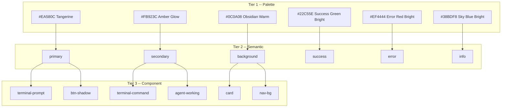
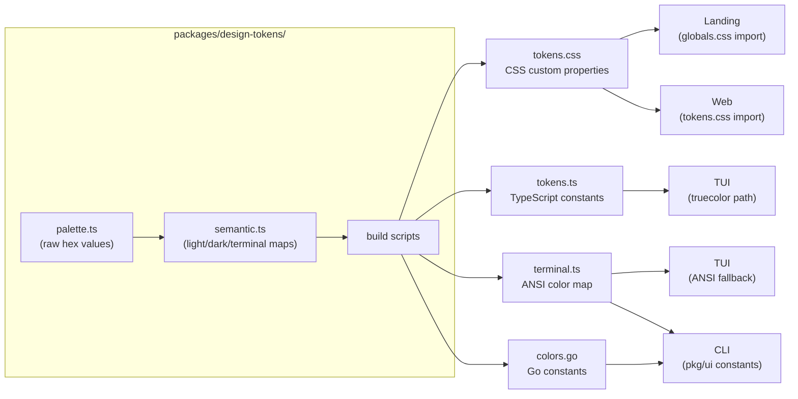
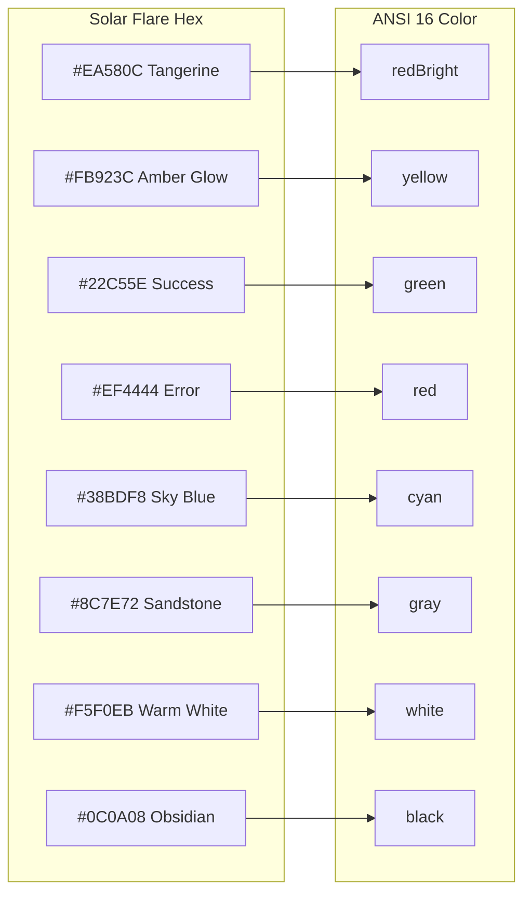

# bc Design System: Solar Flare

> Unified visual language for all bc frontends and CLI output.

---

## 1. Overview

**Solar Flare** is the design system for bc. It defines a single visual language -- warm blacks, deep oranges, sky blue accent -- shared across every surface where bc presents itself to users.

### Consumers

| Consumer | Stack | Rendering Target | Token Format |
|----------|-------|-----------------|--------------|
| **Landing** (`landing/`) | Next.js + Tailwind | Browser (HTML/CSS) | CSS custom properties |
| **Web** (`web/`) | Vite + React + Tailwind | Browser (HTML/CSS) | CSS custom properties |
| **TUI** (`tui/`) | React Ink | Terminal (ANSI/truecolor) | TypeScript constants |
| **CLI** (`pkg/ui/`) | Go (`pkg/ui`) | Terminal (ANSI escape codes) | Go constants |

### Design Principles

- **Warm, not cold.** Solar Flare uses warm blacks and oranges instead of cool blues and grays. Every neutral has a brown undertone.
- **Dark-first.** The primary mode is dark. OLED-safe: no pure `#000000` blacks. Light mode is a warm parchment, not clinical white.
- **Semantic indirection.** Components never reference palette hex values directly. All references go through semantic tokens, which resolve differently per mode.
- **Terminal-native.** The design system treats terminals as first-class. ANSI 16-color mappings exist for every semantic token, with truecolor hex as a progressive enhancement.

---

## 2. Solar Flare Palette

These are the raw palette values. They are **not used directly** in components; semantic tokens (Section 5) map to these.

### 2.1 Neutrals

| Name | Hex | Usage |
|------|-----|-------|
| Obsidian Warm | `#0C0A08` | Dark backgrounds |
| Ember Dark | `#151210` | Muted surfaces (dark) |
| Umber | `#1E1A16` | Cards (dark), foreground (light) |
| Bark | `#2A2420` | Borders, inputs (dark) |
| Charcoal | `#5C524A` | Terminal comments, disabled text |
| Sandstone | `#78706A` | Muted foreground (light) |
| Sandstone Dark | `#8C7E72` | Muted foreground (dark) |
| Linen | `#E5DDD4` | Borders, inputs (light) |
| Sand | `#F0EBE5` | Muted surfaces (light) |
| Parchment | `#FBF7F2` | Light background |
| Warm White | `#F5F0EB` | Dark foreground |
| White | `#FFFFFF` | Cards (light) |

### 2.2 Brand

| Name | Hex | Usage |
|------|-----|-------|
| Tangerine | `#EA580C` | Primary brand color |
| Amber Glow | `#FB923C` | Secondary, commands |
| Peach | `#FDBA74` | Accent highlights |

### 2.3 Status

| Name | Hex | Usage |
|------|-----|-------|
| Success Green | `#16A34A` | Success (light) |
| Success Green Bright | `#22C55E` | Success (dark, terminal) |
| Warning Orange | `#EA580C` | Warning (light) |
| Warning Amber | `#FB923C` | Warning (dark) |
| Error Red | `#DC2626` | Error/destructive (light) |
| Error Red Bright | `#EF4444` | Error/destructive (dark, terminal) |
| Sky Blue | `#0EA5E9` | Info (light) |
| Sky Blue Bright | `#38BDF8` | Info (dark) |

### 2.4 Chrome

| Name | Hex | Usage |
|------|-----|-------|
| Traffic Red | `#FF5F56` | Terminal window close button |
| Traffic Yellow | `#FFBD2E` | Terminal window minimize button |
| Traffic Green | `#27C93F` | Terminal window maximize button |

### 2.5 Light Mode Tokens

| Token | Hex | Palette Name |
|-------|-----|--------------|
| `background` | `#FBF7F2` | Parchment |
| `foreground` | `#1E1A16` | Umber |
| `primary` | `#EA580C` | Tangerine |
| `primary-foreground` | `#FFFFFF` | White |
| `secondary` | `#FB923C` | Amber Glow |
| `secondary-foreground` | `#1E1A16` | Umber |
| `muted` | `#F0EBE5` | Sand |
| `muted-foreground` | `#78706A` | Sandstone |
| `accent` | `#FDBA74` | Peach |
| `accent-foreground` | `#1E1A16` | Umber |
| `border` | `#E5DDD4` | Linen |
| `input` | `#E5DDD4` | Linen |
| `ring` | `#EA580C` | Tangerine |
| `card` | `#FFFFFF` | White |
| `card-foreground` | `#1E1A16` | Umber |
| `popover` | `#FFFFFF` | White |
| `popover-foreground` | `#1E1A16` | Umber |
| `destructive` | `#DC2626` | Error Red |
| `destructive-foreground` | `#FFFFFF` | White |
| `success` | `#16A34A` | Success Green |
| `warning` | `#EA580C` | Warning Orange |
| `error` | `#DC2626` | Error Red |
| `info` | `#0EA5E9` | Sky Blue |

### 2.6 Dark Mode Tokens

| Token | Hex | Palette Name |
|-------|-----|--------------|
| `background` | `#0C0A08` | Obsidian Warm |
| `foreground` | `#F5F0EB` | Warm White |
| `primary` | `#EA580C` | Tangerine |
| `primary-foreground` | `#F5F0EB` | Warm White |
| `secondary` | `#FB923C` | Amber Glow |
| `secondary-foreground` | `#0C0A08` | Obsidian Warm |
| `muted` | `#151210` | Ember Dark |
| `muted-foreground` | `#8C7E72` | Sandstone Dark |
| `accent` | `#FDBA74` | Peach |
| `accent-foreground` | `#0C0A08` | Obsidian Warm |
| `border` | `#2A2420` | Bark |
| `input` | `#2A2420` | Bark |
| `ring` | `#EA580C` | Tangerine |
| `card` | `#1E1A16` | Umber |
| `card-foreground` | `#F5F0EB` | Warm White |
| `popover` | `#1E1A16` | Umber |
| `popover-foreground` | `#F5F0EB` | Warm White |
| `destructive` | `#EF4444` | Error Red Bright |
| `destructive-foreground` | `#F5F0EB` | Warm White |
| `success` | `#22C55E` | Success Green Bright |
| `warning` | `#FB923C` | Warning Amber |
| `error` | `#EF4444` | Error Red Bright |
| `info` | `#38BDF8` | Sky Blue Bright |

### 2.7 Terminal Palette (Always Dark)

The terminal palette is mode-independent. It is always rendered on a dark background.

| Token | Hex | Palette Name |
|-------|-----|--------------|
| `terminal-bg` | `#0C0A08` | Obsidian Warm |
| `terminal-header-bg` | `#151210` | Ember Dark |
| `terminal-text` | `#F5F0EB` | Warm White |
| `terminal-muted` | `#8C7E72` | Sandstone Dark |
| `terminal-prompt` | `#EA580C` | Tangerine |
| `terminal-success` | `#22C55E` | Success Green Bright |
| `terminal-error` | `#EF4444` | Error Red Bright |
| `terminal-command` | `#FB923C` | Amber Glow |
| `terminal-comment` | `#5C524A` | Charcoal |

---

## 3. Token Hierarchy

Tokens are organized in three tiers. Components never reference palette values directly.



**Rules:**
- Tier 3 references Tier 2 only.
- Tier 2 references Tier 1 only.
- Tier 1 values are raw hex constants. They never appear in component code.

---

## 4. Token Distribution

The shared token package (`packages/design-tokens/`) is the single source of truth. Build scripts produce format-specific outputs for each consumer.



### 4.1 CSS Custom Properties (Landing + Web)

Both web frontends consume tokens as CSS custom properties. The build generates a `tokens.css` file with `:root` (light) and `.dark` blocks. Each frontend imports this file and maps values through its Tailwind config.

### 4.2 TypeScript Constants (TUI)

The TUI runs in a terminal and cannot use CSS. The shared package exports a TypeScript module with both hex values (for truecolor terminals) and ANSI color name mappings (for 16-color fallback). The TUI's `themes.ts` imports these constants.

### 4.3 Go Constants (CLI)

The CLI's `pkg/ui/color.go` defines ANSI escape sequences for terminal output. These constants are aligned to the Solar Flare ANSI mapping so that CLI status messages, tables, and badges use the same visual language as the TUI.

---

## 5. Semantic Tokens

Semantic tokens express **intent**, not appearance. Components reference these, and the tokens resolve to different palette values per mode.

### 5.1 Core Semantics

| Semantic Token | Purpose | Light | Dark |
|---------------|---------|-------|------|
| `primary` | Brand actions, CTAs | `#EA580C` | `#EA580C` |
| `primary-foreground` | Text on primary | `#FFFFFF` | `#F5F0EB` |
| `secondary` | Supporting actions | `#FB923C` | `#FB923C` |
| `secondary-foreground` | Text on secondary | `#1E1A16` | `#0C0A08` |
| `accent` | Highlights, hover states | `#FDBA74` | `#FDBA74` |
| `accent-foreground` | Text on accent | `#1E1A16` | `#0C0A08` |
| `background` | Page/app background | `#FBF7F2` | `#0C0A08` |
| `foreground` | Default text | `#1E1A16` | `#F5F0EB` |
| `muted` | Subtle backgrounds | `#F0EBE5` | `#151210` |
| `muted-foreground` | Secondary text | `#78706A` | `#8C7E72` |
| `border` | Dividers, outlines | `#E5DDD4` | `#2A2420` |
| `input` | Input field borders | `#E5DDD4` | `#2A2420` |
| `ring` | Focus rings | `#EA580C` | `#EA580C` |
| `card` | Card backgrounds | `#FFFFFF` | `#1E1A16` |
| `card-foreground` | Text on cards | `#1E1A16` | `#F5F0EB` |
| `popover` | Popover backgrounds | `#FFFFFF` | `#1E1A16` |
| `popover-foreground` | Text on popovers | `#1E1A16` | `#F5F0EB` |

### 5.2 Status Semantics

| Semantic Token | Purpose | Light | Dark |
|---------------|---------|-------|------|
| `success` | Positive outcomes | `#16A34A` | `#22C55E` |
| `warning` | Caution states | `#EA580C` | `#FB923C` |
| `error` / `destructive` | Errors, destructive actions | `#DC2626` | `#EF4444` |
| `info` | Informational highlights | `#0EA5E9` | `#38BDF8` |

### 5.3 Agent State Semantics

These are domain-specific tokens for agent orchestration UI. All four consumers use them.

| Semantic Token | Purpose | Hex (Dark) | ANSI 16 | Symbol |
|---------------|---------|-----------|---------|--------|
| `agent-idle` | Waiting for work | `#8C7E72` | `gray` | `○` |
| `agent-working` | Actively processing | `#FB923C` | `yellow` | `●` |
| `agent-done` | Completed successfully | `#22C55E` | `green` | `✓` |
| `agent-stuck` | Needs attention | `#FDBA74` | `yellowBright` | `⚠` |
| `agent-error` | Failed | `#EF4444` | `red` | `✗` |

Status indicators always pair a symbol with a color so that state is not communicated by color alone (accessibility).

---

## 6. Typography

### 6.1 Font Families

| Token | Font Stack | Usage |
|-------|-----------|-------|
| `font-sans` | `"Inter", ui-sans-serif, system-ui, sans-serif` | Body text (web) |
| `font-heading` | `"Space Grotesk", ui-sans-serif, system-ui, sans-serif` | Headings h1--h6 (web) |
| `font-mono` | `"Space Mono", ui-monospace, SFMono-Regular, Consolas, monospace` | Code, terminal output (web) |

### 6.2 Type Scale

Based on a 1.25 ratio, rem-based for accessibility:

| Name | Size | Weight | Line Height | Usage |
|------|------|--------|-------------|-------|
| `xs` | `0.75rem` (12px) | 400 | 1.5 | Badges, captions |
| `sm` | `0.875rem` (14px) | 400 | 1.5 | Secondary text, labels |
| `base` | `1rem` (16px) | 400 | 1.6 | Body text |
| `lg` | `1.125rem` (18px) | 500 | 1.5 | Subheadings |
| `xl` | `1.25rem` (20px) | 600 | 1.4 | Section titles |
| `2xl` | `1.5rem` (24px) | 600 | 1.3 | Page titles |
| `3xl` | `1.875rem` (30px) | 700 | 1.2 | Hero subheadings |
| `4xl` | `2.25rem` (36px) | 700 | 1.1 | Hero headings |

### 6.3 Terminal Typography

The TUI and CLI use the terminal's configured monospace font. Web type scale tokens do not apply. Text differentiation is achieved through:

| Attribute | ANSI Code | Usage |
|-----------|----------|-------|
| Bold | `\033[1m` | Headers, selected items, emphasis |
| Dim | `\033[2m` | Secondary text, disabled items, separators |
| Italic | `\033[3m` | Agent names, annotations |
| Underline | `\033[4m` | Links, actionable items |
| Inverse | `\033[7m` | Selection highlights |

---

## 7. Spacing Scale

A 4px base grid, consistent across web frontends:

| Token | Value | Usage |
|-------|-------|-------|
| `0` | `0` | Reset |
| `0.5` | `0.125rem` (2px) | Hairline gaps |
| `1` | `0.25rem` (4px) | Tight inner padding |
| `2` | `0.5rem` (8px) | Default inner padding |
| `3` | `0.75rem` (12px) | Card padding |
| `4` | `1rem` (16px) | Section gap |
| `5` | `1.25rem` (20px) | Component spacing |
| `6` | `1.5rem` (24px) | Large gaps |
| `8` | `2rem` (32px) | Section margins |
| `10` | `2.5rem` (40px) | Page margins |
| `12` | `3rem` (48px) | Hero spacing |
| `16` | `4rem` (64px) | Major sections |

This aligns with Tailwind's default spacing scale.

### 7.1 Terminal Spacing

Terminal layout uses character cells. The TUI spacing constants map to cell counts:

| Token | Value (cells) | Usage |
|-------|--------------|-------|
| `XS` | 1 | Tight padding between elements |
| `SM` | 2 | Default padding within panels |
| `MD` | 4 | Section gaps |
| `LG` | 8 | Major section margins |

---

## 8. Component Patterns

### 8.1 Border Radius

Defined relative to a base `--radius: 0.75rem` (12px):

| Token | Value | Usage |
|-------|-------|-------|
| `radius-sm` | `calc(var(--radius) - 4px)` = 8px | Small chips, badges |
| `radius-md` | `calc(var(--radius) - 2px)` = 10px | Buttons, inputs |
| `radius-lg` | `var(--radius)` = 12px | Cards, modals |
| `radius-xl` | `calc(var(--radius) + 4px)` = 16px | Large containers |

### 8.2 Shadows

| Token | Light | Dark |
|-------|-------|------|
| `card-shadow` | `0 1px 3px rgba(30, 26, 22, 0.06)` | `0 1px 4px rgba(0, 0, 0, 0.4)` |
| `btn-shadow` | `0 1px 3px rgba(234, 88, 12, 0.2)` | `0 1px 4px rgba(234, 88, 12, 0.3)` |

### 8.3 Glass Effect

Used for overlays, navigation bars, and floating elements:

```css
/* Light */
background: rgba(251, 247, 242, 0.7);
border: 1px solid rgba(229, 221, 212, 0.5);
backdrop-filter: blur(10px);

/* Dark */
background: rgba(12, 10, 8, 0.7);
border: 1px solid rgba(255, 255, 255, 0.06);
backdrop-filter: blur(10px);
```

### 8.4 Transitions

Default transition for theme-aware properties:

```css
transition-property: background-color, border-color, color, box-shadow;
transition-timing-function: cubic-bezier(0.4, 0, 0.2, 1);
transition-duration: 200ms;
```

Body background/foreground transitions use 300ms ease.

### 8.5 Focus States

All interactive elements use the ring token for keyboard focus:

```css
outline: 2px solid var(--ring);  /* #EA580C */
outline-offset: 2px;
```

In the TUI, focused elements use `borderFocused` color on the panel border. In the CLI, focus is not applicable.

### 8.6 Touch Targets

Minimum size for interactive elements on mobile:

```css
min-height: 2.75rem;  /* 44px */
min-width: 2.75rem;
```

---

## 9. Terminal Color Mapping

The TUI and CLI operate in terminal environments. This section defines how Solar Flare hex values map to ANSI colors.



### Full Mapping Table

| Solar Flare Token | Hex | ANSI 16 Name | Ink Color | Go Constant | Notes |
|-------------------|-----|-------------|-----------|-------------|-------|
| Primary (Tangerine) | `#EA580C` | Red Bright | `redBright` | `BrightRed` | Closest warm hue in ANSI 16 |
| Secondary (Amber Glow) | `#FB923C` | Yellow | `yellow` | `Yellow` | ANSI yellow renders amber on most terminals |
| Accent (Peach) | `#FDBA74` | Yellow Bright | `yellowBright` | `BrightYellow` | Lighter warm highlight |
| Foreground (Warm White) | `#F5F0EB` | White | `white` | `White` | Standard terminal white |
| Muted FG (Sandstone) | `#8C7E72` | Gray | `gray` | `BrightBlack` | ANSI bright black / dim white |
| Background (Obsidian) | `#0C0A08` | Black | `black` | `Black` | Terminal default background |
| Border (Bark) | `#2A2420` | Gray | `gray` | `BrightBlack` | Dim border lines |
| Success | `#22C55E` | Green | `green` | `Green` | Direct match |
| Warning | `#FB923C` | Yellow | `yellow` | `Yellow` | Same as secondary |
| Error | `#EF4444` | Red | `red` | `Red` | Direct match |
| Info (Sky Blue) | `#38BDF8` | Cyan | `cyan` | `Cyan` | Closest cool tone |
| Destructive | `#EF4444` | Red | `red` | `Red` | Same as error |
| Comment (Charcoal) | `#5C524A` | Bright Black | `gray` | `BrightBlack` | Dim/disabled text |

### Truecolor Fallback

When the terminal supports truecolor (24-bit), consumers should prefer hex values directly:
- **TUI:** Ink's `color` prop accepts hex strings (e.g., `color="#EA580C"`).
- **CLI:** Go can emit `\033[38;2;R;G;Bm` escape sequences.

The ANSI 16 mapping serves as a fallback for restricted environments. Runtime detection determines which path to use.

---

## 10. Shared Component Library (`@bc/ui`)

The shared component library provides platform-agnostic component interfaces with platform-specific renderers. Web and TUI share the same component API, ensuring visual and behavioral consistency.

### 10.1 Architecture

```mermaid
flowchart TD
    subgraph "@bc/ui-core"
        TYPES["Component interfaces\n(Props, State, Variants)"]
        TOKENS["Design tokens\n(re-exported)"]
    end

    subgraph "@bc/ui-web"
        WEB_BUTTON["Button.tsx\n(HTML <button>)"]
        WEB_INPUT["Input.tsx\n(HTML <input>)"]
        WEB_TABLE["Table.tsx\n(HTML <table>)"]
        WEB_BADGE["Badge.tsx\n(HTML <span>)"]
        WEB_PANEL["Panel.tsx\n(HTML <div>)"]
        WEB_MODAL["Modal.tsx\n(HTML <dialog>)"]
        WEB_TOAST["Toast.tsx\n(HTML <div>)"]
        WEB_SPINNER["Spinner.tsx\n(CSS animation)"]
    end

    subgraph "@bc/ui-ink"
        INK_BUTTON["Button.tsx\n(Ink <Box>+<Text>)"]
        INK_INPUT["Input.tsx\n(Ink <TextInput>)"]
        INK_TABLE["Table.tsx\n(Ink <Box> grid)"]
        INK_BADGE["Badge.tsx\n(Ink <Text>)"]
        INK_PANEL["Panel.tsx\n(Ink <Box> border)"]
        INK_MODAL["Modal.tsx\n(Ink overlay <Box>)"]
        INK_TOAST["Toast.tsx\n(Ink timed <Text>)"]
        INK_SPINNER["Spinner.tsx\n(Ink <Spinner>)"]
    end

    TYPES --> WEB_BUTTON
    TYPES --> WEB_INPUT
    TYPES --> WEB_TABLE
    TYPES --> WEB_BADGE
    TYPES --> WEB_PANEL
    TYPES --> WEB_MODAL
    TYPES --> WEB_TOAST
    TYPES --> WEB_SPINNER

    TYPES --> INK_BUTTON
    TYPES --> INK_INPUT
    TYPES --> INK_TABLE
    TYPES --> INK_BADGE
    TYPES --> INK_PANEL
    TYPES --> INK_MODAL
    TYPES --> INK_TOAST
    TYPES --> INK_SPINNER

    TOKENS --> WEB_BUTTON
    TOKENS --> INK_BUTTON
```



### 10.2 Package Structure

```
packages/
  ui-core/           # Shared interfaces and types
    src/
      types.ts       # Component prop interfaces
      variants.ts    # Variant definitions (size, intent, state)
      tokens.ts      # Re-export from design-tokens
      index.ts
  ui-web/            # HTML/CSS renderers (web + landing)
    src/
      Button.tsx
      Input.tsx
      Table.tsx
      Badge.tsx
      Panel.tsx
      Modal.tsx
      Toast.tsx
      Spinner.tsx
      index.ts
  ui-ink/            # React Ink renderers (TUI)
    src/
      Button.tsx
      Input.tsx
      Table.tsx
      Badge.tsx
      Panel.tsx
      Modal.tsx
      Toast.tsx
      Spinner.tsx
      index.ts
```

### 10.3 Primitive Components

#### Button

| Prop | Type | Default | Description |
|------|------|---------|-------------|
| `variant` | `'primary' \| 'secondary' \| 'ghost' \| 'destructive'` | `'primary'` | Visual style |
| `size` | `'sm' \| 'md' \| 'lg'` | `'md'` | Size preset |
| `disabled` | `boolean` | `false` | Disabled state |
| `loading` | `boolean` | `false` | Shows spinner, disables interaction |
| `children` | `ReactNode` | -- | Button label |
| `onPress` | `() => void` | -- | Click/press handler |

**Web rendering:** `<button>` with CSS classes derived from variant. Uses `background: var(--primary)`, `border-radius: var(--radius-md)`, `box-shadow: var(--btn-shadow)`. Disabled state applies `opacity: 0.5` and `pointer-events: none`.

**TUI rendering:** `<Box>` + `<Text>` with Ink color props. Primary uses `color="redBright"` (Tangerine ANSI). Ghost uses `dimColor`. Disabled applies `dimColor` attribute. Focus shows `borderStyle="single" borderColor="redBright"`.

#### Input

| Prop | Type | Default | Description |
|------|------|---------|-------------|
| `value` | `string` | `''` | Current value |
| `placeholder` | `string` | `''` | Placeholder text |
| `onChange` | `(value: string) => void` | -- | Value change handler |
| `disabled` | `boolean` | `false` | Disabled state |
| `error` | `string \| undefined` | -- | Error message (shows destructive styling) |

**Web rendering:** `<input>` with `border: 1px solid var(--input)`, `border-radius: var(--radius-md)`, `background: var(--background)`. Focus applies `outline: 2px solid var(--ring)`. Error state applies `border-color: var(--destructive)`.

**TUI rendering:** Ink `<TextInput>` wrapped in a `<Box>` with `borderStyle="single"`. Border color is `gray` by default, `redBright` on focus, `red` on error. Placeholder text rendered with `dimColor`.

#### Table

| Prop | Type | Default | Description |
|------|------|---------|-------------|
| `columns` | `Column[]` | -- | Column definitions (key, header, width, render) |
| `data` | `T[]` | -- | Row data array |
| `selectedIndex` | `number \| undefined` | -- | Currently selected row |
| `onSelect` | `(row: T, index: number) => void` | -- | Row selection handler |
| `emptyMessage` | `string` | `'No data'` | Shown when data is empty |
| `maxVisibleRows` | `number \| undefined` | -- | Enables virtualization |

**Web rendering:** `<table>` with `border-collapse: collapse`. Header row uses `font-weight: 600`, `color: var(--muted-foreground)`. Selected row uses `background: var(--accent)`. Hover uses `background: var(--muted)`.

**TUI rendering:** `<Box flexDirection="column">` grid. Header text uses `bold dimColor`. Selected row prefixed with `▸` in `cyan`/`redBright` (Solar Flare primary ANSI). Virtualization via `scrollOffset` prop.

#### Badge

| Prop | Type | Default | Description |
|------|------|---------|-------------|
| `variant` | `'default' \| 'success' \| 'warning' \| 'error' \| 'info'` | `'default'` | Color variant |
| `children` | `ReactNode` | -- | Badge content |
| `icon` | `string \| undefined` | -- | Optional leading icon/symbol |

**Web rendering:** `<span>` with `border-radius: var(--radius-sm)`, `font-size: var(--text-xs)`, `padding: var(--space-0.5) var(--space-2)`. Variant determines background/foreground from semantic tokens.

**TUI rendering:** `<Text>` with color set to the variant's ANSI mapping. Icon symbols prepended when present (e.g., `✓` for success, `✗` for error). Uses bold for emphasis.

#### Panel

| Prop | Type | Default | Description |
|------|------|---------|-------------|
| `title` | `string \| undefined` | -- | Optional header title |
| `children` | `ReactNode` | -- | Panel content |
| `focused` | `boolean` | `false` | Focus state (highlighted border) |
| `borderColor` | `string` | `'border'` | Border color token |
| `width` | `number \| string \| undefined` | -- | Width constraint |
| `height` | `number \| string \| undefined` | -- | Height constraint |

**Web rendering:** `<div>` with `border: 1px solid var(--border)`, `border-radius: var(--radius-lg)`, `background: var(--card)`, `box-shadow: var(--card-shadow)`. Focused state applies `border-color: var(--ring)`. Title rendered as `<h3>` with `font-weight: 600`.

**TUI rendering:** `<Box borderStyle="single">` with `borderColor="gray"` default. Focused applies `borderColor` from theme's `borderFocused` token. Title rendered as `<Text bold>`. Minimum height ensures title + content visibility.

#### Modal

| Prop | Type | Default | Description |
|------|------|---------|-------------|
| `open` | `boolean` | `false` | Visibility state |
| `title` | `string` | -- | Modal title |
| `children` | `ReactNode` | -- | Modal body |
| `onClose` | `() => void` | -- | Close handler |

**Web rendering:** `<dialog>` with glass effect backdrop. Content uses `background: var(--card)`, `border-radius: var(--radius-lg)`, `box-shadow: var(--card-shadow)`. Close on Escape key.

**TUI rendering:** Absolute-positioned `<Box>` overlay with `borderStyle="double"`. Background cleared with spaces. Close on Escape key via Ink `useInput`.

#### Toast

| Prop | Type | Default | Description |
|------|------|---------|-------------|
| `variant` | `'success' \| 'error' \| 'warning' \| 'info'` | `'info'` | Toast type |
| `message` | `string` | -- | Toast content |
| `duration` | `number` | `3000` | Auto-dismiss time in ms |
| `onDismiss` | `() => void` | -- | Dismiss callback |

**Web rendering:** Fixed-position `<div>` at bottom-right. Uses variant semantic token for left border accent. Glass effect background. Animate in/out with CSS transitions.

**TUI rendering:** `<Text>` rendered at the bottom of the viewport with variant color. Auto-dismisses via `setTimeout`. Symbol prefix matches status semantics (`✓`, `✗`, `⚠`, `→`).

#### Spinner

| Prop | Type | Default | Description |
|------|------|---------|-------------|
| `size` | `'sm' \| 'md' \| 'lg'` | `'md'` | Spinner size |
| `label` | `string \| undefined` | -- | Optional loading text |
| `color` | `string` | `'primary'` | Color token |

**Web rendering:** CSS `@keyframes spin` animation on an SVG circle. Size maps to `16px` / `24px` / `32px`. Color from semantic token.

**TUI rendering:** Ink `<Spinner>` component with `type="dots"`. Label rendered as `<Text>` adjacent to spinner. Color from ANSI mapping of specified token.

---

## 11. CLI Output Styling

The CLI (`pkg/ui/`) is a design system consumer. It uses ANSI escape codes to apply Solar Flare colors to terminal output. The Go `pkg/ui` package provides the styling primitives.

### 11.1 Message Types

Each message type has a fixed color, symbol, and semantic meaning:

| Function | Symbol | Color | ANSI Code | Solar Flare Token |
|----------|--------|-------|-----------|-------------------|
| `Success()` | `✓` | Green | `\033[32m` | `success` |
| `Error()` | `✗` | Red | `\033[31m` | `error` |
| `Warning()` | `!` | Yellow | `\033[33m` | `warning` |
| `Info()` | `→` | Blue | `\033[34m` | `info` |
| `Debug()` | `·` | Dim | `\033[2m` | `muted-foreground` |
| `Header()` | -- | Bold | `\033[1m` | `foreground` + bold |

### 11.2 Table Formatting

CLI tables use `pkg/ui.Table`:
- Headers: **Bold** text (`\033[1m`)
- Separators: Unicode box-drawing character `─`
- Key-value lists: Keys in **dim** (`\033[2m`), values in default foreground

### 11.3 List Formatting

- Bulleted lists: Dim `•` prefix
- Numbered lists: Dim number prefix
- Check lists: Green `✓` prefix with optional dim detail text

### 11.4 Color Helpers

The `pkg/ui` package provides semantic color functions that align with Solar Flare:

| Go Function | ANSI | Solar Flare Equivalent |
|-------------|------|----------------------|
| `RedText()` | `\033[31m` | `error` |
| `GreenText()` | `\033[32m` | `success` |
| `YellowText()` | `\033[33m` | `warning` / `secondary` |
| `BlueText()` | `\033[34m` | `info` |
| `CyanText()` | `\033[36m` | `info` (alternate) |
| `MagentaText()` | `\033[35m` | `accent` |
| `GrayText()` | `\033[90m` | `muted-foreground` |
| `BoldText()` | `\033[1m` | Emphasis |
| `DimText()` | `\033[2m` | `muted-foreground` |

### 11.5 NO_COLOR Support

The CLI respects the `NO_COLOR` environment variable (see https://no-color.org/). When set, all ANSI codes are suppressed and output is plain text. Detection is automatic via `pkg/ui.checkColorSupport()`, which also verifies that stdout is a TTY.

---

## 12. Contrast Ratios

Key foreground/background pairings and their WCAG 2.1 contrast ratios. AA requires 4.5:1 for normal text, 3:1 for large text (18px+ or 14px bold).

| Pair | Light | Ratio | Dark | Ratio | WCAG AA |
|------|-------|-------|------|-------|---------|
| Foreground on Background | `#1E1A16` on `#FBF7F2` | 14.8:1 | `#F5F0EB` on `#0C0A08` | 17.2:1 | Pass |
| Primary on Background | `#EA580C` on `#FBF7F2` | 4.6:1 | `#EA580C` on `#0C0A08` | 3.8:1 | Pass (light), Large only (dark) |
| Primary on Card | `#EA580C` on `#FFFFFF` | 4.6:1 | `#EA580C` on `#1E1A16` | 3.5:1 | Pass (light), Large only (dark) |
| Muted FG on Background | `#78706A` on `#FBF7F2` | 4.7:1 | `#8C7E72` on `#0C0A08` | 5.4:1 | Pass |
| Muted FG on Card | `#78706A` on `#FFFFFF` | 4.5:1 | `#8C7E72` on `#1E1A16` | 4.9:1 | Pass |
| Success on Background | `#16A34A` on `#FBF7F2` | 4.5:1 | `#22C55E` on `#0C0A08` | 7.4:1 | Pass |
| Error on Background | `#DC2626` on `#FBF7F2` | 5.5:1 | `#EF4444` on `#0C0A08` | 4.6:1 | Pass |
| Info on Background | `#0EA5E9` on `#FBF7F2` | 3.5:1 | `#38BDF8` on `#0C0A08` | 8.1:1 | Large only (light), Pass (dark) |
| Foreground on Card | `#1E1A16` on `#FFFFFF` | 16.0:1 | `#F5F0EB` on `#1E1A16` | 13.3:1 | Pass |
| Warning on Background | `#EA580C` on `#FBF7F2` | 4.6:1 | `#FB923C` on `#0C0A08` | 5.8:1 | Pass |

### Guidance for Borderline Pairings

- **Primary text on dark backgrounds** (`#EA580C` on `#0C0A08`, 3.8:1): Falls below 4.5:1. Use primary as a fill color (button background) with `primary-foreground` text, not as text color on dark surfaces. When primary must appear as text, use it at `lg` size (18px+) or bold `base` size where the 3:1 large-text threshold applies.
- **Info text on light backgrounds** (`#0EA5E9` on `#FBF7F2`, 3.5:1): Same guidance -- use info as a fill or at large text sizes in light mode. In dark mode this pairing is 8.1:1 and fully accessible.
