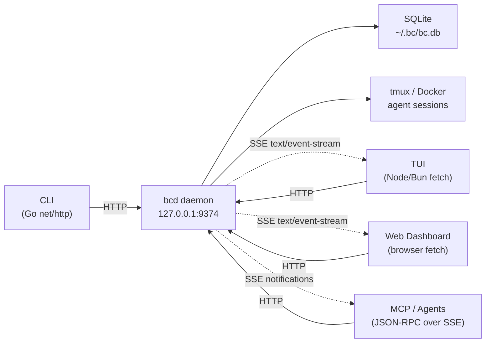
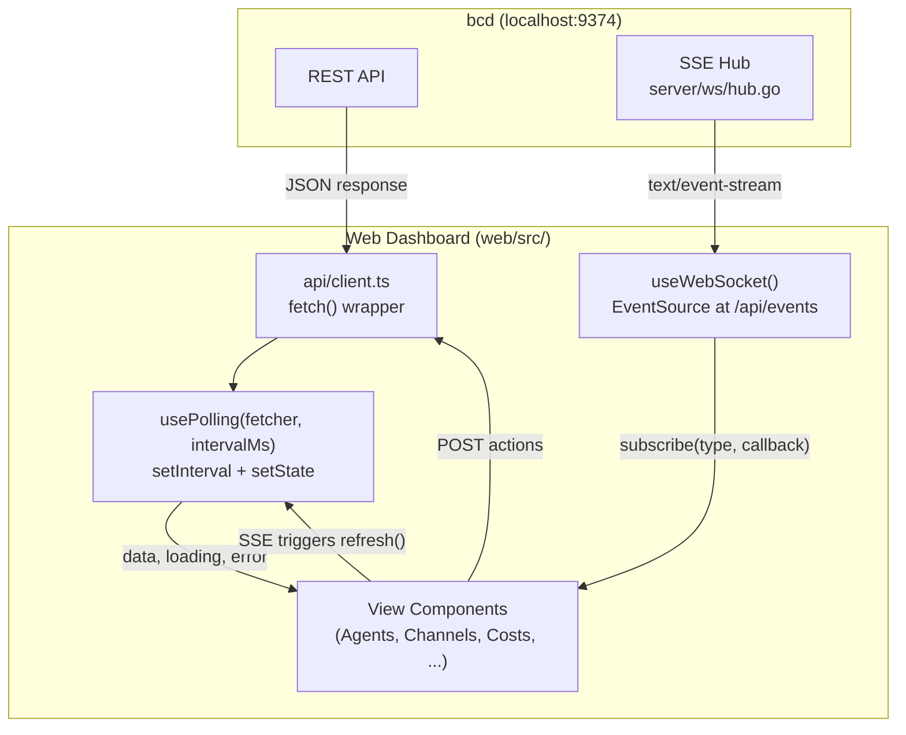
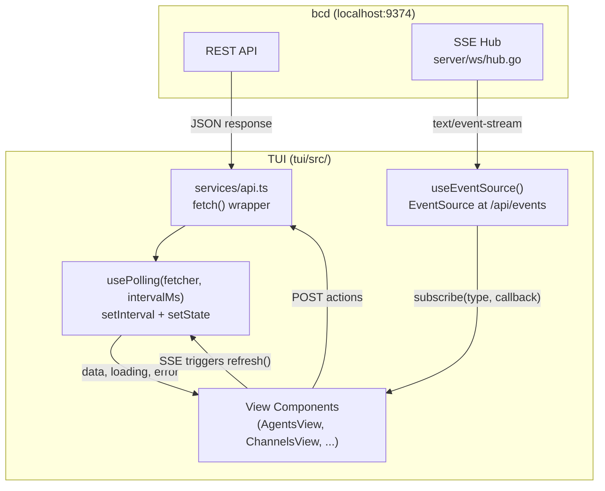
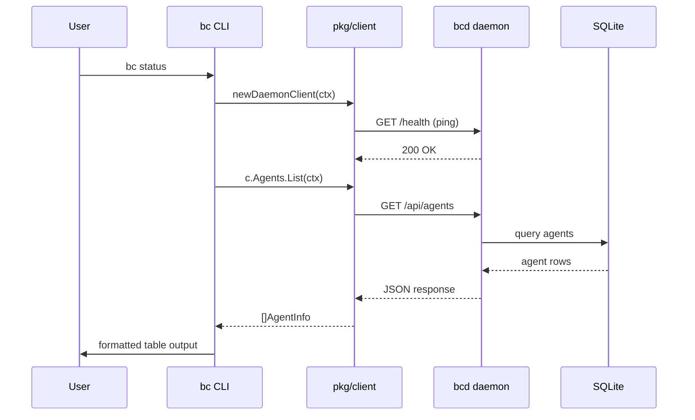
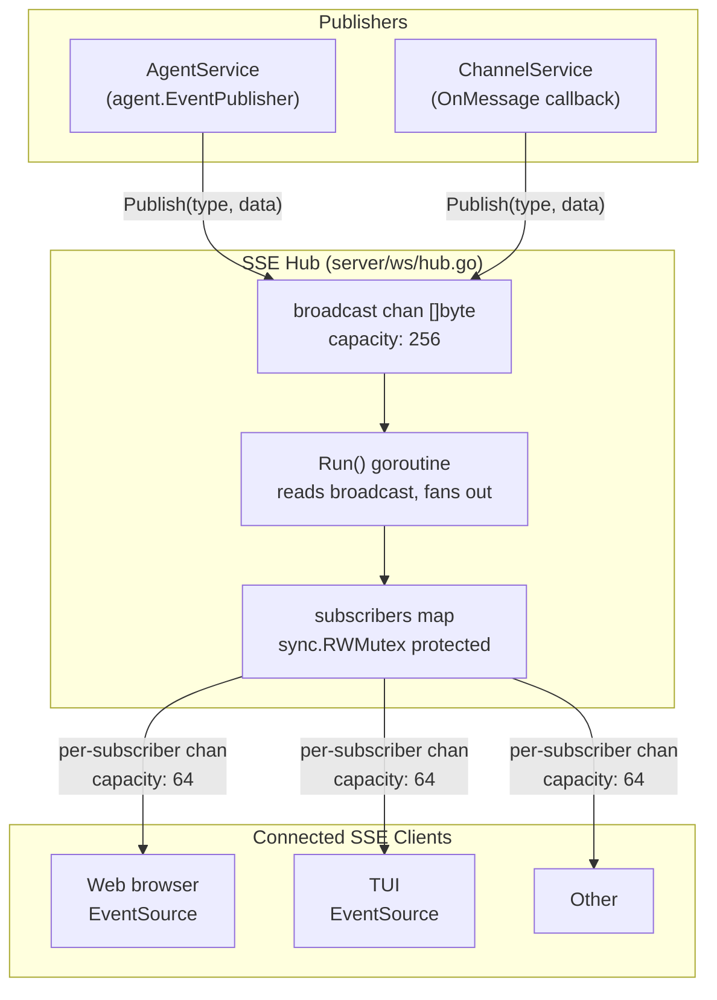
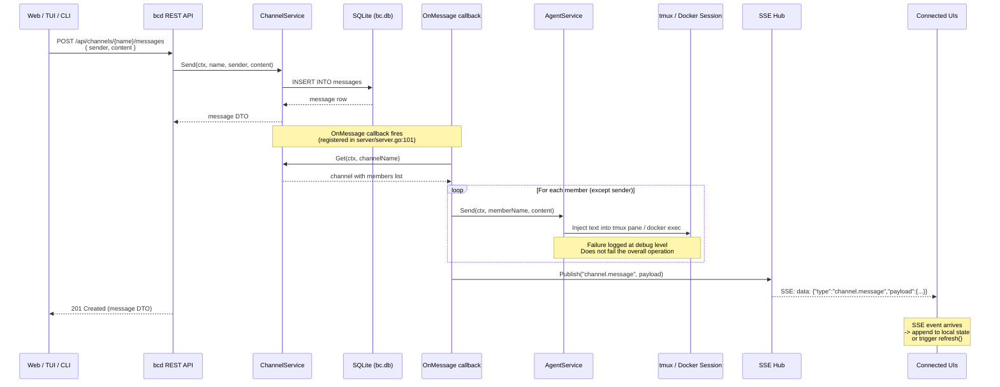

# Frontend Data Flow

This document describes how data flows through bc's client-server architecture. It covers all four API clients (CLI, TUI, Web, MCP/Agents), the bcd daemon they connect to, the SSE real-time event system, and the channel message delivery pipeline.

---

## 1. System Context

bc follows a daemon architecture where **all clients are equal consumers of the bcd HTTP API**. No client has privileged access to the database or internal state. The bcd daemon is the single source of truth.



### Design principles

- **bcd is the gateway.** Every read and write goes through it. Clients never open SQLite directly.
- **Four equal clients.** CLI, TUI, Web, and MCP/Agents all call the same REST endpoints. None is special.
- **Real-time via SSE.** Clients that need live updates (TUI, Web) subscribe to `/api/events`. MCP clients get notifications via a separate SSE transport at `/mcp/sse`.
- **TUI and Web are symmetric.** Both use `fetch()` to call the bcd REST API and `EventSource` for SSE. The only difference is the rendering target: terminal (Ink/React) vs browser (React DOM).

### Component inventory

| Component | Language | Transport | Runtime |
|-----------|----------|-----------|---------|
| bcd daemon | Go | HTTP server on `:9374` | Long-running process |
| CLI (`bc`) | Go | `pkg/client` (Go `net/http`) | One-shot command |
| TUI | TypeScript/React (Ink) | `services/api.ts` (Node/Bun `fetch`) | Terminal app |
| Web dashboard | TypeScript/React | `api/client.ts` (browser `fetch`) | Browser SPA served by bcd |
| MCP server | Go | JSON-RPC 2.0 over SSE at `/mcp/` | Embedded in bcd |

---

## 2. API Surface

bcd listens on `127.0.0.1:9374` by default (configurable via `server.Config.Addr`). Route registration is in `server/server.go`. Each resource has a dedicated handler file in `server/handlers/`.

### Endpoint reference

| Endpoint | Method | Description | CLI | TUI | Web | MCP |
|----------|--------|-------------|-----|-----|-----|-----|
| `/api/agents` | GET | List all agents with state, role, cost | Yes | Yes | Yes | via resource |
| `/api/agents` | POST | Create agent | Yes | Yes | Yes | via tool |
| `/api/agents/{name}` | GET | Single agent detail | Yes | Yes | Yes | -- |
| `/api/agents/{name}` | DELETE | Delete agent | Yes | -- | Yes | -- |
| `/api/agents/{name}/start` | POST | Start agent | Yes | Yes | Yes | -- |
| `/api/agents/{name}/stop` | POST | Stop agent | Yes | Yes | Yes | -- |
| `/api/agents/{name}/send` | POST | Send message to agent session | Yes | Yes | Yes | via tool |
| `/api/agents/{name}/peek` | GET | Peek at agent terminal output | Yes | Yes | -- | -- |
| `/api/agents/{name}/rename` | POST | Rename agent | Yes | -- | Yes | -- |
| `/api/agents/{name}/hook` | POST | Receive Claude Code hook event | -- | -- | -- | Agents |
| `/api/agents/{name}/stats` | GET | Docker stats samples | Yes | -- | Yes | -- |
| `/api/agents/{name}/sessions` | GET | List agent sessions | Yes | -- | Yes | -- |
| `/api/agents/generate-name` | GET | Generate random agent name | Yes | Yes | Yes | -- |
| `/api/agents/broadcast` | POST | Send message to all agents | Yes | -- | Yes | -- |
| `/api/agents/send-role` | POST | Send message to agents by role | Yes | -- | -- | -- |
| `/api/agents/send-pattern` | POST | Send message to agents by name pattern | Yes | -- | -- | -- |
| `/api/agents/stop-all` | POST | Stop all agents | Yes | -- | Yes | -- |
| `/api/channels` | GET | List channels | Yes | Yes | Yes | via resource |
| `/api/channels` | POST | Create channel | Yes | -- | Yes | -- |
| `/api/channels/{name}` | GET | Get channel detail | Yes | Yes | Yes | -- |
| `/api/channels/{name}` | PATCH | Update channel | Yes | -- | Yes | -- |
| `/api/channels/{name}` | DELETE | Delete channel | Yes | -- | Yes | -- |
| `/api/channels/{name}/history` | GET | Message history (`?limit=`, `?offset=`) | Yes | Yes | Yes | -- |
| `/api/channels/{name}/messages` | POST | Send message to channel | Yes | Yes | Yes | via tool |
| `/api/channels/{name}/members` | POST | Add channel member | Yes | -- | Yes | -- |
| `/api/channels/{name}/members` | DELETE | Remove channel member (`?agent_id=`) | Yes | -- | Yes | -- |
| `/api/costs` | GET | Aggregate cost summary | Yes | Yes | Yes | via resource |
| `/api/costs/agents` | GET | Per-agent cost breakdown | Yes | -- | Yes | -- |
| `/api/logs` | GET | Event log (`?tail=`) | Yes | Yes | Yes | -- |
| `/api/logs/{agent}` | GET | Event log filtered by agent | Yes | Yes | Yes | -- |
| `/api/workspace/roles` | GET | Resolved roles | Yes | Yes | Yes | via resource |
| `/api/workspace/status` | GET | Workspace info | Yes | Yes | Yes | via resource |
| `/api/tools` | GET | Installed tools | Yes | Yes | Yes | via resource |
| `/api/mcp` | GET | MCP servers | Yes | Yes | Yes | -- |
| `/api/secrets` | GET | Secrets metadata | Yes | Yes | Yes | -- |
| `/api/cron` | GET | Cron jobs | Yes | Yes | Yes | -- |
| `/api/daemons` | GET | Workspace daemons | Yes | Yes | Yes | -- |
| `/api/doctor` | GET | Workspace health report | Yes | -- | Yes | -- |
| `/api/events` | GET | SSE event stream | -- | Yes | Yes | -- |
| `/mcp/sse` | GET | MCP SSE transport (JSON-RPC notifications) | -- | -- | -- | Yes |
| `/mcp/message` | POST | MCP JSON-RPC request endpoint | -- | -- | -- | Yes |
| `/health` | GET | Liveness probe | Yes | -- | -- | -- |

### MCP protocol surface

The MCP server at `/mcp/` implements JSON-RPC 2.0 with these methods:

| Method | Description |
|--------|-------------|
| `initialize` | Handshake, returns server capabilities |
| `resources/list` | List available resources (agents, channels, costs, roles, tools, workspace status) |
| `resources/read` | Read a specific resource by URI (e.g. `bc://agents`) |
| `tools/list` | List available tools (create_agent, send_message, report_status, query_costs) |
| `tools/call` | Invoke a tool |

Source: `server/mcp/server.go`, `server/mcp/sse.go`.

---

## 3. Client Architecture

### Shared API client design (`@bc/api-client`)

All four clients implement the same logical interface for communicating with bcd. The `@bc/api-client` package extracts this into a shared typed interface:

```
@bc/api-client
  +-- TypeScript interface (methods for each endpoint)
  |     listAgents(): Promise<Agent[]>
  |     getChannelHistory(name, limit): Promise<Message[]>
  |     sendToChannel(name, sender, content): Promise<Message>
  |     ...
  +-- Web implementation: browser fetch()
  +-- TUI implementation: Node/Bun fetch()
  +-- CLI implementation: Go pkg/client (net/http)
  +-- MCP implementation: JSON-RPC wrapper over same endpoints
```

### CLI client (`pkg/client/`)

The Go CLI uses `pkg/client.Client`, a typed HTTP client wrapping `net/http`:

```
pkg/client/
  client.go       -- Client struct, get/post/put/delete helpers, daemon discovery
  agents.go       -- AgentsClient: List, Get, Create, Start, Stop, Send, etc.
  channels.go     -- ChannelsClient: List, Get, History, Send, etc.
  events.go       -- EventsClient: List, ListByAgent
  roles.go        -- RolesClient: List
  tools.go        -- ToolsClient: List
  workspaces.go   -- WorkspacesClient: Status
  cron.go         -- CronClient: List
  mcp.go          -- MCPClient: List
```

Discovery order: `BC_DAEMON_ADDR` env var -> default `http://127.0.0.1:9374`.

**The CLI requires bcd to be running.** If `Ping()` fails, the command exits with an error telling the user to start bcd. There is no fallback to direct `pkg/` calls -- the daemon is mandatory.

Source: `pkg/client/client.go`, `internal/cmd/init.go` (`newDaemonClient`).

### Web client (`web/src/api/client.ts`)

A centralized `request<T>()` wrapper around browser `fetch()`. Uses relative paths (`/api/...`) since the web dashboard is served by bcd itself.

```typescript
const api = {
  listAgents:       () => request<Agent[]>('/agents'),
  getAgent:         (name) => request<Agent>(`/agents/${name}`),
  startAgent:       (name) => request<Agent>(`/agents/${name}/start`, { method: 'POST' }),
  stopAgent:        (name) => request<void>(`/agents/${name}/stop`, { method: 'POST' }),
  sendToAgent:      (name, message) => request<void>(`/agents/${name}/send`, ...),
  listChannels:     () => request<Channel[]>('/channels'),
  getChannelHistory:(name, limit) => request<ChannelMessage[]>(`/channels/${name}/history?limit=${limit}`),
  sendToChannel:    (name, message, sender) => request<ChannelMessage>(`/channels/${name}/messages`, ...),
  getCostSummary:   () => request<CostSummary>('/costs'),
  getCostByAgent:   () => request<AgentCostSummary[]>('/costs/agents'),
  listRoles:        () => request<Record<string,Role>>('/workspace/roles'),
  listTools:        () => request<Tool[]>('/tools'),
  listMCP:          () => request<MCPServer[]>('/mcp'),
  getLogs:          (tail) => request<EventLogEntry[]>(`/logs?tail=${tail}`),
  getDoctor:        () => request<DoctorReport>('/doctor'),
  listCron:         () => request<CronJob[]>('/cron'),
  listSecrets:      () => request<Secret[]>('/secrets'),
  getWorkspaceStatus:() => request<Record<string,unknown>>('/workspace/status'),
};
```

No caching layer -- every call is a fresh fetch. Caching is handled at the polling/SSE layer.

Source: `web/src/api/client.ts`.

### TUI client (`tui/src/services/api.ts`)

A centralized `request<T>()` wrapper around Node/Bun `fetch()`, mirroring the web client. Uses absolute URLs with a base from `BCD_ADDR` env var or default `http://127.0.0.1:9374`.

```typescript
const api = {
  listAgents:       () => request<Agent[]>('/agents'),
  getAgent:         (name) => request<Agent>(`/agents/${name}`),
  startAgent:       (name) => request<Agent>(`/agents/${name}/start`, { method: 'POST' }),
  stopAgent:        (name) => request<void>(`/agents/${name}/stop`, { method: 'POST' }),
  sendToAgent:      (name, message) => request<void>(`/agents/${name}/send`, ...),
  listChannels:     () => request<Channel[]>('/channels'),
  getChannelHistory:(name, limit) => request<ChannelMessage[]>(`/channels/${name}/history?limit=${limit}`),
  sendToChannel:    (name, message, sender) => request<ChannelMessage>(`/channels/${name}/messages`, ...),
  getCostSummary:   () => request<CostSummary>('/costs'),
  listRoles:        () => request<Record<string,Role>>('/workspace/roles'),
  listTools:        () => request<Tool[]>('/tools'),
  getLogs:          (tail) => request<EventLogEntry[]>(`/logs?tail=${tail}`),
  getWorkspaceStatus:() => request<Record<string,unknown>>('/workspace/status'),
};
```

The TUI client is structurally identical to the web client. The only differences are:

1. **Base URL**: absolute `http://127.0.0.1:9374` (TUI) vs relative `/api` (web, since bcd serves the SPA).
2. **Runtime**: Node/Bun `fetch()` (TUI) vs browser `fetch()` (web).
3. **AbortController**: each request uses an `AbortController` signal, cleaned up on component unmount, to prevent stale responses.

No client-side caching -- freshness is managed by polling intervals and SSE-triggered refetches, same as the web dashboard.

Source: `tui/src/services/api.ts`.

---

## 4. Web Data Flow

### Architecture



### Data flow walkthrough

**Step 1: API client.** `web/src/api/client.ts` exports a centralized `request<T>()` wrapper around `fetch()`. Typed methods like `api.listAgents()`, `api.getCostSummary()` provide the interface. No client-side caching -- fresh fetch on every call.

**Step 2: Polling hook.** `web/src/hooks/usePolling.ts` is a generic hook that accepts a fetcher function and interval. It calls the fetcher immediately, then repeats via `setInterval`. Returns `{ data, loading, error, refresh }`.

```typescript
// web/src/hooks/usePolling.ts
export function usePolling<T>(fetcher: () => Promise<T>, intervalMs = 5000) {
  // Calls fetcher immediately, then every intervalMs
  // Returns { data, loading, error, refresh }
}
```

Each view wraps an API method in `useCallback` and passes it to `usePolling`:

| View | Fetcher | Poll Interval |
|------|---------|---------------|
| Agents | `api.listAgents()` | 5000ms |
| Channels | `api.listChannels()` | 10000ms |
| Costs | `api.getCostSummary()` | 5000ms |
| Logs | `api.getLogs(50)` | 5000ms |
| Workspace | `api.getWorkspaceStatus()` | 10000ms |
| Roles, Tools, MCP, Cron, Secrets | Various | 5000-10000ms |

**Step 3: SSE hook.** `web/src/hooks/useWebSocket.ts` creates an `EventSource` at `/api/events`. Incoming events are dispatched to registered listeners by type. On error, the connection is closed and re-established after a 3-second delay.

```
EventSource('/api/events')
  -> onopen: setConnected(true)
  -> onmessage: JSON.parse -> dispatch to Map<WSEventType, Set<Listener>>
  -> onerror: close + setTimeout(connect, 3000)
```

Listeners are stored in a `Map<WSEventType, Set<Listener>>`. Views call `subscribe(type, callback)` which returns an unsubscribe function for `useEffect` cleanup.

**Step 4: View integration.** Views combine polling + SSE. The Agents view is the canonical pattern:

```typescript
// web/src/views/Agents.tsx
const fetcher = useCallback(() => api.listAgents(), []);
const { data: agents, refresh } = usePolling(fetcher, 5000);
const { subscribe } = useWebSocket();

useEffect(() => {
  return subscribe('agent.state_changed', () => void refresh());
}, [subscribe, refresh]);
```

Result: data is never more than 5s stale, and state changes appear within ~100ms via SSE-triggered refresh.

**Step 5: Channel chat pattern.** `web/src/views/Channels.tsx` uses a different approach -- it fetches history once on mount, then subscribes to `channel.message` SSE events and appends new messages directly to local state. After sending a message, it also re-fetches history as a consistency check.

### SSE event types consumed by web

Defined in `web/src/api/types.ts`:

| Event Type | Trigger |
|------------|---------|
| `agent.state_changed` | Agent state transition |
| `agent.output` | Agent terminal output |
| `channel.message` | New message in a channel |
| `cost.updated` | Cost data changed |
| `cost.budget_alert` | Budget threshold exceeded |

---

## 5. TUI Data Flow

### Architecture



The TUI data flow is identical to the web data flow. Both are React applications that call `fetch()` against the bcd REST API and subscribe to `/api/events` for real-time SSE updates. The only difference is the rendering target: Ink renders to the terminal, React DOM renders to the browser.

### Data flow walkthrough

**Step 1: API client.** `tui/src/services/api.ts` exports a `request<T>()` wrapper around Node/Bun `fetch()`. Typed methods match the web client. Base URL from `BCD_ADDR` env var or default `http://127.0.0.1:9374`.

**Step 2: Polling hooks.** TUI hooks accept a fetcher function and interval, calling the fetcher immediately and then on a timer. Returns `{ data, loading, error, refresh }`. Intervals are configurable via workspace `[performance]` config:

| Hook | Default Poll Interval | Config Key |
|------|----------------------|------------|
| `useAgents` | 2000ms | `poll_interval_agents` |
| `useChannels` | 3000ms | `poll_interval_channels` |
| `useCosts` | 5000ms | `poll_interval_costs` |
| `useStatus` | 2000ms | `poll_interval_status` |
| `useLogs` | 3000ms | `poll_interval_logs` |
| `useDashboard` | 30000ms | `poll_interval_dashboard` |

**Step 3: SSE hook.** `EventSource` at `http://127.0.0.1:9374/api/events` (using Node/Bun `EventSource`). Same dispatch pattern as the web: incoming events are parsed and dispatched to registered listeners by type. Reconnects on error with a 3-second delay, then exponential backoff for extended outages.

**Step 4: View integration.** Views combine polling + SSE, following the same pattern as web:

```typescript
// tui/src/hooks/useAgents.ts
const fetcher = useCallback(() => api.listAgents(), []);
const { data: agents, refresh } = usePolling(fetcher, pollInterval);
const { subscribe } = useEventSource();

useEffect(() => {
  return subscribe('agent.state_changed', () => void refresh());
}, [subscribe, refresh]);
```

**Step 5: Channel chat pattern.** Same as web -- fetch history on mount, subscribe to `channel.message` SSE events, append new messages to local state.

### Adaptive polling (`tui/src/hooks/useAdaptivePolling.ts`)

The TUI adjusts poll intervals based on agent activity to reduce unnecessary fetches in the terminal environment:

| Mode | Interval | Trigger |
|------|----------|---------|
| `fast` | 1000ms (configurable) | Agents actively working |
| `normal` | 2000ms (configurable) | Default state |
| `slow` | 4000ms (configurable) | Agents idle >10s |
| `backoff` | Up to 8000ms (configurable) | Extended quiet, 1.5x exponential backoff |

### Agent state debounce

`tui/src/hooks/useAgents.ts` applies a 5s debounce on `working` -> `idle` transitions to prevent UI flickering when agents briefly pause between tasks.

---

## 6. CLI Data Flow

The CLI is a thin client. Every command follows the same pattern:



### Command routing examples

| Command | HTTP Request | Response Handling |
|---------|-------------|-------------------|
| `bc status` | `GET /api/agents` | Format as table: name, role, state, uptime, task |
| `bc status --json` | `GET /api/agents` | Print raw JSON |
| `bc agent create eng-01 --role engineer` | `POST /api/agents` `{"name":"eng-01","role":"engineer"}` | Print confirmation |
| `bc agent start eng-01` | `POST /api/agents/eng-01/start` | Print confirmation |
| `bc agent stop eng-01` | `POST /api/agents/eng-01/stop` | Print confirmation |
| `bc agent send eng-01 "run tests"` | `POST /api/agents/eng-01/send` `{"message":"run tests"}` | Print confirmation |
| `bc agent peek eng-01` | `GET /api/agents/eng-01/peek` | Print terminal output |
| `bc channel list` | `GET /api/channels` | Format as table |
| `bc channel send eng "hello"` | `POST /api/channels/eng/messages` `{"sender":"cli","content":"hello"}` | Print confirmation |
| `bc channel history eng` | `GET /api/channels/eng/history?limit=50` | Format messages |
| `bc cost show` | `GET /api/costs` | Format cost summary |
| `bc logs --tail 20` | `GET /api/logs?tail=20` | Format log entries |

### Daemon requirement

The CLI requires bcd to be running. If `Ping()` fails, the command exits with:

```
bcd is not running -- start it with 'bcd' or 'bc up' first
```

Source: `internal/cmd/init.go` line 265-271, `pkg/client/client.go`.

---

## 7. SSE Event System

### Server-side hub architecture

The SSE hub is implemented in `server/ws/hub.go`:



Hub behavior:

- Manages subscribers via `sync.RWMutex`-protected map
- Broadcasts serialized JSON events through a buffered channel (capacity 256)
- Serves `text/event-stream` responses with `Cache-Control: no-cache` and `X-Accel-Buffering: no`
- Sends a `connected` event on initial connection
- **Non-blocking send**: drops events for slow subscribers to prevent backpressure
- Mounted at `/api/events` in `server/server.go` line 93
- `WriteTimeout` is set to 0 on the HTTP server to support long-lived SSE connections

### Event types with payloads

Events are published by `AgentService` (via the `agent.EventPublisher` interface) and the channel `OnMessage` callback:

| Event Type | Source | Trigger | Payload |
|------------|--------|---------|---------|
| `connected` | Hub | SSE connection established | `{}` |
| `agent.created` | AgentService | Agent created | `{ name, role }` |
| `agent.started` | AgentService | Agent started | `{ name }` |
| `agent.stopped` | AgentService | Agent stopped | `{ name }` |
| `agent.deleted` | AgentService | Agent deleted | `{ name }` |
| `agent.renamed` | AgentService | Agent renamed | `{ old_name, new_name }` |
| `agents.stopped_all` | AgentService | All agents stopped | `{ count }` |
| `channel.message` | OnMessage callback | Message sent to channel | `{ channel, message: { sender, content, type } }` |

Source: `pkg/agent/service.go` (agent events), `server/server.go` lines 101-128 (channel events).

### Wire format

Each SSE message is a single `data:` line containing a JSON object:

```
data: {"type":"agent.started","payload":{"name":"eng-01"}}

data: {"type":"channel.message","payload":{"channel":"eng","message":{"sender":"eng-01","content":"Tests passed","type":"text"}}}
```

The Go struct:

```go
// server/ws/hub.go
type Event struct {
    Type    string `json:"type"`
    Payload any    `json:"payload"`
}
```

### Client subscription models

**Web dashboard** (`web/src/hooks/useWebSocket.ts`):

```
new EventSource('/api/events')
  -> onopen: setConnected(true)
  -> onmessage: JSON.parse(e.data) -> dispatch to Map<WSEventType, Set<Listener>>
  -> onerror: close() -> setTimeout(connect, 3000)
```

Views call `subscribe(type, callback)` which returns an unsubscribe function:

```typescript
useEffect(() => {
  return subscribe('agent.state_changed', () => void refresh());
}, [subscribe, refresh]);
```

**TUI** (`tui/src/hooks/useEventSource.ts`):

```
new EventSource('http://127.0.0.1:9374/api/events')
  -> onopen: setConnected(true)
  -> onmessage: JSON.parse(e.data) -> dispatch to Map<EventType, Set<Listener>>
  -> onerror: close() -> setTimeout(connect, 3000) -> exponential backoff
```

Same `subscribe(type, callback)` pattern as web. Views use identical `useEffect` cleanup.

**MCP clients**: Separate SSE transport at `/mcp/sse`. The MCP broker (`server/mcp/sse.go`) sends JSON-RPC 2.0 notifications:

```
event: endpoint
data: /mcp/message

data: {"jsonrpc":"2.0","method":"notifications/message","params":{"channel":"eng","sender":"eng-01","message":"Done","time":"..."}}
```

### Reconnection strategy

| Client | Strategy | Delay | Notes |
|--------|----------|-------|-------|
| Web | Close + reconnect | 3s fixed | `setTimeout(connect, 3000)` in `onerror` handler |
| TUI | Close + reconnect | 3s fixed, then exponential | Match web pattern, add backoff for extended outages |
| MCP | Browser-native EventSource retry | Default | EventSource auto-reconnects per spec |

---

## 8. Channel Message Delivery

This is the most complex data flow in bc. When a message is sent to a channel, it must be persisted, delivered to agent sessions, and broadcast to connected UIs.

### Sequence diagram



### Implementation details

1. The `OnMessage` callback is registered in `server/server.go` lines 101-129 when `ChannelService` is initialized.
2. Message delivery to agent sessions uses `AgentService.Send()` which injects text into the tmux pane or Docker exec session.
3. Delivery failures to individual agents are logged at debug level but **do not fail** the overall send operation. This is intentional -- a stopped agent should not prevent channel communication.
4. The SSE event is published **after** DB persistence and agent delivery, so web/TUI clients see the event only after the message is durably stored.
5. The 201 response to the original sender returns after DB persistence but does not wait for agent delivery or SSE publication to complete (the `OnMessage` callback is synchronous but agent sends are best-effort).

### Delivery order guarantee

```
1. Save to DB (synchronous, must succeed)
2. Deliver to each agent session (synchronous loop, individual failures tolerated)
3. Publish SSE event (non-blocking send to hub)
4. Return 201 to caller
```

---

## 9. Polling vs SSE Decision Matrix

| Data Type | Web | TUI | Strategy Rationale |
|-----------|-----|-----|-------------------|
| Agent list/state | Poll 5s + SSE refresh | Poll 2s (adaptive) + SSE refresh | SSE triggers immediate refresh on state change; polling is safety net |
| Channel list | Poll 10s | Poll 3s | Channel creation is infrequent; SSE not needed |
| Channel messages | SSE push (append to local) | SSE push (append to local) | Messages need low-latency delivery; SSE is ideal |
| Cost summary | Poll 5s | Poll 5s | Aggregated data with no SSE event; slow-changing |
| Cost by agent | Poll on view mount | Poll on view mount | Detail view, not continuously displayed |
| Event logs | Poll 5s | Poll 3s | Could subscribe to all event types for real-time log |
| Roles | Poll on view mount | Fetch once + manual refresh | Roles change only via file edits |
| Tools / MCP / Secrets | Poll on view mount | Fetch once + manual refresh | Configuration data, rarely changes at runtime |
| Workspace status | Poll 10s | Poll 2s + SSE | Status derives from agent states; SSE can trigger refresh |
| Cron jobs | Poll on view mount | Fetch once + manual refresh | Configuration data |
| Doctor report | Fetch on demand | Fetch on demand | Expensive computation, user-triggered only |

### Decision criteria

Use **SSE** when:
- Data changes unpredictably (agent state transitions, channel messages)
- Low latency matters (< 500ms from event to UI update)
- The server already publishes an event for the data change

Use **polling** when:
- Data changes at a known rate (costs aggregate over time)
- No SSE event exists for the data type
- The data is needed as a baseline guarantee (SSE can miss events on reconnect)

Use **fetch-once** when:
- Data is configuration that changes only through explicit user action
- The view is not continuously displayed
- Staleness of 30-60s is acceptable

---

## 10. Caching Strategy

### Web dashboard

**No client-side caching.** Every `fetch()` call hits bcd. Freshness is managed by:

1. **Polling intervals** -- views re-fetch at 5-10s intervals as a baseline
2. **SSE-triggered refresh** -- `refresh()` calls the fetcher immediately, overwriting stale data
3. **Optimistic local updates** -- channel chat appends messages from SSE without waiting for the next poll

This is the simplest model and appropriate because bcd is on localhost with sub-millisecond latency.

### TUI

**No client-side caching.** Same model as the web dashboard. Every `fetch()` call hits bcd directly (~1-5ms round-trip on localhost). Freshness is managed by:

1. **Polling intervals** -- hooks re-fetch at configurable intervals (2-30s depending on data type)
2. **SSE-triggered refresh** -- SSE events trigger immediate targeted refetches
3. **Optimistic local updates** -- channel chat appends messages from SSE without waiting for the next poll
4. **AbortController** on all requests prevents stale responses from overwriting newer data

### Shared SWR pattern (future)

For views that need stale-while-revalidate behavior:

```typescript
// Stale-while-revalidate hook
function useSWR<T>(key: string, fetcher: () => Promise<T>, options?: { revalidateMs?: number }) {
  // 1. Return cached data immediately (stale)
  // 2. Fetch in background (revalidate)
  // 3. Update state when fresh data arrives
  // 4. SSE events trigger immediate revalidation
}
```

This pattern is not yet implemented but would replace both the web's `usePolling` and the TUI's polling hooks with a unified approach.

### HTTP-level caching

bcd does not currently set `Cache-Control` headers on API responses (all responses are implicitly `no-store` for API consumers on localhost). If caching at the HTTP level becomes necessary:

| Endpoint Pattern | Suggested Cache-Control | Rationale |
|-----------------|------------------------|-----------|
| `/api/agents` | `no-store` | State changes unpredictably |
| `/api/channels` | `max-age=5` | List changes infrequently |
| `/api/channels/{name}/history` | `no-store` | Messages arrive unpredictably |
| `/api/costs` | `max-age=10` | Aggregated, slow-changing |
| `/api/workspace/roles` | `max-age=60` | File-based, rarely changes |
| `/api/tools`, `/api/mcp`, `/api/secrets` | `max-age=30` | Configuration data |
| `/api/events` | N/A | SSE stream, not cacheable |

---

## Appendix: File Reference

| File | Role |
|------|------|
| `server/server.go` | bcd server setup, route registration, channel OnMessage hook |
| `server/ws/hub.go` | SSE hub implementation (Event struct, subscriber management, broadcast) |
| `server/handlers/agents.go` | Agent REST endpoints (list, create, start, stop, send, peek, rename, etc.) |
| `server/handlers/channels.go` | Channel REST endpoints (list, create, history, messages, members) |
| `server/handlers/events.go` | Event log endpoints (`/api/logs`, `/api/logs/{agent}`) |
| `server/handlers/costs.go` | Cost endpoints (`/api/costs`, `/api/costs/agents`) |
| `server/handlers/workspace.go` | Workspace endpoints (`/api/workspace/status`, `/api/workspace/roles`) |
| `server/handlers/tools.go` | Tools endpoint (`/api/tools`) |
| `server/handlers/mcp.go` | MCP servers endpoint (`/api/mcp`) |
| `server/handlers/secrets.go` | Secrets endpoint (`/api/secrets`) |
| `server/handlers/cron.go` | Cron endpoint (`/api/cron`) |
| `server/handlers/daemons.go` | Daemons endpoint (`/api/daemons`) |
| `server/handlers/doctor.go` | Doctor endpoint (`/api/doctor`) |
| `server/mcp/server.go` | MCP JSON-RPC server (initialize, resources, tools) |
| `server/mcp/sse.go` | MCP SSE transport (broker, handleSSE, HandleSSEMessage, MountOn) |
| `pkg/client/client.go` | Go HTTP client for bcd (discovery, get/post/delete helpers) |
| `pkg/client/agents.go` | Go agent client (List, Get, Create, Start, Stop, Send, etc.) |
| `pkg/client/channels.go` | Go channel client (List, Get, History, Send, etc.) |
| `pkg/agent/service.go` | Agent service with event publishing (implements EventPublisher) |
| `web/src/api/client.ts` | Web API client (fetch wrapper + typed methods) |
| `web/src/api/types.ts` | SSE event type definitions (WSEventType, WSEvent) |
| `web/src/hooks/usePolling.ts` | Web generic polling hook |
| `web/src/hooks/useWebSocket.ts` | Web SSE client hook (EventSource, reconnection, subscribe) |
| `web/src/views/Agents.tsx` | Web agents view (polling + SSE refresh pattern) |
| `web/src/views/Channels.tsx` | Web channel chat (SSE append pattern) |
| `tui/src/services/api.ts` | TUI API client (fetch wrapper + typed methods) |
| `tui/src/hooks/useAgents.ts` | TUI agents hook (polling + SSE refresh + state debounce) |
| `tui/src/hooks/useChannels.ts` | TUI channels hook (polling + SSE + unread tracking) |
| `tui/src/hooks/useCosts.ts` | TUI costs hook (polling) |
| `tui/src/hooks/usePolling.ts` | TUI polling hooks (message + agent + coordinated) |
| `tui/src/hooks/useAdaptivePolling.ts` | TUI adaptive polling (activity-based intervals) |
| `tui/src/hooks/useEventSource.ts` | TUI SSE client hook (EventSource, reconnection, subscribe) |
| `tui/src/hooks/useStatus.ts` | TUI workspace status hook |
| `tui/src/hooks/useLogs.ts` | TUI event log hook |
| `tui/src/config/ConfigContext.tsx` | TUI performance config defaults |
| `internal/cmd/init.go` | CLI daemon client creation (`newDaemonClient`) |
| `internal/cmd/status.go` | CLI status command (uses `pkg/client`) |
| `internal/cmd/agent.go` | CLI agent commands |
