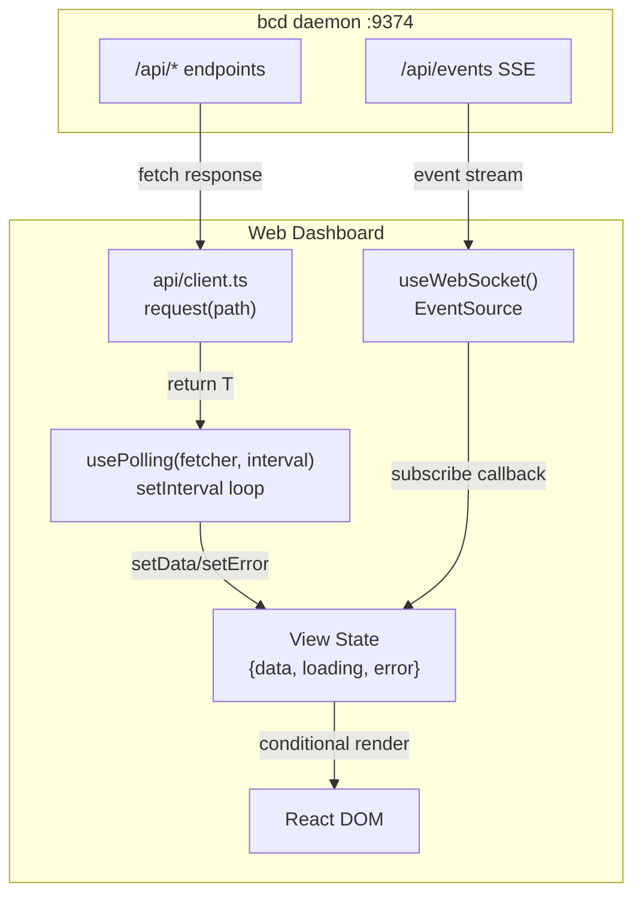
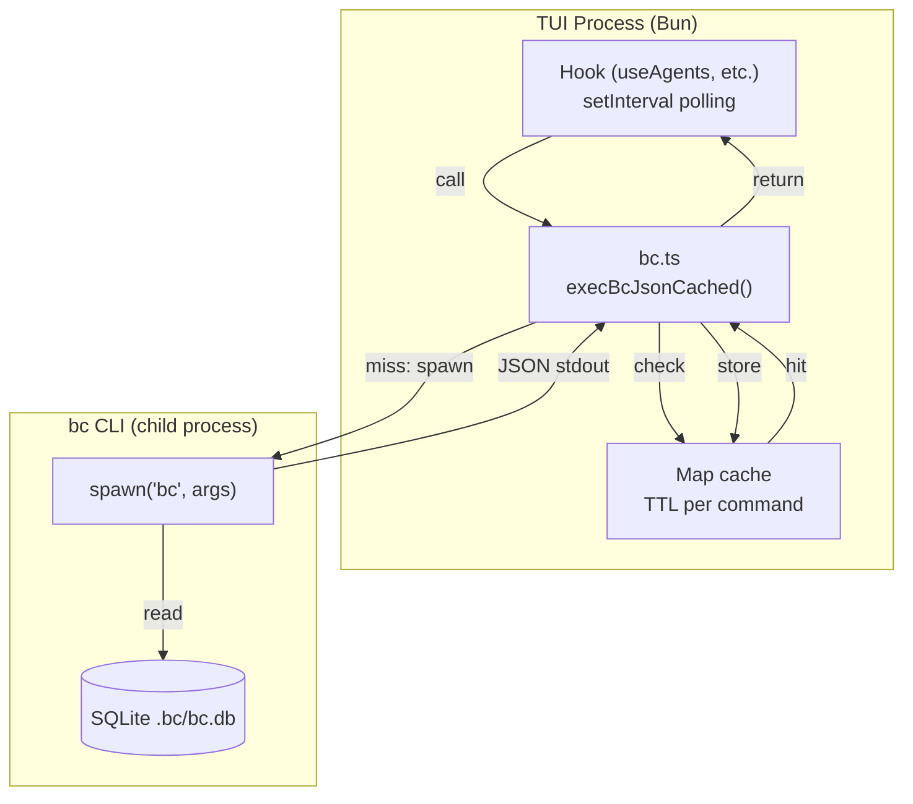
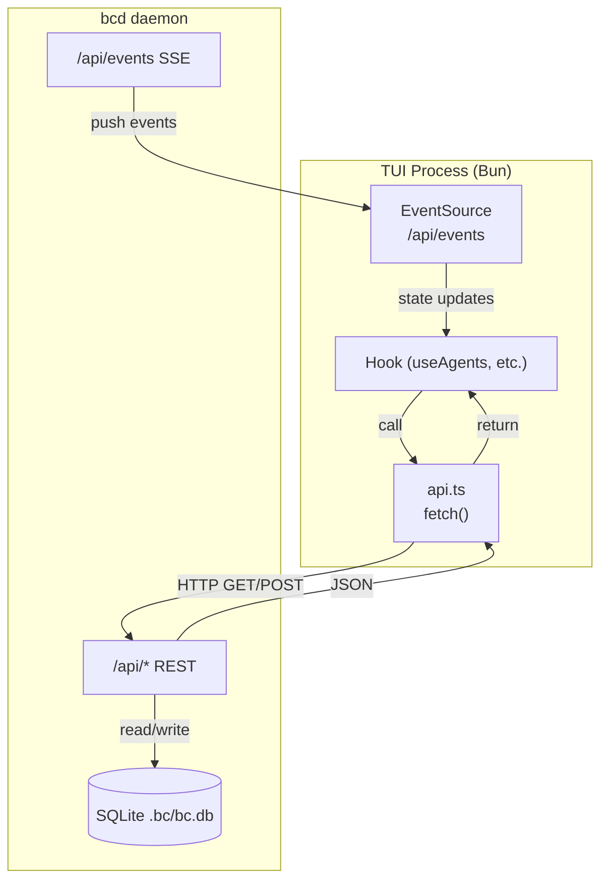
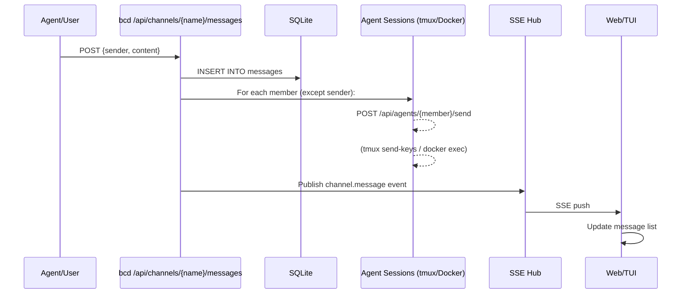

# Frontend Data Flow

How data flows from the bcd daemon through the frontend layers in bc's web dashboard and TUI.

## Overview

Two frontend applications consume workspace data:

1. **Web dashboard** (`web/src/`) -- browser React SPA. Uses `fetch()` to REST API + `EventSource` SSE for real-time.
2. **TUI** (`tui/src/`) -- terminal React/Ink app. Currently spawns `bc` CLI subprocesses. Target: HTTP calls to bcd API.

---

## API Surface

| Endpoint | Method | Used By | Purpose |
|----------|--------|---------|----------|
| `/api/agents` | GET | Web, TUI | List agents with state |
| `/api/agents/{name}` | GET | Web | Single agent detail |
| `/api/agents/{name}/start` | POST | Web | Start agent |
| `/api/agents/{name}/stop` | POST | Web | Stop agent |
| `/api/agents/{name}/send` | POST | Web | Send text to agent session |
| `/api/agents/{name}/peek` | GET | TUI | Read terminal output |
| `/api/channels` | GET | Web, TUI | List channels |
| `/api/channels/{name}/history` | GET | Web, TUI | Message history |
| `/api/channels/{name}/messages` | POST | Web, TUI | Send message |
| `/api/costs` | GET | Web, TUI | Cost summary |
| `/api/costs/agents` | GET | Web | Per-agent costs |
| `/api/logs` | GET | Web, TUI | Event log |
| `/api/workspace/roles` | GET | Web, TUI | Resolved roles |
| `/api/tools` | GET | Web, TUI | Tool list |
| `/api/mcp` | GET | Web, TUI | MCP server list |
| `/api/secrets` | GET | Web, TUI | Secret metadata |
| `/api/cron` | GET | Web | Cron jobs |
| `/api/daemons` | GET | Web | Daemon list |
| `/api/events` | GET (SSE) | Web, TUI (target) | Real-time event stream |

---

## Web Dashboard Data Flow



### Polling path
1. View creates memoized fetcher calling `api.*` methods
2. `usePolling` calls fetcher on mount + `setInterval`
3. Returns `{data, loading, error}` triple
4. View renders loading/error/data conditionally

### SSE path
1. `useWebSocket` opens `EventSource` to `/api/events`
2. On error, reconnects after 3s
3. Views `subscribe(type, callback)` to trigger `refresh()`
4. Only Agents and Channels views use SSE currently

---

## TUI Data Flow -- Current (CLI Subprocess)



**Cache TTLs:** status=1s, channel:list=5s, channel:history=2s, cost:show=10s, role:list=30s, workspace:list=60s

**Cost per call:** ~100ms process startup + exec + parse

---

## TUI Data Flow -- Target (API)



**Cost per call:** ~1ms fetch (localhost)
**Real-time:** SSE replaces polling for agent state changes

---

## SSE Event System

Server-side hub (`server/ws/hub.go`) publishes events on state changes.

| Event Type | Trigger | Payload |
|------------|---------|----------|
| `connected` | SSE connection opened | `{"status": "connected"}` |
| `agent.created` | Agent created | `{"name", "role", "tool"}` |
| `agent.started` | Agent started | `{"name"}` |
| `agent.stopped` | Agent stopped | `{"name", "reason"}` |
| `agent.deleted` | Agent deleted | `{"name"}` |
| `agent.renamed` | Agent renamed | `{"old_name", "new_name"}` |
| `agents.stopped_all` | Stop-all called | `{"stopped": N}` |
| `channel.message` | New message posted | `{"channel", "sender", "content"}` |

Client subscription model:
```typescript
// Web: useWebSocket().subscribe(type, callback)
const unsub = subscribe('agent.state_changed', () => void refresh());
return () => unsub(); // cleanup
```

---

## Channel Message Delivery



---

## Polling vs SSE Decision Matrix

| Data | Web (current) | TUI (current) | TUI (target) |
|------|--------------|---------------|---------------|
| Agent list | Polling 5s + SSE | Polling 2s | SSE primary, polling fallback |
| Agent state | SSE `agent.state_changed` | Polling 2s + debounce | SSE primary |
| Channel list | Polling 10s | Polling 3s | Polling 10s |
| Channel messages | SSE `channel.message` | Polling 2s | SSE primary |
| Cost summary | Polling 10s | Polling 5s | Polling 30s |
| Logs | Polling 5s | Polling 3s | SSE (new event type needed) |
| Roles | Polling 30s | Polling 30s | Polling 60s |
| Tools/MCP/Secrets | Polling 30s | Polling 30s | Polling 60s |

---

## Known Issues and Migration Plan

| Issue | Description |
|-------|-------------|
| #2128 | Web API client has no AbortController -- memory leaks on unmount |
| #2171 | Web Channels message duplication from WebSocket + fetch race |
| #2174 | TUI bc.ts command cache unbounded (no LRU eviction) |

### TUI Migration Steps (#2155)
1. Create `tui/src/services/api.ts` with fetch-based client (same function signatures as bc.ts)
2. Add `tui/src/services/sse.ts` with EventSource client
3. Migrate hooks one-by-one: useAgents, useChannels, useCosts, useLogs, useDashboard
4. Remove in-memory cache (daemon manages freshness)
5. Remove `_setSpawnForTesting` -- use fetch mocking instead
