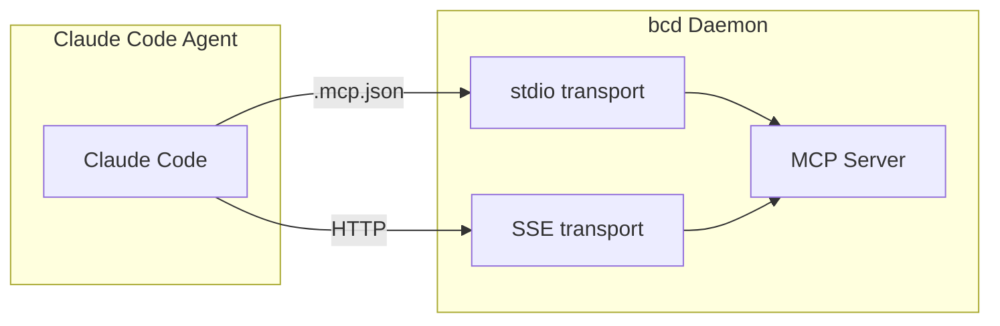

# MCP Server Architecture

## Overview

bc exposes a Model Context Protocol (MCP) server so AI agents can read state and take actions. Protocol version: `2024-11-05`.

## Transports

| Transport | Entry | Limit | Use Case |
|-----------|-------|-------|----------|
| stdio | `bc mcp serve` | 4MB/line | Claude Code direct via .mcp.json |
| SSE | `/mcp/sse` + `/mcp/message` | 4MB body | Browser clients, remote |

## Resources (read-only)

| URI | Description |
|-----|-------------|
| `bc://agents` | All agents with state, role, tool, workspace |
| `bc://agents/{name}` | Single agent detail + recent output |
| `bc://teams` | Team hierarchy tree |
| `bc://channels` | All channels with member counts |
| `bc://channels/{name}/history` | Last 50 messages |
| `bc://costs` | Workspace + per-agent + per-model breakdown |
| `bc://roles` | Available roles with MCP/secret associations |
| `bc://tools` | AI tools with availability check |
| `bc://status` | System status summary |

## Tools (curated actions)

### Agent Management

| Tool | Args | Description |
|------|------|-------------|
| `create_agent` | name, role, workspace, tool, team | Create and start agent |
| `stop_agent` | name | Stop running agent |
| `delete_agent` | name, force | Delete + cleanup worktree |
| `send_to_agent` | name, message | Send text to session |
| `list_agents` | role, state | List with filters |

### Communication

| Tool | Args | Description |
|------|------|-------------|
| `send_message` | channel, message, sender | Post to channel, triggers delivery |
| `list_channels` | — | List all channels |
| `read_channel` | channel, limit | Read recent messages |

### Status & Costs

| Tool | Args | Description |
|------|------|-------------|
| `report_status` | agent, task | Update task description |
| `query_costs` | agent, team, period | Query cost data |

### Scheduling

| Tool | Args | Description |
|------|------|-------------|
| `create_cron` | name, schedule, agent, prompt | Schedule recurring task |
| `list_crons` | — | List scheduled jobs |

## Notifications

| Method | Trigger |
|--------|---------|
| `notifications/message` | New channel message |
| `notifications/agent_state` | Agent state change |

Channel polling uses message ID watermarks (not array length) to avoid the >100 message bug.

## External MCP Server Management

bc manages MCP servers that agents connect to (Playwright, GitHub, etc.):

- Stored in `mcp_servers` table
- Associated with roles via `role_mcp_servers`
- Env vars support `${secret:NAME}`
- Written to agent `.mcp.json` during role setup

## Code Map

| File | Purpose |
|------|---------|
| `server/mcp/server.go` | Server, dispatcher, polling |
| `server/mcp/protocol.go` | JSON-RPC 2.0 types |
| `server/mcp/tools.go` | Tool implementations |
| `server/mcp/resources.go` | Resource readers |
| `server/mcp/sse.go` | SSE transport + broker |
| `server/mcp/stdio.go` | stdio transport |
| `pkg/mcp/store.go` | External MCP config storage |
