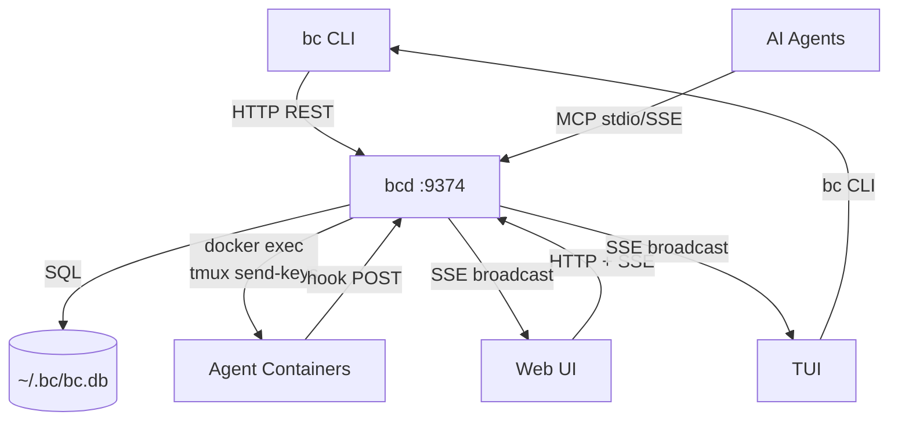
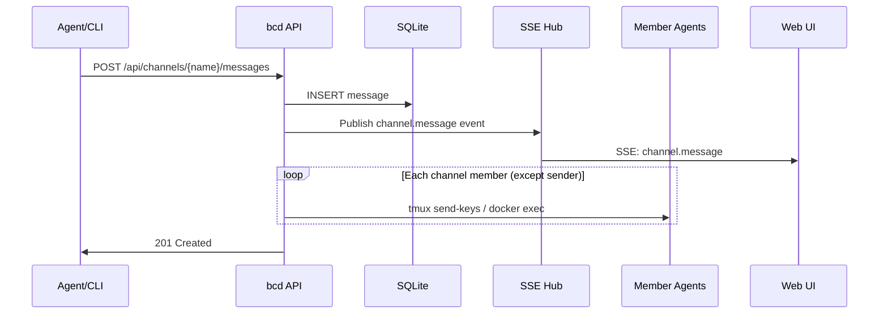
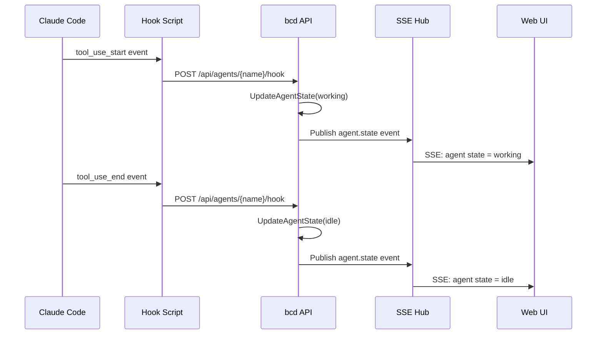
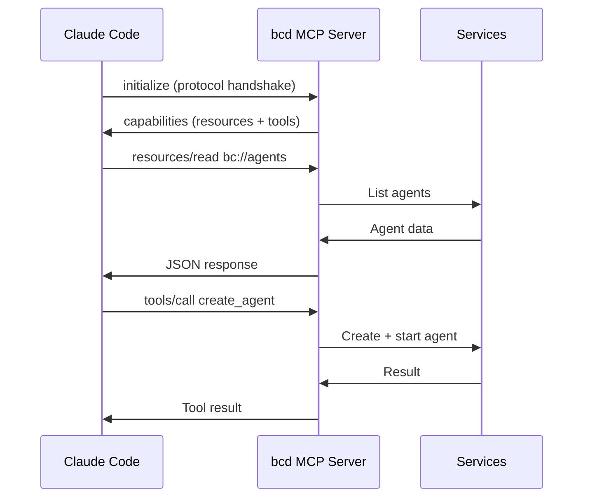
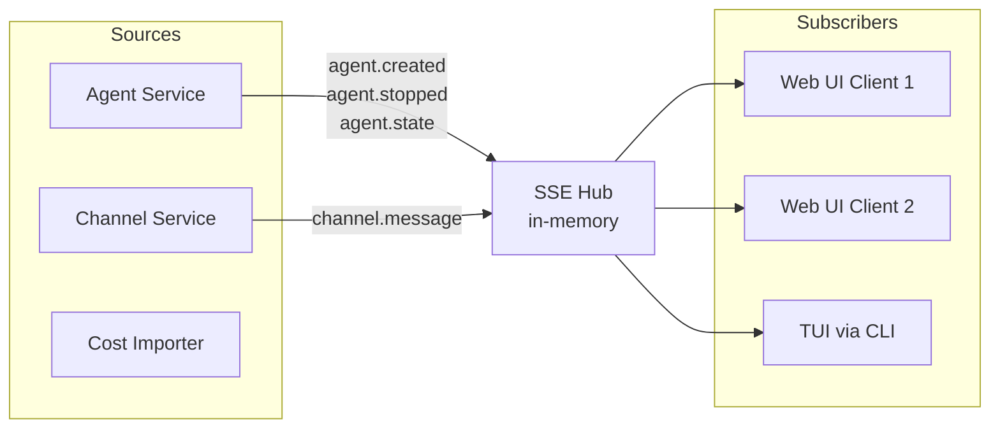

# Networking & Communication Architecture

## Component Communication



All communication flows through **bcd** as the central hub. No component talks directly to another.

## Protocol Reference

| Interface | Protocol | Endpoint | Purpose |
|-----------|----------|----------|---------|
| REST API | HTTP/JSON | `/api/*` (68 endpoints) | CRUD for all resources |
| SSE Events | HTTP SSE | `/api/events` | Real-time state updates |
| MCP (stdio) | JSON-RPC 2.0 | stdin/stdout | Agent -> bcd integration |
| MCP (SSE) | JSON-RPC 2.0 | `/mcp/sse` + `/mcp/message` | Remote MCP clients |
| Health | HTTP | `/health` | Liveness probe |

## Message Delivery Flow

When a message is sent to a channel, it's delivered to all members:



## Agent Hook Event Flow

Claude Code hooks fire on tool use start/stop, updating agent state:



## MCP Integration

AI agents connect to bcd's MCP server to read workspace state and take actions:



### MCP Transports

| Transport | Connection | Use Case |
|-----------|-----------|----------|
| **stdio** | `bc mcp serve` via `.mcp.json` | Claude Code agents (local) |
| **SSE** | `GET /mcp/sse` + `POST /mcp/message` | Remote/browser MCP clients |

Both have a 4MB message size limit.

## SSE Event System

bcd maintains an in-memory SSE hub. All connected clients (web UI, TUI) receive real-time events.



### Event Types

| Event | Trigger | Payload |
|-------|---------|---------|
| `connected` | Client connects to SSE | `{"status":"connected"}` |
| `agent.created` | Agent created | `{"name","role","tool"}` |
| `agent.started` | Agent started/restarted | `{"name"}` |
| `agent.stopped` | Agent stopped | `{"name","reason"}` |
| `agent.deleted` | Agent deleted | `{"name"}` |
| `agent.renamed` | Agent renamed | `{"old_name","new_name"}` |
| `agents.stopped_all` | All agents stopped | `{"count"}` |
| `channel.message` | New message posted | `{"channel","message"}` |

## Request/Response Format

### Success Response
```json
{
  "name": "eng-01",
  "role": "engineer",
  "state": "idle"
}
```

### Error Response
```json
{
  "error": "agent not found: eng-01"
}
```

All responses use `Content-Type: application/json`.

## CORS Policy

- **Default**: `Access-Control-Allow-Origin: *` (safe on loopback)
- **Methods**: GET, POST, PUT, PATCH, DELETE, OPTIONS
- **Headers**: Content-Type, Authorization

Wildcard CORS is acceptable because bcd binds to `127.0.0.1` by default. When exposed beyond loopback (Docker `0.0.0.0`), CORS should be restricted.

## Connection Lifecycle

### SSE Connections
- Server sends `data: {"type":"connected"}` immediately on connect
- No keepalive pings (relies on TCP keepalive)
- Client reconnects on disconnect (EventSource auto-reconnect)
- WriteTimeout disabled on server for long-lived SSE connections
- IdleTimeout: 120 seconds

### MCP SSE Connections
- Server sends `event: endpoint` with message POST URL on connect
- Client POSTs JSON-RPC to the message endpoint
- Server sends responses via SSE stream
- ReadHeaderTimeout: 10 seconds (Slowloris protection)

## Port Allocation

| Port | Service | Binding |
|------|---------|---------|
| 9374 | bcd (REST + SSE + MCP + Web UI) | `127.0.0.1` (default) |
| 5432 | bcdb (PostgreSQL) | `127.0.0.1` |

Single port for bcd serves everything: REST API, SSE events, MCP protocol, and embedded web UI (SPA with client-side routing).