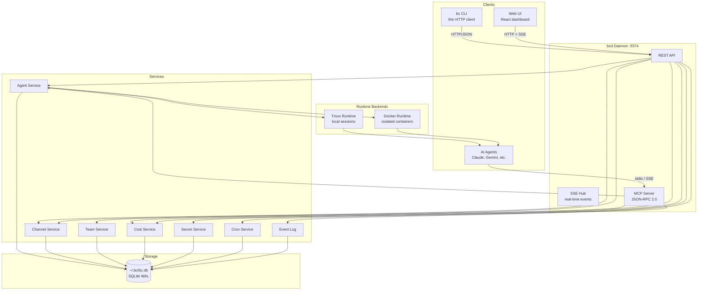
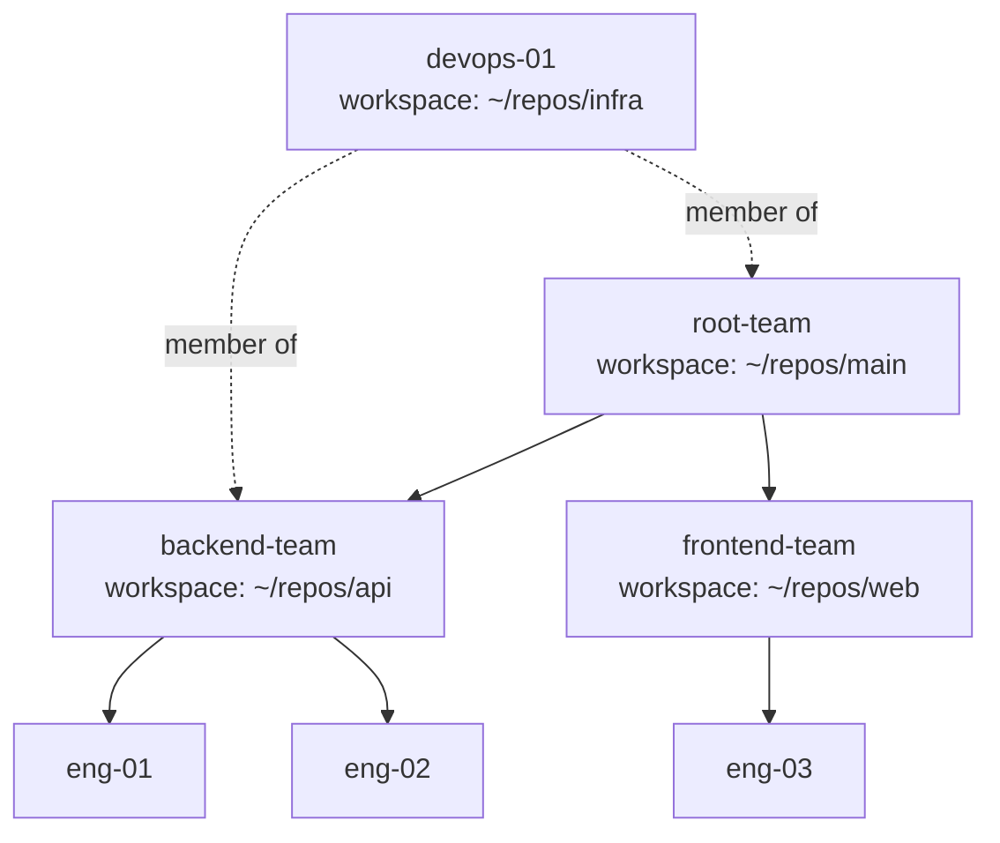
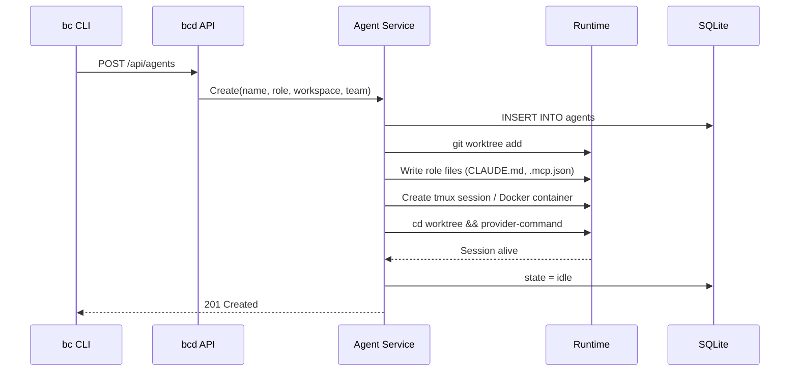
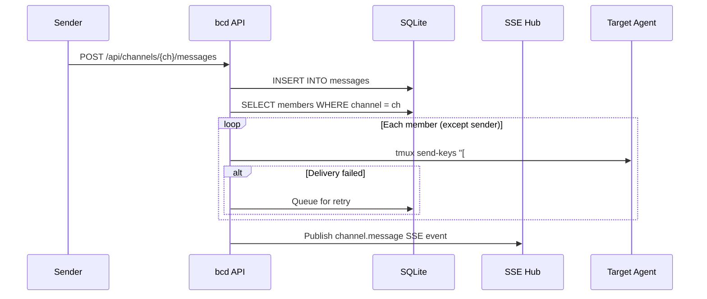
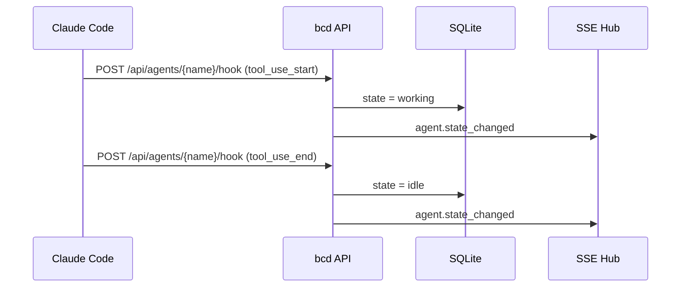

# Architecture Overview

## System Design

bc is a CLI-first orchestration system for coordinating teams of AI coding agents. It runs locally as a daemon (`bcd`) managing agents across multiple git repositories from a single global installation.

### Global Installation

All bc state lives in `~/.bc/`:

```
~/.bc/
  bc.db                  # All data (agents, teams, channels, costs, etc.)
  settings.toml          # Global config (providers, runtime, defaults)
  secret-key             # Auto-generated AES-256 encryption key (0600)
  agents/
      .claude/            # Claude config (mounted into containers)
        CLAUDE.md      # Role prompt
        settings.json  # Claude Code settings + hooks
        .mcp.json      # MCP server configs
          CLAUDE.md      # Role prompt
          settings.json  # Claude Code settings + hooks
          .mcp.json      # MCP server configs
      worktree/          # Git worktree checkout
```

There is no per-project config. `bc init` initializes `~/.bc/` and starts bcd.

## Architecture Layers



## Components

### bc CLI (`cmd/bc/`)

Thin HTTP client. All commands are HTTP requests to bcd — no direct DB/filesystem access.

### bcd Daemon (`cmd/bcd/`, `server/`)

Long-running HTTP server on `127.0.0.1:9374`. Single process managing all state.

| Component | Path | Purpose |
|-----------|------|---------|
| REST API | `/api/*` | CRUD for all resources |
| SSE Hub | `/api/events` | Real-time event stream |
| MCP Server | `/mcp/*` | AI agent integration (JSON-RPC 2.0) |
| Web UI | `/` | Embedded React dashboard |
| Health | `/health` | Liveness + readiness probe |

### Agents

AI coding assistants running in isolated sessions. Each agent has:
- A tmux session or Docker container
- A git worktree (created and managed by bc)
- A role defining its prompt, MCP servers, and secrets
- An associated workspace (git repo path)
- Optional team membership for organizational grouping

See [agents.md](agents.md) for lifecycle, state machine, and runtime details.

### Teams

Hierarchical organizational groups for visualizing agents. Decoupled from agent lifecycle:



- Teams are **views**, not ownership — agents exist independently
- Agents can appear in **multiple teams** (many-to-many via `team_members`)
- Teams form a tree via `parent_id`
- Teams can have a default workspace; agents inherit it but can override
- Deleting a team does NOT delete its agents

### Channels

SQLite-backed messaging for agent coordination:
- Group and direct channels with member management
- Message types: text, task, review, approval, merge, status
- @mentions, reactions, FTS5 search
- Delivery to agents via `tmux send-keys` with formatted context: `[#channel @sender] message`
- Auto-enrollment: agents join team channels on creation
- Retry queue for failed deliveries

### Secrets

AES-256-GCM encrypted secret store. Referenced in agent env vars as `${secret:NAME}`, resolved at runtime. Key derived via PBKDF2-SHA256 (600k iterations).

### Cost Tracking

Automatic import from Claude Code JSONL session files every 5 minutes. Per-agent, per-team, per-model breakdown with budget enforcement.

## Data Flow

### Agent Creation



### Channel Message Delivery



### Agent State via Hooks



## Key Design Decisions

| Decision | Choice | Rationale |
|----------|--------|-----------|
| Global `~/.bc/` | Not per-project | One daemon manages agents across all repos |
| SQLite WAL | Only DB for now | Zero-config, local-first. Server DB deferred |
| Teams as views | Decoupled, many-to-many | No lifecycle coupling; pure organization |
| bc owns worktrees | All providers, uniform | Avoids nesting; consistent across Claude/Gemini/etc. |
| tmux send-keys | Only delivery mechanism | Hooks are one-way; no other way into agent session |
| No RBAC | Deleted | Capabilities via secrets + MCP scoping |
| No auth | Localhost only | Local dev tool; auth when remote access needed |
| MCP curated tools | Subset of API | Agents get key operations, not full admin |
| INTEGER timestamps | Unix millis | Faster range queries, smaller storage than TEXT ISO8601 |
| goose migrations | Not CREATE TABLE IF NOT EXISTS | Proper versioning, rollback support |
