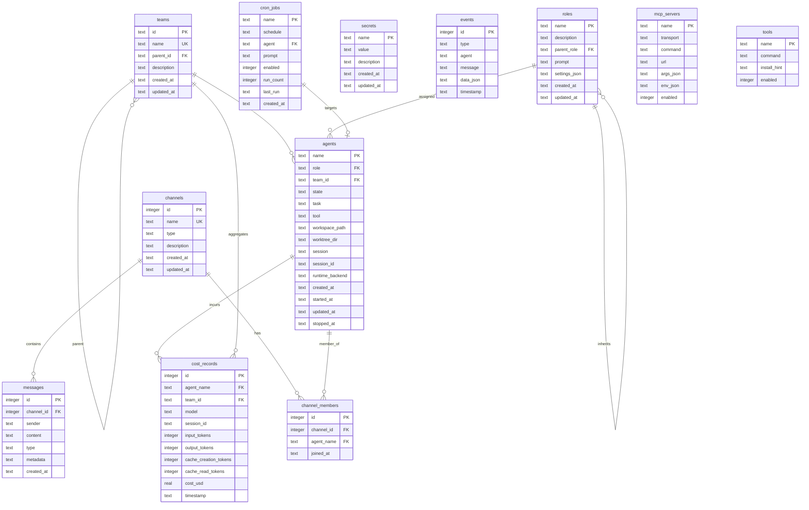
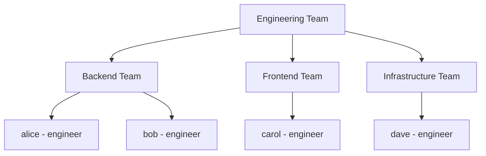
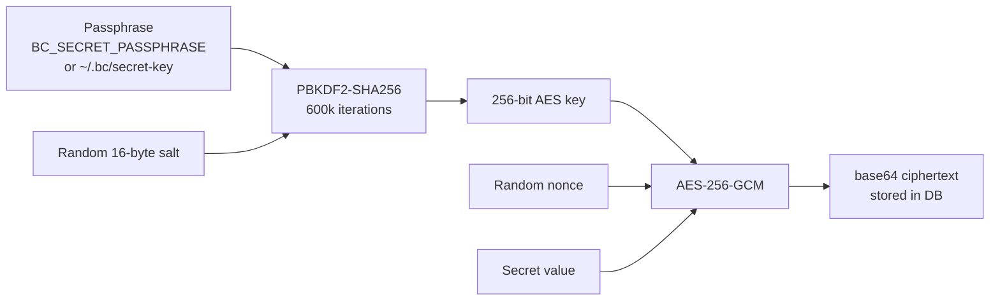

# Storage & Data Architecture

## Filesystem Layout

bc stores all state globally under `~/.bc/` (not per-project):

```
~/.bc/
  bc.db                     # Main SQLite database (all tables)
  settings.toml             # Global settings
  secret-key                # AES-256 encryption key (0600 perms)
  agents/
    alice/
      auth/.claude/         # Provider auth (Claude settings, sessions)
      auth/.claude.json     # Provider config
    bob/
      auth/.claude/
  logs/
    alice.log               # Agent session logs
    bob.log
    daemon-bcdb.log         # Daemon process logs
```

Each agent has an associated **workspace** — a path to a git repo. The agent's worktree lives inside that repo at `.claude/worktrees/<project>-<agent>/`.

## Database Schema



## Key Design Decisions

### Teams (replacing workspaces)

Teams are hierarchical groups that organize agents as a tree:



- A team can contain agents or other teams
- Agents always belong to exactly one team
- Cost aggregation rolls up the tree
- Channel membership can be team-scoped

### Roles in Database

Roles are stored in the `roles` table (not filesystem). Each role defines:
- Prompt template (CLAUDE.md content)
- Settings JSON (model, permissions)
- Parent role (BFS inheritance)
- Associated MCP servers and secrets (via join tables)

CRUD via `POST/GET/PUT/DELETE /api/roles`.

### Workspace Association

Each agent has a `workspace_path` column pointing to a git repository. The agent's worktree is created inside that repo. This replaces the old per-project `.bc/` directory.

## SQLite Configuration

| Pragma | Value | Purpose |
|--------|-------|---------|
| `journal_mode` | WAL | Concurrent reads during writes |
| `foreign_keys` | ON | Referential integrity |
| `busy_timeout` | 30000ms | Handle concurrent agent access |
| `synchronous` | NORMAL | Performance (WAL makes this safe) |
| `cache_size` | -2000 (2MB) | Page cache |
| `temp_store` | MEMORY | Temp tables in RAM |
| `mmap_size` | 256MB | Memory-mapped I/O |

Connection pool: `MaxOpenConns=1`, `MaxIdleConns=1` (SQLite single-writer model).

## Secret Encryption

Secrets are encrypted at rest using AES-256-GCM:



The key file (`~/.bc/secret-key`) is auto-generated with `0600` permissions on first use.

## Cost Data Pipeline

```mermaid
graph LR
    CLAUDE[Claude Code<br/>JSONL session files] --> IMPORT[Cost Importer<br/>every 5 minutes]
    IMPORT --> PARSE[Parse tokens<br/>+ model pricing]
    PARSE --> DB[(cost_records)]
    DB --> API[/api/costs/*]
    API --> WEB[Web UI<br/>Cost Dashboard]
```

The importer scans `~/.bc/agents/*/auth/.claude/` for session JSONL files, extracts token usage, applies model-specific pricing, and inserts records.

## Migration Path

```
OLD (per-project):                NEW (global):
  project/.bc/bc.db        ->     ~/.bc/bc.db
  project/.bc/config.toml  ->     ~/.bc/settings.toml
  project/.bc/agents/      ->     ~/.bc/agents/
  project/.bc/roles/*.md   ->     roles table in bc.db
  project/.bc/logs/        ->     ~/.bc/logs/
```

Migration tool: `bc migrate` — copies data from per-project `.bc/` to `~/.bc/`, converts role files to database records.