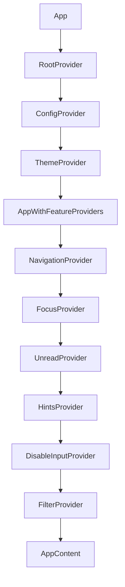
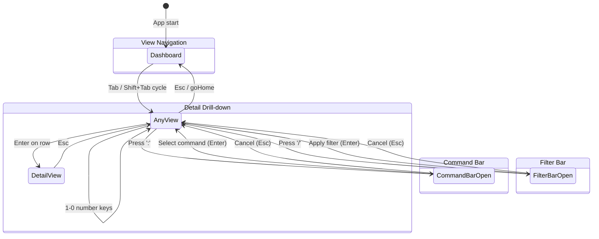
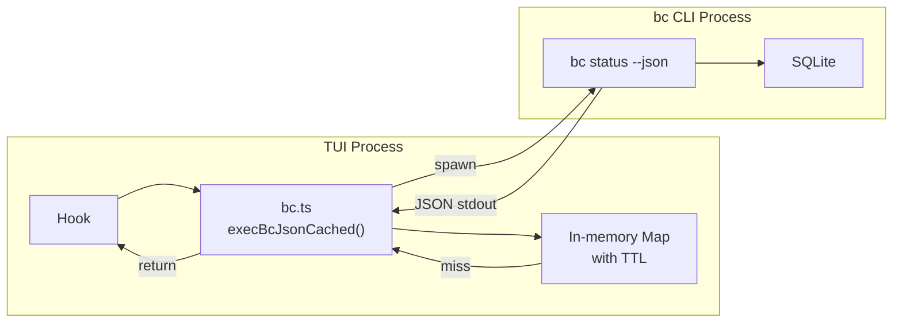
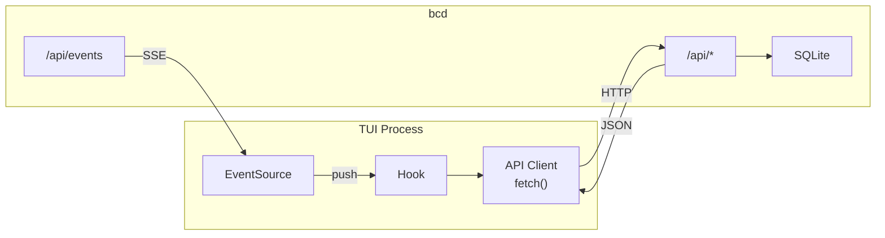
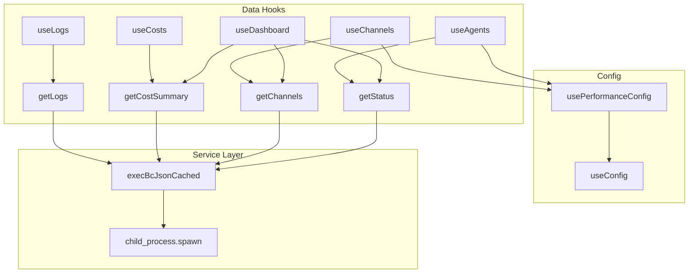
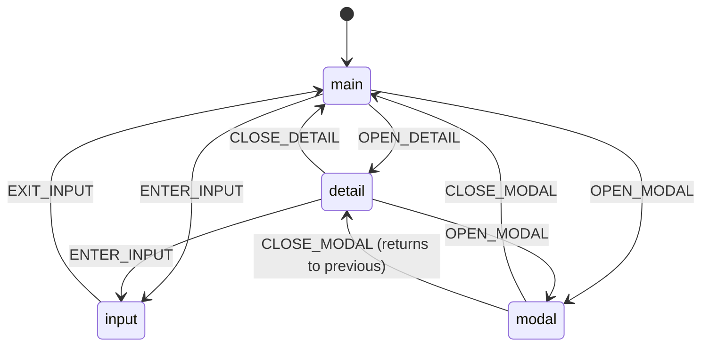

# TUI Architecture

## Overview

The bc TUI is a terminal user interface for the bc agent orchestration system. It is the primary interface for monitoring and managing AI agents, channels, costs, and workspace state.

**Tech stack:**
- React 18 + [Ink 4](https://github.com/vadimdemedes/ink) (React renderer for terminal UIs)
- TypeScript (strict mode)
- Bun (runtime, bundler, test runner)
- CommonJS output compiled to `tui/dist/`

**File counts (as of 2026-03):**
- 106 source files (`tui/src/`)
- 111 test files (`tui/src/**/__tests__/`)

**Entry point:** `tui/src/index.tsx` -- validates TTY, calls `render(<App />)` via Ink.

---

## Provider Architecture

| Provider | File | Purpose |
|---|---|---|
| `RootProvider` | `tui/src/providers/RootProvider.tsx` | Groups ConfigProvider + ThemeProvider |
| `ConfigProvider` | `tui/src/config/ConfigContext.tsx` | Fetches workspace config, provides `PerformanceConfig` and `TUIConfig` |
| `ThemeProvider` | `tui/src/theme/ThemeContext.tsx` | Dark/light mode, color accessor, theme cycling |
| `NavigationProvider` | `tui/src/navigation/NavigationContext.tsx` | Current view, history stack, tab cycling, breadcrumbs |
| `FocusProvider` | `tui/src/navigation/FocusContext.tsx` | Focus area tracking (main, detail, input, modal, command, filter, view) |
| `UnreadProvider` | `tui/src/hooks/UnreadContext.tsx` | Per-channel unread counts, persisted to `~/.bc/tui-unread.json` |
| `HintsProvider` | `tui/src/hooks/useHintsContext.tsx` | View-specific keyboard hints for the global footer |
| `DisableInputProvider` | `tui/src/hooks/useDisableInput.tsx` | Global input gating |
| `FilterProvider` | `tui/src/hooks/useFilter.tsx` | Global `/filter` query state |

---

## View System

12 views rendered by `ViewContent` switch in `tui/src/app.tsx`:

| View | File | Data Source |
|---|---|---|
| Dashboard | `tui/src/views/Dashboard.tsx` | `useDashboard` |
| Agents | `tui/src/views/AgentsView.tsx` | `useAgents` |
| Channels | `tui/src/views/ChannelsView.tsx` | `useChannelsWithUnread` |
| Costs | `tui/src/views/CostsView.tsx` | `useCosts` |
| Logs | `tui/src/views/LogsView.tsx` | `useLogs` |
| Roles | `tui/src/views/RolesView.tsx` | `getRoles()` |
| Worktrees | `tui/src/views/WorktreesView.tsx` | `getWorktrees()` |
| Tools | `tui/src/views/ToolsView.tsx` | `getToolList()` |
| MCP | `tui/src/views/MCPView.tsx` | `getMCPList()` |
| Secrets | `tui/src/views/SecretsView.tsx` | `getSecretList()` |
| Processes | `tui/src/views/ProcessesView.tsx` | `getProcessList()` |
| Help | `tui/src/views/HelpView.tsx` | Static |

### Navigation Model

Number key mappings: `1=Dashboard  2=Agents  3=Channels  4=Costs  5=Roles  6=Logs  7=Worktrees  8=Tools  9=MCP  0=Secrets  -=Processes`

---

## Data Layer

### Current: CLI Subprocess Spawning

Default TTLs: status=1s, channel:list=5s, channel:history=2s, cost:show=10s, role:list=30s.

### Target: bcd REST API + SSE (#2155)

---

## Hook Architecture

---

## Keyboard Navigation

| Tier | Scope | Keys | When Active |
|---|---|---|---|
| **Global** | Always | `:` `/` `?` `Tab` `1-0` `q` `Esc` `Ctrl+R` | FocusArea != input/command/filter |
| **View-local** | Per view | `j/k` `g/G` `Enter` `r` | FocusArea == main or detail |
| **Context** | Overlays | `Esc` `Enter` text input | FocusArea == input/modal |

### Focus State Machine

---

## Theme System

**Current:** ANSI 16-color names (primary=cyan, accent=magenta, success=green, error=red).

**Target (#2154):** Solar Flare palette (primary=orange `#EA580C`, accent=amber `#FB923C`). Truecolor hex when supported, ANSI fallback.

---

## Testing

111 test files. `bun:test` + `ink-testing-library` + `@testing-library/react`.

Key patterns: mock spawn injection via `_setSpawnForTesting()`, viewport tests for 80x24, render performance benchmarks, E2E tmux integration tests.

---

## Known Issues

| Issue | Summary |
|---|---|
| #2130 | Missing PageUp/PageDown navigation |
| #2131 | Focus trap incomplete for overlays |
| #2133 | AgentDetailView 595-line god component |
| #2134 | CostsView 613-line god component |
| #2135 | Stale closure in useChannelsWithUnread |
| #2136 | useAgents debounce refs memory leak |
| #2173 | AgentsView setTimeout leak on unmount |
| #2174 | bc.ts command cache unbounded |

---

## Migration Plan

1. **CLI to API (#2155):** Replace `bc.ts` spawn with `fetch()` to bcd. Add SSE for real-time. Feature flag `BC_USE_API=1` during transition.
2. **Solar Flare (#2154):** Extend `TerminalColor` to support hex. Update themes. Audit 40+ hardcoded colors.
3. **Teams replace workspaces:** Hierarchical team grouping. Update `useAgentGroups`.
4. **Roles in DB:** Transparent -- `getRoles()` returns same JSON shape regardless of backend storage.
