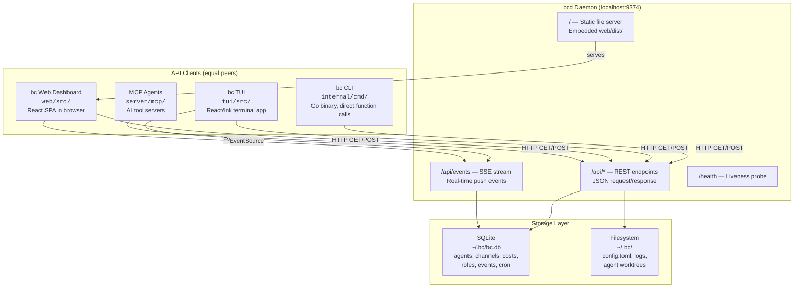
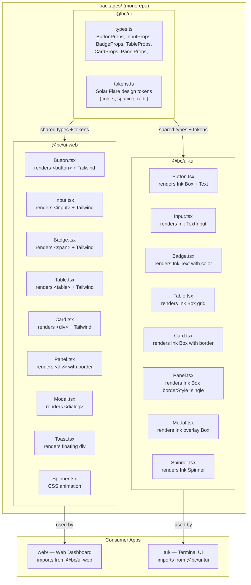
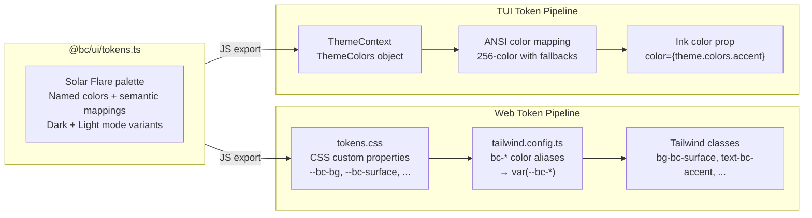
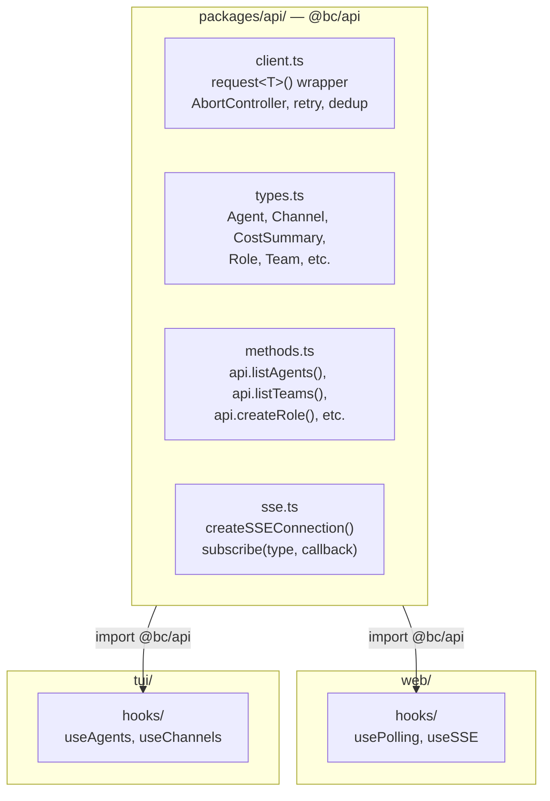
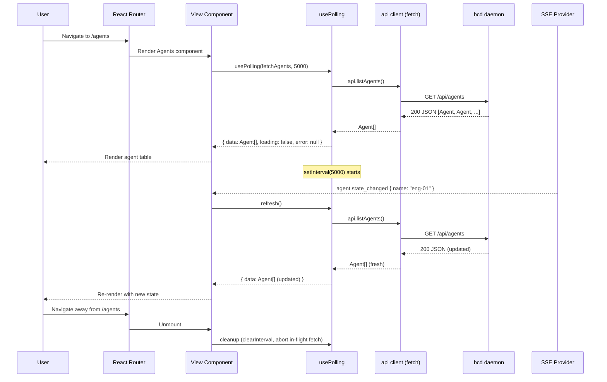
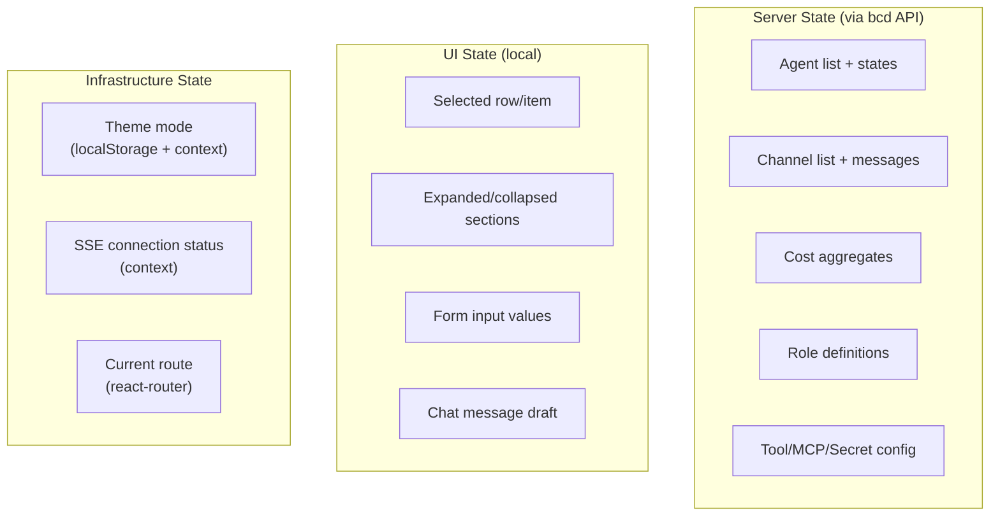

# Web Dashboard Architecture

Design document for the bc web dashboard — one of four equal API clients of the `bcd` daemon.

---

## 1. System Context

The web dashboard is one of four equal API consumers of the `bcd` daemon. It has no special access, no elevated privileges, and no server-side rendering dependency on `bcd` internals. Every operation available in the web UI is available through the same REST + SSE API that the CLI, TUI, and MCP agents use.



**Key principle:** The web dashboard is a thin view layer. All business logic, persistence, agent orchestration, and event publishing live in `bcd`. The dashboard only renders state received over HTTP and SSE.

---

## 2. Component Architecture

### 2.1 Component Tree

```mermaid
graph TD
    Root["ReactDOM.createRoot"]
    Root --> StrictMode["React.StrictMode"]
    StrictMode --> TP["ThemeProvider<br/>light/dark mode, Solar Flare tokens"]
    TP --> SSEP["SSEProvider<br/>singleton EventSource"]
    SSEP --> Router["BrowserRouter / Next.js App Router"]
    Router --> Layout["Layout Shell"]

    subgraph Layout ["Layout Shell (AppShell)"]
        Sidebar["Sidebar<br/>@bc/ui NavLink, Badge"]
        Header["Header Bar<br/>team selector, theme toggle"]
        Main["Main Content Area<br/>Outlet / children"]
        Toast["Toast Container<br/>@bc/ui Toast"]
    end

    Layout --> Suspense["React.Suspense<br/>per-route lazy loading"]
    Suspense --> Views["View Components"]

    subgraph Views ["Views (lazy-loaded)"]
        V_Dash["Dashboard"]
        V_Agents["Agents"]
        V_Channels["Channels"]
        V_Costs["Costs"]
        V_Teams["Teams"]
        V_Roles["Roles (CRUD)"]
        V_Tools["Tools"]
        V_MCP["MCP"]
        V_Logs["Logs"]
        V_Cron["Cron"]
        V_Secrets["Secrets"]
        V_Doctor["Doctor"]
    end

    subgraph SharedLib ["@bc/ui — Shared Component Library"]
        Button["Button"]
        Input["Input"]
        Badge["Badge / StatusBadge"]
        Table["Table"]
        Card["Card"]
        Panel["Panel"]
        Modal["Modal"]
        ToastComp["Toast"]
        Spinner["Spinner / LoadingIndicator"]
    end

    Views -->|"imports"| SharedLib
```



**Structural decisions:**

- Every view is wrapped in its own `ErrorBoundary` so a crash in one view does not affect the sidebar or other views. A root-level `ErrorBoundary` wraps the entire `BrowserRouter` as a last resort.
- `Layout` (`web/src/components/Layout.tsx`) renders a fixed 192px sidebar with `NavLink` items and an `<Outlet />` for the matched child route.
- Views are lazy-loaded per route via `React.Suspense`.

### 2.2 Shared Components

| Component | File | Purpose |
|---|---|---|
| `Layout` | `web/src/components/Layout.tsx` | Shell: sidebar nav + main content area via `<Outlet/>` |
| `ErrorBoundary` | `web/src/components/ErrorBoundary.tsx` | Class component; catches render errors, shows retry UI |
| `StatusBadge` | `web/src/components/StatusBadge.tsx` | Colored pill for agent states (idle, working, done, stuck, error, stopped) |
| `Table<T>` | `web/src/components/Table.tsx` | Generic typed table with columns, row click, empty state |

---

## 3. Shared Component Library Design

### 3.1 Problem Statement

The web dashboard and TUI duplicate every UI primitive. Both have a `StatusBadge`, both have a `Table`, both have a `Panel` -- but with incompatible interfaces and no code sharing. When the Solar Flare design system rolls out, every component must be updated in two places. When a new component is needed, it is built twice.

### 3.2 Architecture: Common Interface, Separate Renderers

The shared library lives in a `packages/ui/` monorepo package. It exports a common props interface for each primitive. Two renderer packages provide platform-specific implementations.



### 3.3 Primitive Component Inventory

Each primitive has a single props interface in `@bc/ui` and two renderers.

| Component | `@bc/ui` Props | `@bc/ui-web` Renders As | `@bc/ui-tui` Renders As |
|---|---|---|---|
| **Button** | `variant`, `size`, `disabled`, `onClick`, `children` | `<button>` with Tailwind classes | Ink `<Box>` with border + `<Text>` |
| **Input** | `value`, `onChange`, `placeholder`, `disabled` | `<input>` with Tailwind | Ink `TextInput` component |
| **Badge** | `variant` (status/role/info), `children` | `<span>` pill with bg/text colors | Ink `<Text>` with ANSI color |
| **StatusBadge** | `state` (idle/working/done/error/...) | `<span>` with semantic color classes | Ink `<Text>` with symbol + color |
| **Table** | `columns`, `data`, `keyFn`, `onRowClick`, `emptyMessage` | HTML `<table>` | Ink `<Box>` column layout |
| **Card** | `title`, `children`, `variant` | `<div>` with border + padding | Ink `<Box>` with borderStyle |
| **Panel** | `title`, `children`, `focused`, `borderColor` | `<div>` with header + border | Ink `<Box borderStyle="single">` |
| **Modal** | `open`, `onClose`, `title`, `children` | `<dialog>` or portal overlay | Ink `<Box>` absolute overlay |
| **Toast** | `message`, `variant` (success/error/info), `duration` | Floating `<div>` with auto-dismiss | Ink `<Box>` at bottom of screen |
| **Spinner** | `label`, `size` | CSS keyframe animation | Ink `<Spinner>` component |
| **ProgressBar** | `value`, `max`, `label` | `<div>` with width percentage | Ink `<Box>` with filled chars |

### 3.4 Design Token Flow



### 3.5 Implementation Strategy

**Phase 1 -- Extract types.** Create `packages/ui/` with shared `Props` interfaces and `tokens.ts`. No renderer changes. Both apps continue using their existing components but the interfaces converge.

**Phase 2 -- Web renderers.** Create `packages/ui-web/` implementing all primitives against the shared interfaces. Migrate `web/src/components/` to re-export from `@bc/ui-web`. The web dashboard's existing components become thin wrappers.

**Phase 3 -- TUI renderers.** Create `packages/ui-tui/` implementing the same interfaces with Ink primitives. Migrate `tui/src/components/` to re-export from `@bc/ui-tui`.

**Phase 4 -- Delete duplicates.** Remove the original component files from both `web/src/components/` and `tui/src/components/`. All imports resolve to `@bc/ui-web` or `@bc/ui-tui`.

---

## 4. Routing and Navigation

### 4.1 Route Map

```mermaid
graph LR
    subgraph Routes ["Routes"]
        I["/ — Dashboard"]
        A["/agents — Agent list"]
        AD["/agents/:name — Agent detail<br/>(terminal peek, cost, logs)"]
        CH["/channels — Channel list"]
        CHD["/channels/:name — Channel chat room"]
        CO["/costs — Cost overview"]
        T_List["/teams — Team list"]
        T_Detail["/teams/:name — Team detail<br/>(members, config, metrics)"]
        RO_List["/roles — Role list"]
        RO_Detail["/roles/:name — Role detail"]
        RO_New["/roles/new — Create role"]
        RO_Edit["/roles/:name/edit — Edit role"]
        T["/tools — Tools"]
        M["/mcp — MCP servers"]
        CR["/cron — Cron jobs"]
        SE["/secrets — Secrets"]
        LO["/logs — Event log"]
        DR["/doctor — Health check"]
    end
```



Navigation is a static `NAV_ITEMS` array in `Layout.tsx`. Each entry has a `to` path, `label`, and single-character `icon`. `NavLink` provides active styling. The index route (`/`) uses the `end` prop.

### 4.2 Next.js File-Based Routing Structure

```
web/src/app/
  layout.tsx              # Root layout: ThemeProvider, SSEProvider, AppShell
  page.tsx                # / — Dashboard
  agents/
    page.tsx              # /agents — Agent list
    [name]/
      page.tsx            # /agents/:name — Agent detail
  channels/
    page.tsx              # /channels — Channel list
    [name]/
      page.tsx            # /channels/:name — Chat room
  costs/
    page.tsx              # /costs — Cost overview
  teams/
    page.tsx              # /teams — Team list
    [name]/
      page.tsx            # /teams/:name — Team detail
  roles/
    page.tsx              # /roles — Role list
    new/
      page.tsx            # /roles/new — Create role
    [name]/
      page.tsx            # /roles/:name — Role detail
      edit/
        page.tsx          # /roles/:name/edit — Edit role
  tools/
    page.tsx              # /tools
  mcp/
    page.tsx              # /mcp
  cron/
    page.tsx              # /cron
  secrets/
    page.tsx              # /secrets
  logs/
    page.tsx              # /logs
  doctor/
    page.tsx              # /doctor
  not-found.tsx           # 404 catch-all
```

---

## 5. Data Layer

### 5.1 API Client

`web/src/api/client.ts` exports a typed `api` object with methods for all REST endpoints. It uses a `request<T>()` helper that prepends `/api`, sets `Content-Type: application/json`, throws on non-2xx, and returns `res.json()` cast to `T`.

**API surface:**

| Method | Endpoint | Used By |
|---|---|---|
| `api.listAgents()` | `GET /api/agents` | Dashboard, Agents |
| `api.getAgent(name)` | `GET /api/agents/:name` | Agent detail |
| `api.startAgent(name)` | `POST /api/agents/:name/start` | Agents |
| `api.stopAgent(name)` | `POST /api/agents/:name/stop` | Agents |
| `api.sendToAgent(name, msg)` | `POST /api/agents/:name/send` | Agents |
| `api.listChannels()` | `GET /api/channels` | Dashboard, Channels |
| `api.getChannelHistory(name)` | `GET /api/channels/:name/history` | Channels |
| `api.sendToChannel(name, msg)` | `POST /api/channels/:name/messages` | Channels |
| `api.getCostSummary()` | `GET /api/costs` | Dashboard, Costs |
| `api.getCostByAgent()` | `GET /api/costs/agents` | Costs |
| `api.listRoles()` | `GET /api/roles` | Roles |
| `api.getRole(name)` | `GET /api/roles/:name` | Role detail |
| `api.createRole(data)` | `POST /api/roles` | Role create form |
| `api.updateRole(name, data)` | `PUT /api/roles/:name` | Role edit form |
| `api.deleteRole(name)` | `DELETE /api/roles/:name` | Role delete action |
| `api.listTools()` | `GET /api/tools` | Tools |
| `api.listMCP()` | `GET /api/mcp` | MCP |
| `api.getLogs(tail)` | `GET /api/logs` | Logs |
| `api.getDoctor()` | `GET /api/doctor` | Doctor |
| `api.listCron()` | `GET /api/cron` | Cron |
| `api.listSecrets()` | `GET /api/secrets` | Secrets |
| `api.listTeams()` | `GET /api/teams` | Teams |
| `api.getTeam(name)` | `GET /api/teams/:name` | Team detail |

**Design requirements:**

- `AbortController` on every `fetch()`, cleaned up in `useEffect` return.
- Request deduplication via a shared API client instance (singleton module or context).
- Exponential backoff retry for transient failures (503, network errors).
- No auth headers -- assumes same-origin (localhost only).

### 5.2 Shared API Client

Both the web dashboard and TUI use the same typed HTTP client, extracted to `packages/api/`:



### 5.3 Data Flow: Typical View Load



---

## 6. State Management

### 6.1 Approach

There is no global state store. Each view manages its own data via `usePolling` and local `useState`. SSE events are delivered through a singleton `SSEProvider` context.



### 6.2 State Categories and Where They Live

| Category | Location | Rationale |
|---|---|---|
| **Agent list** | Per-view `usePolling` + SSE refresh | Server is source of truth; no client cache needed beyond current fetch |
| **Channel messages** | Per-view local state + SSE append | Messages appended via SSE, full refetch for consistency |
| **Cost data** | Per-view `usePolling` | Aggregated, changes slowly |
| **Roles** | Per-view fetch + invalidate on mutation | Refetch after create/update/delete |
| **Theme** | `ThemeProvider` context, persisted to `localStorage` | User preference survives page reload |
| **SSE connection** | Singleton `SSEProvider` context | Single `EventSource` shared across all views |
| **Selected row** | Local `useState` | Ephemeral, resets on navigation |
| **Form state** | Local `useState` (or `useActionState` in React 19) | Ephemeral, tied to form lifecycle |
| **Route params** | `react-router-dom` / Next.js `useParams` | Framework-managed |

### 6.3 Polling and SSE by View

| View | Polling Interval | SSE Events | API Calls |
|---|---|---|---|
| Dashboard | 5s | -- | `listAgents`, `listChannels`, `getCostSummary` |
| Agents | 5s | `agent.state_changed` | `listAgents`, `startAgent`, `stopAgent`, `sendToAgent` |
| Channels | 10s (list) | `channel.message` | `listChannels`, `getChannelHistory`, `sendToChannel` |
| Costs | 10s | -- | `getCostSummary`, `getCostByAgent` |
| Roles | 30s | -- | `listRoles` + full CRUD |
| Tools | 30s | -- | `listTools` |
| MCP | 30s | -- | `listMCP` |
| Logs | 5s | all events | `getLogs` |
| Doctor | 30s | -- | `getDoctor` |
| Cron | 10s | -- | `listCron` |
| Secrets | 30s | -- | `listSecrets` |
| Teams | 10s | -- | `listTeams` |

**Known duplication concerns:**

- Dashboard, Agents, and Costs all independently poll `listAgents` and/or cost endpoints. Multiple `setInterval` timers hit the same endpoints on overlapping schedules.
- `useWebSocket` should be a singleton SSE provider rather than instantiated per component.
- Logs view polls every 5s but should use SSE, since the event log is exactly what SSE was designed for.

---

## 7. Styling and Theme

### 7.1 Token Layer

Styling uses Tailwind CSS utility classes with a custom color palette mapped to CSS custom properties.

**Tokens** (`web/src/theme/tokens.css`):

```css
:root {
  --bc-bg: #0C0A08;          /* Obsidian Warm */
  --bc-surface: #151210;     /* Ember Dark */
  --bc-border: #2A2420;      /* Bark */
  --bc-text: #F5F0EB;        /* Warm White */
  --bc-muted: #8C7E72;       /* Sandstone Dark */
  --bc-accent: #EA580C;      /* Tangerine */
  --bc-success: #22C55E;     /* Success Green Bright */
  --bc-warning: #FB923C;     /* Warning Amber */
  --bc-error: #EF4444;       /* Error Red Bright */
}

[data-theme="light"] {
  --bc-bg: #FBF7F2;          /* Parchment */
  --bc-surface: #FFFFFF;     /* White */
  --bc-border: #E5DDD4;      /* Linen */
  --bc-text: #1E1A16;        /* Umber */
  --bc-muted: #78706A;       /* Sandstone */
  --bc-accent: #EA580C;      /* Tangerine */
  --bc-success: #16A34A;     /* Success Green */
  --bc-warning: #EA580C;     /* Warning Orange */
  --bc-error: #DC2626;       /* Error Red */
}
```

**Tailwind bridge** (`web/tailwind.config.ts`): maps `bc-*` color names to the CSS variables, so classes like `bg-bc-surface`, `text-bc-accent`, `border-bc-border` resolve to the custom properties.

The font stack is `ui-monospace, SFMono-Regular, 'SF Mono', Menlo, monospace`. Theme preference is stored in `localStorage('bc-theme')`, defaulting to system preference via `prefers-color-scheme`. Toggle is managed by `ThemeProvider` context, applied as `data-theme` attribute on `<html>`.

### 7.2 Hardcoded Color Audit

Several views use Tailwind color literals directly instead of `bc-*` tokens. These break in light mode because they have no corresponding light-mode override:

- `Roles.tsx`: `bg-purple-500/20 text-purple-400`, `bg-cyan-500/20 text-cyan-400`, `bg-orange-500/20 text-orange-400`, `bg-blue-500/20 text-blue-400`, `bg-yellow-500/20 text-yellow-400`, `bg-green-500/20 text-green-400`, `bg-emerald-500/20 text-emerald-400`
- `Agents.tsx`, `Tools.tsx`, `MCP.tsx`, `Cron.tsx`, `Secrets.tsx`, `Doctor.tsx`: various hardcoded color literals

All hardcoded colors must migrate to semantic token classes (e.g., `bg-bc-accent/20 text-bc-accent`) or to new categorical tokens (e.g., `--bc-tag-mcp`, `--bc-tag-secret`).

---

## 8. Next.js Considerations

### 8.1 Stack Comparison

| Aspect | Vite | Next.js |
|---|---|---|
| Framework | Vite 6 + react-router-dom 6 | Next.js 15 (App Router) |
| Rendering | Client-side SPA only | SPA initially, progressive SSR later |
| Routing | Declarative `<Routes>` in App.tsx | File-based `app/` directory |
| Build output | Static `dist/` embedded in bcd | Static `out/` via `next export`, embedded in bcd |
| Shared framework | None (landing is Next.js, web is Vite) | Same framework as landing page |
| Code splitting | Manual `React.lazy` | Automatic per-route |

### 8.2 Benefits

1. **Consistency with landing page.** The landing site (`landing/`) already uses Next.js + Tailwind. Sharing the same framework means shared tooling, shared config patterns, and easier knowledge transfer.

2. **Automatic code splitting.** Next.js splits by route automatically. The current Vite setup eagerly imports all 12 views, so the initial bundle includes every view regardless of which route is visited.

3. **File-based routing.** Route definitions become the filesystem structure. No manual `<Route>` registration in `App.tsx`. Adding a new view means adding a directory and `page.tsx`.

4. **Future SSR capability.** If the dashboard ever needs to serve pre-rendered HTML (e.g., shareable report pages, print-friendly cost summaries), Next.js supports this without architectural changes.

5. **API routes.** Next.js API routes could serve as a BFF (backend for frontend) layer if the web dashboard ever needs to aggregate or transform bcd API responses before rendering.

### 8.3 Risks

1. **Added complexity for localhost.** The web dashboard runs on `localhost:9374`. SSR adds a Node.js server requirement, which is unnecessary when bcd (a Go binary) already serves static files. This is mitigated by starting as a fully client-side SPA (`'use client'` on all pages) with `output: 'export'` for static generation.

2. **Build size.** Next.js adds ~80-100KB to the client bundle (React Server Components runtime, router). For a localhost dashboard, this is negligible but worth noting.

3. **Embedding complexity.** The current Vite build produces a flat `dist/` directory that bcd embeds via `//go:embed`. Next.js static export produces a similar flat structure, but the output directory layout differs slightly. The `server/embed.go` file needs updating.

4. **Development experience.** Next.js dev server is slower to start than Vite. Hot module replacement is comparable, but cold start is noticeably slower.

### 8.4 Incremental Approach

**Phase 1 -- SPA in Next.js shell.** All pages use `'use client'` directive. `next.config.ts` sets `output: 'export'` for static generation. The result is functionally identical to the current Vite SPA but with file-based routing.

```typescript
// web/next.config.ts
import type { NextConfig } from 'next';

const config: NextConfig = {
  output: 'export',        // Static export, no Node.js server needed
  distDir: 'dist',         // Match current output dir for bcd embedding
  trailingSlash: false,
};

export default config;
```

**Phase 2 -- Extract shared components.** Move reusable components to `@bc/ui-web`. Both the web dashboard and landing page import from the same package.

**Phase 3 -- Progressive server rendering.** For pages that benefit from SSR (if any), remove `'use client'` and fetch data server-side. This requires running the Next.js server alongside bcd, or using bcd as a reverse proxy. This phase is optional and should only be pursued if there is a concrete SSR use case.

**Phase 4 -- Landing page convergence.** If both the landing site and web dashboard use Next.js, they could become a single Next.js app with route groups: `(marketing)` for the landing pages and `(dashboard)` for the web UI. This is a long-term consideration, not a near-term goal.

---

## 9. Teams Replace Workspaces

### 9.1 Design

Teams are the primary organizational unit. Agents belong to teams, and the agent naming convention encodes team membership: `bc-<session-id-last6>-<team>-<agent>`.

**API:**

| Method | Endpoint | Purpose |
|---|---|---|
| `GET /api/teams` | List all teams | List view |
| `GET /api/teams/:name` | Team detail: members, agents, config, metrics | Detail view |
| `GET /api/roles` | List roles (standalone, not nested under workspace) | Roles view |

**UI:**

| Element | Design |
|---|---|
| Sidebar label | "Teams" |
| Routes | `/teams` (list) + `/teams/:name` (detail) |
| Dashboard summary | Per-team agent counts, team status indicators |
| Agent table | Grouped by team, with team column and filter |
| Agent name display | Parsed: highlight team segment, linkable to team detail |

### 9.2 Agent Naming Convention

Agent names follow `bc-<session-id-last6>-<team>-<agent>`. The web dashboard parses this format to extract and display the team and agent segments separately.

```
bc-a1b2c3-frontend-eng-01
   |       |         |
   |       |         +-- Agent name within team
   |       +-- Team name
   +-- Session ID (last 6 chars)
```

The Agents view displays this as columns: Session, Team, Agent, Role, Status.

---

## 10. Roles: Database-Backed CRUD

### 10.1 API

Roles are stored in SQLite with a full CRUD API:

| Method | Endpoint | Purpose |
|---|---|---|
| `GET /api/roles` | List all roles | List view |
| `GET /api/roles/:name` | Get single role | Detail view |
| `POST /api/roles` | Create role | Create form |
| `PUT /api/roles/:name` | Update role | Edit form |
| `DELETE /api/roles/:name` | Delete role | Delete confirmation |

### 10.2 UI Design

**List view** (`/roles`): Card layout with "Create Role" button and per-card edit/delete actions.

**Create/Edit form** (`/roles/new`, `/roles/:name/edit`): Form with fields for:
- Name (text input, required, immutable on edit)
- Prompt (multiline textarea)
- MCP Servers (tag input)
- Secrets (tag input)
- Plugins (tag input)
- Lifecycle prompts: on-create, on-start, on-stop, on-delete (collapsible section)
- Commands (key-value editor)
- Rules (key-value editor)
- Skills (key-value editor)
- Settings (JSON editor)

**Delete flow**: Confirmation modal ("Delete role `engineer`? This cannot be undone.") before sending `DELETE /api/roles/:name`.

---

## 11. Global Config Directory

The config directory lives at `~/.bc/` as a global location. The web dashboard references this in several places:

- `Roles.tsx` displays labels for role field names from the DB, not filesystem paths.
- The `Doctor` view surfaces file-path-based diagnostics that reference `~/.bc/` paths.
- The `Teams` view shows the workspace config path as `~/.bc/config.toml`.

---

## 12. File Reference

| File | Role |
|---|---|
| `web/src/main.tsx` | Entry point: mounts `<App />` in `React.StrictMode` |
| `web/src/App.tsx` | Route definitions, root `ErrorBoundary` |
| `web/src/components/Layout.tsx` | App shell: sidebar nav + content outlet |
| `web/src/components/ErrorBoundary.tsx` | React error boundary with retry UI |
| `web/src/components/StatusBadge.tsx` | Agent state pill component |
| `web/src/components/Table.tsx` | Generic typed table component |
| `web/src/api/client.ts` | REST API client with typed methods |
| `web/src/api/types.ts` | SSE event type definitions |
| `web/src/hooks/usePolling.ts` | Generic polling hook (fetch + setInterval) |
| `web/src/hooks/useWebSocket.ts` | SSE connection hook (misnamed, uses EventSource) |
| `web/src/views/*.tsx` | 12 view components (one per route) |
| `web/src/theme/tokens.css` | CSS custom properties + Tailwind base |
| `web/tailwind.config.ts` | Tailwind config mapping `bc-*` to CSS vars |
| `web/vite.config.ts` | Vite config: dev proxy to bcd, build output |
| `web/package.json` | `@bc/web` package definition |
| `server/server.go` | bcd server: route registration, static file serving |
| `server/embed.go` | `//go:embed web/dist` for production serving |
| `server/ws/hub.go` | SSE hub: subscriber management, event broadcast |
| `server/handlers/*.go` | REST endpoint handlers (one file per resource) |
| `docs/architecture/design-system.md` | Solar Flare design system specification |
| `docs/architecture/tui.md` | TUI architecture (parallel reference) |
| `docs/architecture/frontend-data-flow.md` | Cross-frontend data flow documentation |
