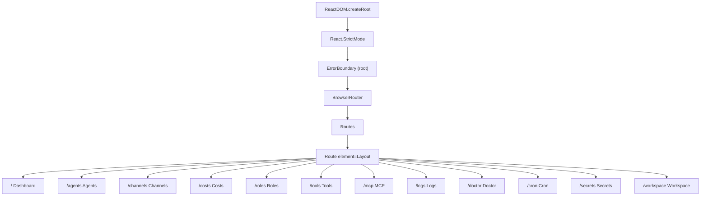
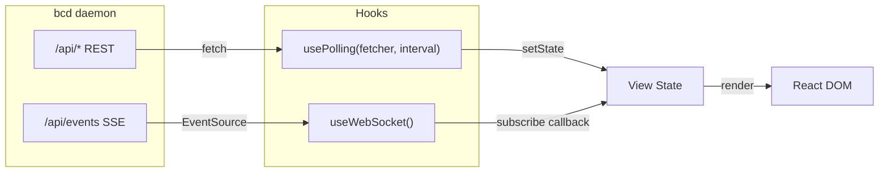
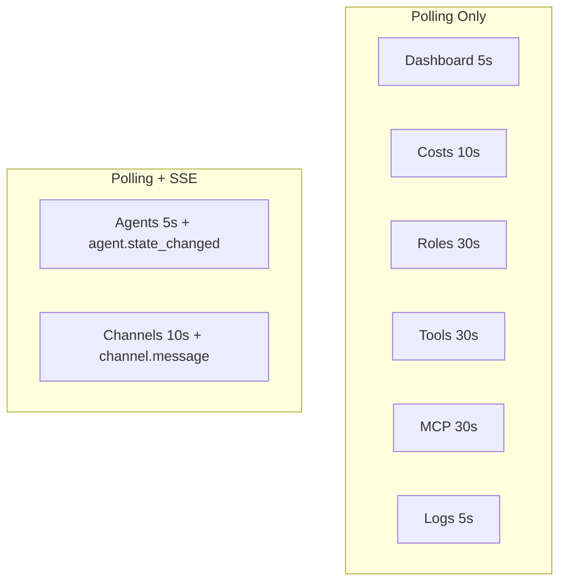

# Web Dashboard Architecture

## Overview

The bc web dashboard is a single-page application that provides a browser-based interface for monitoring and interacting with the bc agent orchestration system. It connects to the `bcd` daemon over HTTP REST and Server-Sent Events (SSE).

**Tech stack:**

| Layer        | Technology                                |
|--------------|-------------------------------------------|
| Framework    | React 18.3 (`react`, `react-dom`)         |
| Routing      | react-router-dom 6.28                     |
| Build        | Vite 6 + `@vitejs/plugin-react`           |
| Language     | TypeScript 5.6                            |
| Styling      | Tailwind CSS 3.4 + CSS custom properties  |
| Linting      | ESLint 8 + `@typescript-eslint` + `eslint-plugin-react-hooks` |

**Package:** `@bc/web` (private), defined in `web/package.json`.

**Entry point:** `web/index.html` loads `web/src/main.tsx`, which renders `<App />` inside `React.StrictMode`.

**API target:** In development, Vite proxies `/api` to `http://localhost:9375` and `/ws` to `ws://localhost:9375`. In production, built assets in `web/dist/` are served by bcd directly.

---

## Component Architecture

Every view is wrapped in its own `ErrorBoundary`. `Layout` renders a 192px sidebar with `NavLink` items and an `<Outlet />`.

### Shared Components

| Component | File | Purpose |
|-----------|------|---------|
| `Layout` | `web/src/components/Layout.tsx` | Shell: sidebar nav + main content |
| `ErrorBoundary` | `web/src/components/ErrorBoundary.tsx` | Catches render errors, shows retry UI |
| `StatusBadge` | `web/src/components/StatusBadge.tsx` | Colored pill for agent states |
| `Table<T>` | `web/src/components/Table.tsx` | Generic typed table with row click |

---

## Data Flow

## State Management

No global store. Each view manages its own data via `usePolling` + local `useState`.

| View | Interval | SSE Events | API Calls |
|------|----------|------------|-----------|
| Dashboard | 5s | -- | listAgents, listChannels, getCostSummary |
| Agents | 5s | agent.state_changed | listAgents, sendToAgent |
| Channels | 10s | channel.message | listChannels, getChannelHistory, sendToChannel |
| Costs | 10s | -- | getCostSummary, getCostByAgent |
| Roles | 30s | -- | listRoles |
| Tools | 30s | -- | listTools |
| MCP | 30s | -- | listMCP |
| Logs | 5s | -- | getLogs |

---

## Theme & Styling

Current tokens in `web/src/theme/tokens.css`:

| Token | Value | Solar Flare Target |
|-------|-------|--------------------|
| `--bc-bg` | `#0f1117` | `#0C0A08` |
| `--bc-surface` | `#1a1d27` | `#1E1A16` |
| `--bc-border` | `#2a2d3a` | `#2A2420` |
| `--bc-text` | `#e2e4e9` | `#F5F0EB` |
| `--bc-accent` | `#60a5fa` (blue) | `#EA580C` (tangerine) |
| `--bc-success` | `#34d399` | `#22C55E` |
| `--bc-error` | `#f87171` | `#EF4444` |

Dark-only currently. Light mode planned via `[data-theme="light"]` selector.

---

## Known Issues

| Issue | Summary |
|-------|---------|
| #2122 | API parameter injection -- no `encodeURIComponent` on path segments |
| #2126 | No 404 catch-all route -- blank page on invalid URLs |
| #2127 | No code splitting -- all 12 views eagerly imported |
| #2128 | No AbortController -- memory leaks on unmount |
| #2171 | Channels message duplication from WebSocket + fetch race |
| #2172 | Auto-scroll interrupts reading in Channels view |

---

## Migration Plan

### Teams Replace Workspaces
- Sidebar: "Workspace" becomes "Teams" with `/teams/:teamName` drill-down
- Agent names: `bc-<session-id-last6>-<team>-<agent>`

### Roles in DB
- `GET /api/roles` with full CRUD replaces `GET /api/workspace/roles`
- Roles view needs create/edit form

### Singleton SSE
- Lift `useWebSocket` into a context provider -- all views share one `EventSource`

### Code Splitting
- Wrap view imports in `React.lazy()` + `<Suspense>` fallbacks
