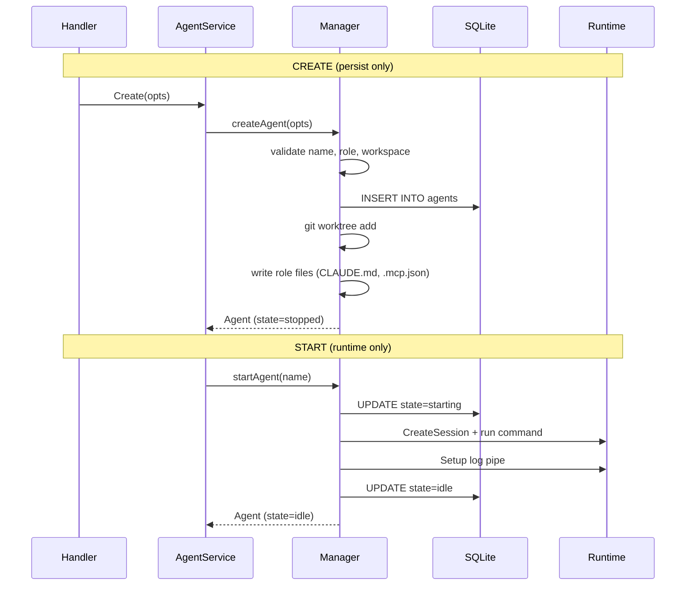

# Design: Agent Lifecycle Consolidation

**Issue:** #2165
**Status:** Draft — awaiting review
**Author:** backend-agent

## Problem

Agent lifecycle management in `pkg/agent/agent.go` (~1900 lines) has these problems:

1. **`SpawnAgentWithOptions` does everything** — 300 lines handling create + restart + validation + worktree + role setup + runtime launch, all under a single write lock
2. **Single `sync.RWMutex`** at line 423 blocks ALL agents during slow I/O (Docker start = seconds, `git worktree remove` = seconds)
3. **`RefreshState` on every GET** — `server/handlers/agents.go:77` calls it synchronously, shelling out to `docker ps` / `tmux list-sessions` while holding the write lock
4. **Delete is incomplete** — doesn't clean up log files, agent state dirs, channel memberships, or children's ParentID
5. **Rename is broken** — doesn't update tmux session, Docker container, worktree path, children's ParentID, or the agent's own ID field

## Design

### Separated Create and Start



**`createAgent(opts)`** — validation, worktree, role setup, persist. Does NOT start a session. Returns agent in `stopped` state.

**`startAgent(name, opts)`** — builds command, creates tmux/Docker session, starts log streaming. Transitions `stopped` → `starting` → `idle`.

**`SpawnAgentWithOptions(opts)`** — becomes a thin wrapper: `createAgent(opts)` then `startAgent(name, opts)`. Backward compatible.

### Comprehensive Delete

```go
func (m *Manager) deleteAgent(name string, force bool) error {
    // 1. Stop if running (with force option)
    // 2. Remove channel memberships
    // 3. Kill Docker container (docker rm -f)
    // 4. Remove git worktree (git worktree remove --force)
    // 5. Delete worktree branch (git branch -D)
    // 6. Remove agent state dir (~/.bc/agents/<name>/)
    // 7. Remove log file (~/.bc/logs/<name>.log)
    // 8. Update children's ParentID to ""
    // 9. Remove from parent's Children list
    // 10. DELETE FROM agents WHERE name = ?
}
```

### Per-Agent Locks

Replace single `sync.RWMutex` with a lock per agent:

```go
type Manager struct {
    agents   map[string]*Agent
    locks    map[string]*sync.Mutex  // per-agent lock
    globalMu sync.RWMutex            // protects the maps themselves
    // ...
}

func (m *Manager) lockAgent(name string) func() {
    m.globalMu.RLock()
    lock, ok := m.locks[name]
    m.globalMu.RUnlock()
    if !ok {
        return func() {} // agent doesn't exist
    }
    lock.Lock()
    return lock.Unlock
}
```

**Pattern:**
- `globalMu.RLock()` for map reads (ListAgents, GetAgent)
- `globalMu.Lock()` for map mutations (add/remove agent)
- `locks[name].Lock()` for agent-specific operations (start, stop, send)
- Slow I/O (Docker, tmux, git) only holds the per-agent lock

### Background RefreshState

```go
// Start background reconciler in bcd main.go
go mgr.RunReconciler(ctx, 5*time.Second)

func (m *Manager) RunReconciler(ctx context.Context, interval time.Duration) {
    ticker := time.NewTicker(interval)
    defer ticker.Stop()
    for {
        select {
        case <-ticker.C:
            m.reconcile(ctx)
        case <-ctx.Done():
            return
        }
    }
}
```

`GET /api/agents` reads from in-memory state (fast, no subprocess calls). Background ticker updates state every 5s.

### Fixed RenameAgent

```go
func (m *Manager) renameAgent(oldName, newName string) error {
    // 1. Validate newName
    // 2. Stop agent if running
    // 3. Rename tmux session: tmux rename-session -t old new
    // 4. Rename Docker container: docker rename old new
    // 5. Move worktree directory
    // 6. Rename git branch
    // 7. Update agent fields: Name, ID, Session, LogFile, WorktreeDir
    // 8. Update children's ParentID
    // 9. Update channel memberships
    // 10. Update maps: delete old, insert new
    // 11. Persist
}
```

## Phases

### Phase 1: Split Create/Start
- Extract `createAgent()` and `startAgent()` from `SpawnAgentWithOptions`
- `SpawnAgentWithOptions` calls both (backward compat)
- `AgentService.Create()` calls `createAgent()` + `startAgent()`
- `AgentService.Start()` calls `startAgent()` only
- **~200 lines changed in agent.go, ~20 in service.go**

### Phase 2: Comprehensive Delete
- Add cleanup for: log files, agent state dir, channel memberships, children's ParentID
- Subsumes #2038
- **~50 lines changed in agent.go**

### Phase 3: Background RefreshState
- Add `RunReconciler()` method
- Start in `cmd/bcd/main.go`
- Remove `RefreshState()` call from `handlers/agents.go:77`
- **~30 lines changed across 3 files**

### Phase 4: Per-Agent Locks
- Add `locks map[string]*sync.Mutex` to Manager
- Replace `m.mu.Lock()` in agent-specific operations with per-agent lock
- Keep `globalMu` for map access only
- **~100 lines changed in agent.go**

### Phase 5: Fix Rename
- Add tmux/Docker rename, worktree move, children/channel updates
- **~80 lines changed in agent.go**

## Risk Assessment

| Phase | Risk | Mitigation |
|-------|------|------------|
| 1 | Behavior change if create without start is unexpected | SpawnAgentWithOptions wrapper maintains old behavior |
| 3 | 5s stale state window | Acceptable for local tool; hooks still update state instantly |
| 4 | Deadlock with nested locks | Never hold globalMu.Lock while acquiring agent lock |
| 5 | Rename while running may corrupt state | Stop agent before rename |

## Testing Strategy

- Existing `pkg/agent/*_test.go` must continue passing
- New tests for: create-without-start, delete cleanup verification, concurrent agent operations, rename side-effects
- Integration tests: start → stop → start cycle, create → delete → recreate with same name
