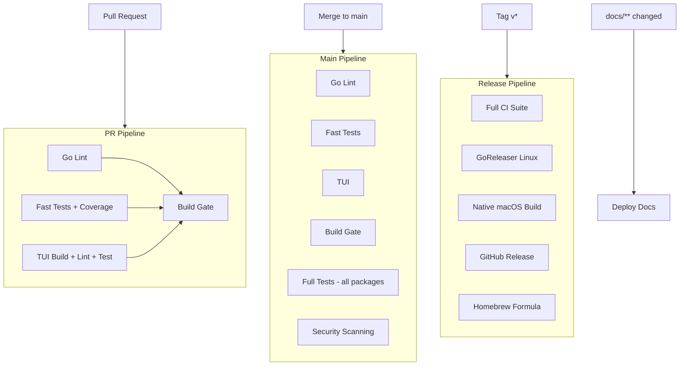
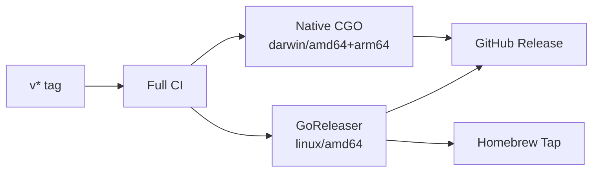

# CI/CD Pipeline Architecture

## Pipeline Overview

## PR Pipeline (blocking, ~90s)

| Job | Duration | What | Blocks merge? |
|-----|----------|------|---------------|
| Lint | ~35s | `golangci-lint` (new issues only) | Yes |
| Test | ~90s | Fast packages + race + 60% coverage | Yes |
| TUI | ~45s | `bun build + lint + test` | Yes |
| Build | ~15s | `make release` + verify | Yes |
| PR Quality | ~5s | Title/description/issue checks | No |

### Excluded from PR (speed optimization)
- `pkg/tmux` (89s — live tmux sessions)
- `pkg/secret` (28s — PBKDF2 crypto)
- `pkg/doctor` (15s — system checks)
- `internal/cmd` (E2E — needs running bcd)
- Security scanning (govulncheck + gitleaks)

## Main Pipeline (after merge, ~5m)

Includes everything from PR pipeline plus:

| Job | Duration | Blocking |
|-----|----------|----------|
| Full Tests | ~5m | No (independent) |
| Security | ~3m | No (continue-on-error) |

## Release Pipeline (tag push)

| Platform | Architecture | CGO | Method |
|----------|-------------|-----|--------|
| Linux | amd64 | Yes | GoReleaser |
| macOS | amd64 + arm64 | Yes | Native build |

## Deployment

| Target | Trigger | Platform |
|--------|---------|----------|
| Docs | `docs/**` push to main | GitHub Pages (MkDocs) |
| Landing | `landing/**` push to main | Cloudflare Pages (Next.js) |

## Test Strategy

| Tier | Packages | When | Duration |
|------|----------|------|----------|
| Fast unit | All except slow | Every PR | ~90s |
| TUI | TypeScript tests | Every PR | ~30s |
| Full | All packages | Main only | ~5m |
| Security | govulncheck + gitleaks | Main only | ~3m |
| E2E | Live agents (future) | Main only | ~10m |

### Coverage

| Metric | Value |
|--------|-------|
| Current threshold | 60% |
| Target | 90%+ |
| Measured on | Fast tests (PR pipeline) |
| Reporting | Codecov |

## Caching

| Cache | Key | Mechanism |
|-------|-----|-----------|
| Go modules | `go.sum` hash | `setup-go cache: true` |
| golangci-lint | Config + source hash | Built-in action cache |
| Bun deps | `bun.lock` hash | Future: `actions/cache` |

## Secrets

| Secret | Used By | Purpose |
|--------|---------|---------|
| `GITHUB_TOKEN` | All workflows | Checkout, releases, gitleaks |
| `HOMEBREW_TAP_TOKEN` | Release | Push formula to tap repo |

## Workflow Files

| File | Trigger | Purpose |
|------|---------|---------|
| `ci.yml` | Push main, PRs | Core CI pipeline |
| `pr-quality.yml` | PRs | Advisory quality checks |
| `release.yml` | Tag `v*` | Build + publish releases |
| `pages.yml` | Push main (docs paths) | Deploy docs to GitHub Pages |