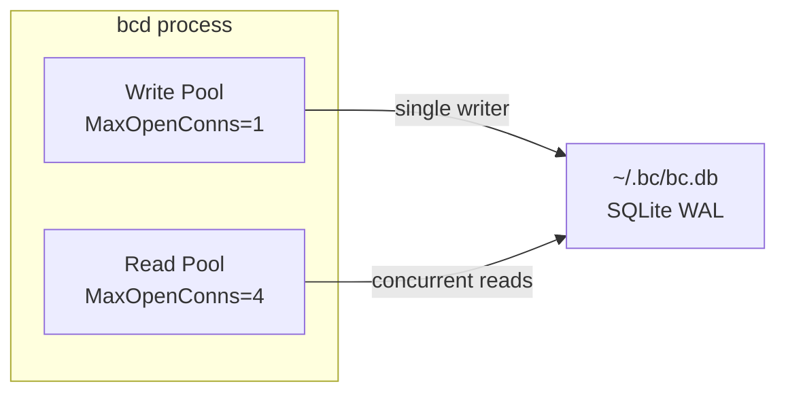
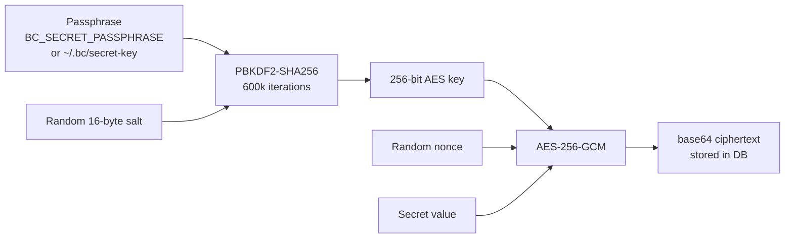

# Database Architecture

## Overview

All bc data lives in a single SQLite database at `~/.bc/bc.db` using WAL mode. A server-based SQL backend is planned for future multi-user deployments but is not currently implemented.

## Connection Architecture



### Connection Settings

| Setting | Value | Rationale |
|---------|-------|-----------|
| Journal mode | WAL | Concurrent reads + single writer |
| Foreign keys | ON (per-connection) | Referential integrity |
| Busy timeout | 30,000ms | Handle concurrent agent access |
| Synchronous | NORMAL | Safe with WAL; avoids unnecessary fsync |
| Cache size | -2000 (2MB) | Reasonable for local workload |
| Temp store | MEMORY | Faster temp table operations |
| mmap_size | 268435456 (256MB) | Memory-mapped reads |

### Rules

1. One shared DB opened at bcd startup, passed to all stores
2. All stores accept `*db.DB` — no store opens its own connection
3. Write pool (MaxOpenConns=1): all mutations
4. Read pool (MaxOpenConns=4, read-only): all queries
5. Never open the same file from multiple sql.Open calls

## Entity Relationship Diagram

```mermaid
erDiagram
    teams ||--o{ teams : "parent_id (tree)"
    teams ||--o{ team_members : has
    agents ||--o{ team_members : "member of"
    agents }o--o| roles : "has role"
    roles ||--o{ role_mcp_servers : uses
    roles ||--o{ role_secrets : needs
    channels ||--o{ channel_members : has
    agents ||--o{ channel_members : "member of"
    channels ||--o{ messages : contains
    messages ||--o{ mentions : has
    messages ||--o{ reactions : has
    agents ||--o{ cost_records : generates
    agents ||--o{ events : logs
    agents ||--o{ agent_sessions : "session history"
    cron_jobs ||--o{ cron_logs : executions
    mcp_servers ||--o{ role_mcp_servers : "used by"
    secrets ||--o{ role_secrets : "used by"

    teams {
        text id PK
        text name "NOT NULL"
        text parent_id FK "NULL for root"
        text workspace "git repo path"
        integer created_at "unix millis"
    }
    team_members {
        text team_id FK "PK"
        text agent_id FK "PK"
        integer joined_at "unix millis"
    }
    agents {
        text name PK
        text role_id FK
        text state "idle|working|stuck|starting|stopped|error"
        text tool "claude|gemini|cursor|aider|codex"
        text workspace "git repo path"
        text session_id "Claude UUID"
        text runtime "tmux|docker"
        integer created_at "unix millis"
    }
    roles {
        text id PK
        text name "UNIQUE"
        blob prompt "CLAUDE.md content"
        blob settings "JSON"
        blob commands "JSON map"
        integer created_at "unix millis"
    }
    channels {
        integer id PK
        text name "UNIQUE"
        text type "group|direct"
        integer created_at "unix millis"
    }
    messages {
        integer id PK
        integer channel_id FK
        text sender
        text content
        text type "text|task|review|..."
        integer created_at "unix millis"
    }
    cost_records {
        integer id PK
        text agent_name FK
        text model
        real cost_usd
        integer timestamp "unix millis"
    }
    secrets {
        text name PK
        blob value "AES-256-GCM"
        integer created_at "unix millis"
    }
    mcp_servers {
        text name PK
        text transport "stdio|sse"
        integer enabled "0|1"
    }
    events {
        integer id PK
        text type
        text agent
        integer timestamp "unix millis"
    }
    cron_jobs {
        text name PK
        text schedule "5-field cron"
        integer enabled "0|1"
    }
    cron_logs {
        integer id PK
        text job_name FK
        text status
        integer run_at "unix millis"
    }
```



## Timestamp Convention

All timestamps: `INTEGER` storing Unix milliseconds (`time.Now().UnixMilli()` in Go).

| Benefit | Detail |
|---------|--------|
| Storage | 8 bytes vs 20-24 for TEXT |
| Range queries | Integer compare vs string compare |
| Go marshaling | `time.UnixMilli(ts)` — trivial |
| Human queries | `datetime(ts/1000, 'unixepoch')` in SQLite |

## Index Strategy

Composite indexes on hot paths, following SQLite left-to-right rule:

| Index | Query Pattern |
|-------|---------------|
| `idx_cost_agent_time(agent_name, timestamp DESC)` | Budget checks per agent |
| `idx_cost_team_time(team_id, timestamp DESC)` | Team cost queries |
| `idx_messages_channel_time(channel_id, created_at DESC)` | Channel history |
| `idx_agent_sessions_agent(agent_name, created_at DESC)` | Session resume |
| `idx_events_timestamp(timestamp DESC)` | Recent events |
| `idx_cron_logs_job(job_name, run_at DESC)` | Job execution logs |

## Migration Strategy

[goose](https://github.com/pressly/goose) with embedded SQL files:

```
pkg/db/migrations/
  001_create_settings.sql
  002_create_teams.sql
  003_create_roles.sql
  004_create_agents.sql
  005_create_channels.sql
  006_create_costs.sql
  ...
```

Run `goose.Up()` at bcd startup. No `CREATE TABLE IF NOT EXISTS` in application code.

## Future: Server-Based SQL

When needed for multi-user deployment:
- Add driver for target DB (Postgres, SQL Server)
- Dialect abstraction for placeholder differences (`?` vs `$1`)
- goose handles multi-DB migrations natively
- Split read/write at connection string level

## Filesystem Layout

```
~/.bc/
  bc.db                     # Main SQLite database (all tables)
  settings.json             # Global settings
  secret-key                # AES-256 encryption key (0600 perms)
  agents/
    <agent-name>/
      .claude/              # Provider config (mounted into containers)
        CLAUDE.md           # Role prompt
        settings.json       # Claude Code settings + hooks
        .mcp.json           # MCP server configs
      worktree/             # Git worktree checkout
  logs/
    <agent-name>.log        # Session logs (tmux pipe-pane output)
```

## Secret Encryption



Key file (`~/.bc/secret-key`) auto-generated with `0600` on first use.

## Cost Data Pipeline

```mermaid
graph LR
    CLAUDE[Claude Code<br/>JSONL sessions] --> IMPORT[Cost Importer<br/>every 5 min]
    IMPORT --> PARSE[Parse tokens<br/>+ model pricing]
    PARSE --> DB[(cost_records)]
    DB --> API[/api/costs/*]
    API --> WEB[Web/TUI dashboards]
```

Importer scans `~/.bc/agents/*/auth/.claude/` for session JSONL files, extracts token usage, applies model pricing, inserts with watermark dedup.

## Migration Path (old -> new)

```
OLD (per-project):                NEW (global):
  project/.bc/bc.db        ->     ~/.bc/bc.db
  project/.bc/settings.json  ->     ~/.bc/settings.json
  project/.bc/agents/      ->     ~/.bc/agents/
  project/.bc/roles/*.md   ->     roles table in bc.db
  project/.bc/logs/        ->     ~/.bc/logs/
```

`bc workspace migrate` migrates workspace config format from v1 (`.bc/config.json`) to v2 (`.bc/settings.json`). It does not migrate database schema or copy data between directories. Agent JSON state files auto-migrate on next load.
