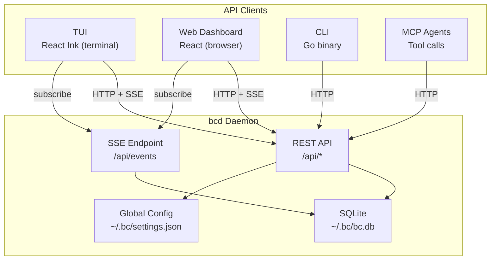
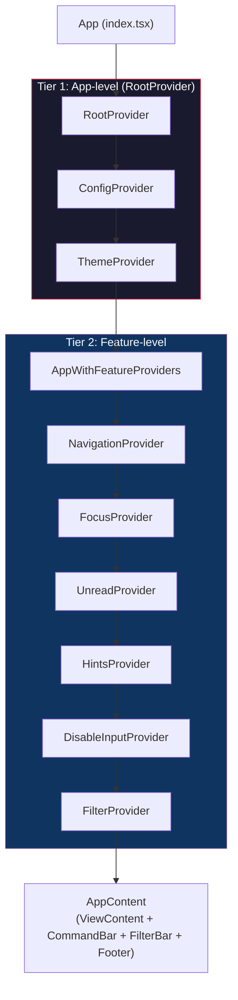
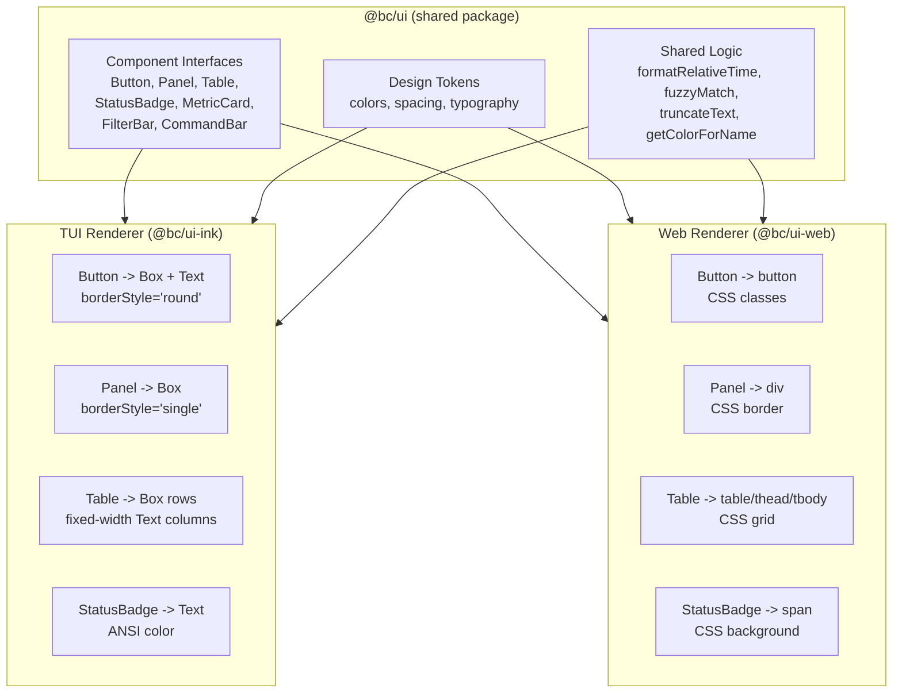
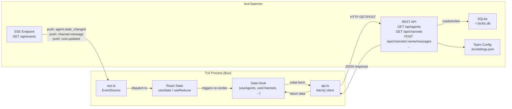
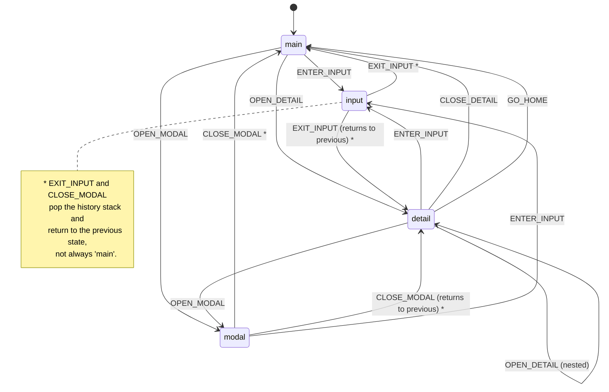

# TUI Architecture

## 1. System Context

The bc TUI is one of four equal API clients to the `bcd` daemon. It does not occupy a privileged position in the architecture -- it is a consumer of the same REST and SSE interfaces available to the web dashboard, the CLI, and MCP agent tooling.



**Key architectural invariants:**

- The TUI calls `bcd`, not the `bc` CLI. The CLI is a sibling client, not an intermediary.
- All four clients share the same REST contract. A feature available in one client can be built in any other without backend changes.
- Real-time updates (agent state transitions, channel messages, cost ticks) arrive via SSE, not polling.
- Global configuration lives at `~/.bc/settings.json`. Team-scoped configuration lives at `<project>/.bc/settings.json`.

### Tech Stack

| Layer | Technology | Version |
|-------|-----------|---------|
| Runtime | Bun | 1.x |
| UI framework | React | 18.2 |
| Terminal renderer | Ink | 4.4 |
| Language | TypeScript (strict) | 5.3 |
| Test runner | bun:test | -- |
| Test utilities | ink-testing-library, @testing-library/react | 3.0, 14.1 |

**File counts (as of 2026-03):**
- 217 TypeScript source files in `tui/src/`
- 111 test files in `tui/src/**/__tests__/`

**Entry point:** `tui/src/index.tsx` -- validates TTY, calls `render(<App />)` via Ink.

**Key directories:**

| Directory | Contents |
|-----------|----------|
| `tui/src/views/` | 12 view components (one per screen) |
| `tui/src/hooks/` | 20 hooks for data fetching, navigation, polling |
| `tui/src/components/` | Shared UI components (Panel, DataTable, CommandBar, FilterBar, etc.) |
| `tui/src/navigation/` | NavigationContext, FocusContext, TabBar, Breadcrumb, keyboard handling |
| `tui/src/services/api.ts` | HTTP client -- `fetch()` calls to bcd REST API at `localhost:9374` |
| `tui/src/theme/` | ThemeContext, dark/light themes, terminal color detection |
| `tui/src/config/` | ConfigContext for workspace performance and theme settings |
| `tui/src/constants/` | Centralized timing, cache, dimension, and color constants |
| `tui/src/types/` | TypeScript interfaces for all API response shapes |

---

## 2. Provider Architecture

The app uses a nested context provider tree. `RootProvider` wraps config and theme (app-level concerns), then feature providers handle navigation, focus, unread tracking, hints, input gating, and filtering. There are 9 providers total, organized into two tiers.



### Provider Responsibilities

| Provider | File | Purpose | State Shape |
|----------|------|---------|-------------|
| `RootProvider` | `providers/RootProvider.tsx` | Groups ConfigProvider + ThemeProvider into a single wrapper | -- (composition only) |
| `ConfigProvider` | `config/ConfigContext.tsx` | Fetches workspace config via `GET /api/config`, provides `PerformanceConfig` (14 tunable intervals) and `TUIConfig` (theme name, mode) | `{ performance, tui, loading, error, refresh }` |
| `ThemeProvider` | `theme/ThemeContext.tsx` | Dark/light mode, color accessor, theme cycling, auto-detection | `{ theme, mode, themeName, isDark, color(), toggleTheme(), cycleTheme() }` |
| `NavigationProvider` | `navigation/NavigationContext.tsx` | Current view, history stack with back/forward, tab cycling, breadcrumbs | `{ currentView, previousView, history[], breadcrumbs[], navigate(), goBack(), nextTab() }` |
| `FocusProvider` | `navigation/FocusContext.tsx` | Focus area tracking across 7 areas | `{ focusedArea, setFocus(), returnFocus(), cycleFocus() }` |
| `UnreadProvider` | `hooks/UnreadContext.tsx` | Per-channel unread message counts | `{ unreadCounts, markRead(), getUnread() }` |
| `HintsProvider` | `hooks/useHintsContext.tsx` | View-specific keyboard hints for the global footer | `{ hints[], setHints() }` |
| `DisableInputProvider` | `hooks/useDisableInput.tsx` | Global input gating (replaces prop drilling for `disableInput`) | `{ isDisabled }` |
| `FilterProvider` | `hooks/useFilter.tsx` | Global `/filter` query state shared across all views | `{ query, isActive, setFilter(), clearFilter() }` |

---

## 3. Shared Component Library

The TUI and Web dashboard share fundamental UI constructs. The planned `@bc/ui` package provides platform-agnostic component interfaces that each renderer maps to its native primitives.



### Abstraction Layers

**Layer 1: Design Tokens** (`@bc/ui/tokens`)

Platform-agnostic color, spacing, and typography values derived from the Solar Flare palette. The token file is the single source of truth.

```typescript
// @bc/ui/tokens/colors.ts
export const colors = {
  primary: '#EA580C',        // Tangerine
  secondary: '#FB923C',      // Amber Glow
  success: '#22C55E',        // Success Green Bright
  error: '#EF4444',          // Error Red Bright
  info: '#38BDF8',           // Sky Blue Bright
  // ... full Solar Flare palette
};
```

**Layer 2: Component Interfaces** (`@bc/ui/components`)

Abstract prop types that both renderers implement. No JSX or rendering logic -- pure TypeScript interfaces.

```typescript
// @bc/ui/components/Button.ts
export interface ButtonProps {
  label: string;
  variant: 'primary' | 'secondary' | 'ghost' | 'destructive';
  disabled?: boolean;
  onPress: () => void;
}
```

**Layer 3: Platform Renderers**

Each renderer maps abstract props to native primitives.

| Component | TUI (Ink) | Web (HTML) |
|-----------|-----------|------------|
| `Button` | `<Box borderStyle="round"><Text>{label}</Text></Box>` | `<button className={variant}>{label}</button>` |
| `Panel` | `<Box borderStyle="single" borderColor={theme.border}>` | `<div className="panel border rounded">` |
| `Table` | Fixed-width `<Text>` columns in `<Box>` rows | `<table>` with CSS grid |
| `StatusBadge` | `<Text color={stateColor}>{symbol} {label}</Text>` | `<span className="badge" style={{background}}>` |
| `MetricCard` | `<Box borderStyle="round"><Text bold>{value}</Text>` | `<div className="metric-card"><span>{value}</span>` |
| `FilterBar` | `<Box><Text color="yellow">/</Text><Text>{input}</Text>` | `<input type="search" className="filter-bar">` |

**Layer 4: Shared Logic** (`@bc/ui/utils`)

Pure functions with no rendering dependencies, usable in both environments:

- `formatRelativeTime(date)` -- "5m ago", "just now"
- `fuzzyScore(query, target)` -- scoring for command bar matching
- `truncateText(text, maxLen)` -- text truncation with ellipsis
- `getColorForName(name)` -- role-based color lookup from `ROLE_PREFIXES`
- `abbreviateRole(role)` -- "engineer" to "eng"
- `normalizeTask(task)` -- task string normalization

### Current State

Today, these layers do not exist as separate packages. The TUI contains all logic inline:

- Design tokens: `tui/src/constants/colors.ts`, `tui/src/theme/themes.ts`
- Component interfaces: implicit in component props
- Platform rendering: directly in `tui/src/components/*.tsx`
- Shared logic: `tui/src/utils/formatting.ts`, `tui/src/navigation/viewCommands.ts`

The extraction to `@bc/ui` is tracked in the design system epic.

---

## 4. View System

### Views

12 views rendered by the `ViewContent` switch in `tui/src/app.tsx`. Each is wrapped in a `ViewErrorBoundary` keyed by `currentView`, so errors in one view do not crash the entire TUI.

| # | View | File | Data Hook / Service | Primary Display |
|---|------|------|-------------------|-----------------|
| 1 | Dashboard | `views/Dashboard.tsx` | `useDashboard` (aggregates status + channels + costs) | MetricCards, SystemHealth, CostPanel, ActivityFeed |
| 2 | Agents | `views/AgentsView.tsx` | `useAgents`, `useAgentGroups` | Grouped agent list with peek panel, actions, search |
| 3 | Channels | `views/ChannelsView.tsx` | `useChannelsWithUnread`, `useChannelHistory` | Channel list with unread counts, drill into message history |
| 4 | Costs | `views/CostsView.tsx` | `useCosts`, `getCostUsage` | Cost summary, daily/monthly/session breakdowns, sparklines |
| 5 | Logs | `views/LogsView.tsx` | `useLogs` | Event log with severity filtering, agent filtering |
| 6 | Roles | `views/RolesView.tsx` | `getRoles()` | Role list with capabilities, agent counts |
| 7 | Worktrees | `views/WorktreesView.tsx` | `getWorktrees()` | Worktree list with orphan detection, prune action |
| 8 | Tools | `views/ToolsView.tsx` | `getToolList()` | Provider tool status (installed/missing, version) |
| 9 | MCP | `views/MCPView.tsx` | `getMCPList()` | MCP server list with transport and status |
| 10 | Secrets | `views/SecretsView.tsx` | `getSecretList()` | Secret metadata (no values exposed) |
| 11 | Processes | `views/ProcessesView.tsx` | `getProcessList()` | Managed process list with PID, port, status |
| 12 | Help | `views/HelpView.tsx` | Static | Keybinding reference, command list |

### Navigation Model

Navigation uses k9s-style patterns: a `:command` bar with fuzzy matching, `/filter` bar, `Tab` cycling, number keys `1-0` for direct access, and uppercase letter shortcuts.

```mermaid
stateDiagram-v2
    [*] --> Dashboard: App start (initialView)

    state "View Layer" as VL {
        Dashboard --> AnyView: Tab / Shift+Tab
        AnyView --> Dashboard: Esc / goHome()
        AnyView --> AnyView: Number keys 1-0, -
        AnyView --> AnyView: Uppercase shortcuts (A, C, D, L, M, S, P)
    }

    state "Command Bar (:)" as CB {
        AnyView --> CommandBarOpen: Press ':'
        CommandBarOpen --> AnyView: Select command (Enter)
        CommandBarOpen --> AnyView: Cancel (Esc)
        CommandBarOpen --> CommandBarOpen: Type / Arrow / Tab autocomplete
    end

    state "Filter Bar (/)" as FB {
        AnyView --> FilterBarOpen: Press '/'
        FilterBarOpen --> AnyView: Apply filter (Enter)
        FilterBarOpen --> AnyView: Clear + close (Esc)
        FilterBarOpen --> FilterBarOpen: Type / Backspace (live preview)
    end

    state "Detail Drill-down" as DD {
        AnyView --> DetailView: Enter on list row
        DetailView --> AnyView: Esc (back to list)
        DetailView --> NestedDetail: Enter on sub-item
        NestedDetail --> DetailView: Esc
    end
```

### CommandBar

**File:** `tui/src/components/CommandBar.tsx`

Activated by pressing `:`. Renders a fuzzy-matched dropdown above a text input line at the bottom of the screen.

- **Registry:** `tui/src/navigation/viewCommands.ts` defines `VIEW_COMMANDS` (9 view commands with aliases) and `ACTION_COMMANDS` (`:q`, `:q!`).
- **Fuzzy matching:** `searchCommands(query, recentCommands)` scores by exact match (100), starts-with (80), contains (60), and character-by-character fuzzy (10 per char). LRU boost adds 5 points for recently used commands.
- **Interaction:** Arrow keys select, Tab autocompletes, Enter navigates or executes action, Esc cancels.
- **LRU tracking:** `AppContent` maintains a `recentCommandsRef` (max 10) that persists across command bar open/close cycles. Recent commands appear in a `RECENT` section when no query is entered.

### FilterBar

**File:** `tui/src/components/FilterBar.tsx`

Activated by pressing `/`. Sets the global `FilterContext` query which views can read via `useFilter()`.

- Live preview: filter updates on each keystroke via `setFilter()`.
- Enter applies and closes. Esc clears and closes.
- Filter state persists across the FilterBar open/close cycle but resets on view change (known issue).

### Tab Cycling

`NavigationProvider` maintains an ordered tab list (`DEFAULT_TABS` in `NavigationContext.tsx`). `Tab` advances to the next view, `Shift+Tab` goes to the previous. The Help view is excluded from the cycle.

### Detail Drill-down Pattern

Views that support drill-down (Agents, Channels, Roles) follow a consistent pattern:

1. View maintains a `viewMode` state (`'list' | 'history'` or `'list' | 'detail'`).
2. `useListNavigation` handles j/k/Enter on the list.
3. Enter on a row sets `viewMode = 'detail'` and renders the detail component.
4. Detail component handles Esc to return to list mode.
5. `NavigationProvider.setBreadcrumbs()` updates the breadcrumb trail during drill-down.

### Number Key Mappings

Defined in `tui/src/hooks/useKeybindings.ts`:

```
1 = Dashboard    2 = Agents     3 = Channels   4 = Costs      5 = Roles
6 = Logs         7 = Worktrees  8 = Tools      9 = MCP        0 = Secrets
- = Processes
```

Uppercase letter shortcuts: `D` = Dashboard, `A` = Agents, `C` = Channels, `L` = Logs, `M` = MCP, `S` = Secrets, `P` = Processes.

---

## 5. Data Layer

The TUI fetches all data from the `bcd` REST API over HTTP and receives real-time updates via SSE. This is the same data layer pattern used by the web dashboard.



### Service Layer: `tui/src/services/api.ts`

The service layer is an HTTP client that calls the `bcd` REST API at `localhost:9374` using `fetch()`. The base URL is configurable via the `BCD_ADDR` environment variable or read from `~/.bc/settings.json`.

**Key characteristics:**

- Standard `fetch()` for all HTTP requests (GET for reads, POST/PUT/DELETE for writes).
- JSON request and response bodies with typed return values.
- HTTP cache headers (`ETag`, `Cache-Control`) for server-managed caching.
- Error handling maps HTTP status codes to typed error results consumed by hooks.

**Exported convenience functions:** `getStatus`, `getChannels`, `getChannelHistory`, `sendChannelMessage`, `getCostSummary`, `getCostUsage`, `reportState`, `getLogs`, `getRoles`, `getRole`, `deleteRole`, `validateRoles`, `getWorktrees`, `pruneWorktrees`, `getTeams`, `addTeamMember`, `removeTeamMember`, `getDemons`, `getDemon`, `getDemonLogs`, `enableDemon`, `disableDemon`, `runDemon`, `getProcesses`, `getProcessLogs`, `getToolList`, `getMCPList`, `getSecretList`, `getProcessList`, `getWorkspaces`, `getIssues`, `getIssue`, `closeIssue`, `assignIssue`, `attachToAgentSession`, and cache utilities.

### SSE: Real-Time Event Stream

An `EventSource` connection to `GET /api/events` receives server-pushed events for real-time updates. Event types include:

| Event Type | Payload | Consumer |
|-----------|---------|----------|
| `agent.state_changed` | Agent name, old state, new state | `useAgents`, Dashboard |
| `channel.message` | Channel name, message body, sender | `useChannelHistory`, `UnreadProvider` |
| `cost.updated` | Cost delta, agent, model | `useCosts`, Dashboard |
| `log.entry` | Log entry with severity and metadata | `useLogs` |

SSE events trigger React state updates, which cause hooks to re-render their consumers with fresh data. For event types covered by SSE, no polling is needed. Polling is retained as a fallback for data types without SSE support.

### How Data Flows Through the System

1. **Initial load:** Hook calls a service function (e.g., `getStatus()`), which issues `fetch('http://localhost:9374/api/agents')`. The JSON response is parsed, typed, and returned to the hook, which sets React state.
2. **Real-time updates:** The SSE client receives a pushed event (e.g., `agent.state_changed`), parses it, and dispatches it to registered callbacks. The callback updates React state, triggering a re-render.
3. **Write operations:** Hook calls a service function (e.g., `sendChannelMessage()`), which issues a POST request. On success, the SSE stream delivers the resulting event to all connected clients, keeping the UI in sync without manual cache invalidation.

---

## 6. Hook Architecture

### Hook Inventory

| Hook | File | Purpose |
|------|------|---------|
| `useAgents` | `hooks/useAgents.ts` | Fetches agent status with 5s working-to-idle debounce to prevent UI flicker |
| `useAgentsByState` | `hooks/useAgents.ts` | Filtered view of agents by state |
| `useAgentsByRole` | `hooks/useAgents.ts` | Filtered view of agents by role |
| `useAgent` | `hooks/useAgents.ts` | Single agent lookup by name |
| `useAgentGroups` | `hooks/useAgentGroups.ts` | Groups agents by role, computes per-group state counts |
| `useAgentDetails` | `hooks/useAgentDetails.ts` | Per-agent cost breakdown and activity log |
| `useChannels` | `hooks/useChannels.ts` | Fetches channel list |
| `useChannelHistory` | `hooks/useChannels.ts` | Fetches message history for a specific channel |
| `useChannelsWithUnread` | `hooks/useChannels.ts` | Combines channel list with `UnreadContext` unread counts |
| `useCosts` | `hooks/useCosts.ts` | Fetches cost summary data |
| `useLogs` | `hooks/useLogs.ts` | Fetches event logs with severity and agent filtering |
| `useStatus` | `hooks/useStatus.ts` | Workspace status summary with agent counts by state |
| `useDashboard` | `hooks/useDashboard.ts` | Aggregates `getStatus()` + `getChannels()` + `getCostSummary()` in parallel |
| `useMessagePolling` | `hooks/usePolling.ts` | Incremental message detection |
| `useAgentPolling` | `hooks/usePolling.ts` | Agent change detection |
| `useCoordinatedPolling` | `hooks/usePolling.ts` | Dashboard tick coordinator |
| `useAdaptivePolling` | `hooks/useAdaptivePolling.ts` | 4-mode adaptive intervals: fast(1s)/normal(2s)/slow(4s)/backoff(up to 8s) |
| `useAdaptiveAgentPolling` | `hooks/useAdaptivePolling.ts` | Wraps adaptive polling with automatic activity detection from agent counts |
| `useListNavigation` | `hooks/useListNavigation.ts` | Vim-style j/k/g/G/Enter/Esc navigation for all list views |
| `useFocusStateMachine` | `hooks/useFocusStateMachine.ts` | Formal state machine for focus: main/input/detail/modal |
| `useKeybindings` | `hooks/useKeybindings.ts` | 3-tier keybinding system, status bar hint generation |
| `useDebounce` | `hooks/useDebounce.ts` | Value debounce, callback debounce (leading/trailing/maxWait), debounced search |
| `useLoadingTimeout` | `hooks/useLoadingTimeout.ts` | Tracks elapsed seconds during loading for timeout UX |

### Hook Dependency Graph

```mermaid
graph TD
    subgraph "Data Hooks (fetch from service layer)"
        useDashboard --> getStatus
        useDashboard --> getChannels
        useDashboard --> getCostSummary
        useAgents --> getStatus
        useChannels --> getChannels
        useChannels --> getChannelHistory
        useChannelsWithUnread --> useChannels
        useChannelsWithUnread --> UnreadContext["useUnread\n(UnreadContext)"]
        useLogs --> getLogs
        useCosts --> getCostSummary
        useStatus --> getStatus
        useAgentDetails --> getLogs
        useAgentDetails --> getCostSummary
        useAgentGroups --> useAgents
    end

    subgraph "Config Hooks (read from ConfigContext)"
        useAgents --> usePerformanceConfig
        useChannels --> usePerformanceConfig
        usePolling --> usePerformanceConfig
        useAdaptivePolling --> usePerformanceConfig
        useDashboard --> usePerformanceConfig
        useLogs --> usePerformanceConfig
        useStatus --> usePerformanceConfig
        usePerformanceConfig --> ConfigContext["useConfig\n(ConfigContext)"]
    end

    subgraph "Navigation Hooks (read from NavigationContext / FocusContext)"
        useListNavigation --> FocusContext["useFocus\n(FocusContext)"]
        useKeyboardNavigation --> NavigationContext["useNavigation\n(NavigationContext)"]
        useKeyboardNavigation --> FocusContext
    end

    subgraph "Polling Hooks (orchestrate fetch timing)"
        useAdaptiveAgentPolling --> useAdaptivePolling
        useCoordinatedPolling --> usePolling
        useMessagePolling --> usePolling
        useAgentPolling --> usePolling
    end

    subgraph "Service Layer (HTTP client)"
        getStatus["getStatus()"]
        getChannels["getChannels()"]
        getChannelHistory["getChannelHistory()"]
        getCostSummary["getCostSummary()"]
        getLogs["getLogs()"]
    end

    getStatus --> fetchClient["fetch()\nbcd REST API"]
    getChannels --> fetchClient
    getChannelHistory --> fetchClient
    getCostSummary --> fetchClient
    getLogs --> fetchClient
```



Data hooks depend on service function signatures, not transport details. The hooks call typed functions like `getStatus()` which return `Promise<StatusResponse>`. Whether the service layer uses `fetch()` against the REST API or receives a push via SSE is invisible to the hook consumer.

---

## 7. Keyboard Navigation

### 3-Tier Keybinding System

Defined in `tui/src/hooks/useKeybindings.ts`. The three tiers form a priority hierarchy: context bindings override view-local bindings, which override global bindings.

| Tier | Scope | Keys | When Active |
|------|-------|------|-------------|
| **1. Global** | Always (unless in input mode) | `:` command bar, `/` filter, `?` help, `Tab`/`Shift+Tab` cycle views, `1-0,-` direct view, uppercase shortcuts, `q` quit, `Esc` home, `Ctrl+R` refresh | `FocusArea` is not `input`, `command`, or `filter` |
| **2. View-local** | Within a specific view | `j/k` up/down, `g/G` top/bottom, `Enter` select, `r` refresh, view-specific custom keys | `FocusArea` is `main` or `detail` |
| **3. Context** | Modal/input overlays | `Esc` cancel/close, `Enter` confirm/submit, all text input | `FocusArea` is `input`, `modal`, `command`, or `filter` |

### Implementation

Global keyboard handling lives in `tui/src/navigation/useKeyboardNavigation.ts`. It uses Ink's `useInput` hook with an `isActive` guard that checks the current `FocusArea`:

```typescript
useInput((input, key) => {
  if (isFocused('input') || isFocused('command') || isFocused('filter')) return;
  // ... handle global keys
}, { isActive: !disabled });
```

View-local handling lives in `tui/src/hooks/useListNavigation.ts`, which also checks `FocusContext` to disable itself when overlays are open:

```typescript
const isOverlayActive = focusedArea === 'command' || focusedArea === 'filter' || focusedArea === 'modal';
useInput(handler, { isActive: !disabled && isActive && !isOverlayActive && navLength > 0 });
```

### Focus State Machine

`tui/src/hooks/useFocusStateMachine.ts` defines a formal state machine to prevent key leaks between contexts. It has 4 states and 7 transition events.



### Key Permission Matrix

Each focus state allows a specific set of key categories. The `canHandle(category)` method checks this at runtime.

| Key Category | `main` | `input` | `detail` | `modal` |
|-------------|--------|---------|----------|---------|
| `global_nav` (Tab, ?, view shortcuts) | Yes | -- | Yes | -- |
| `global_quit` (q) | Yes | -- | -- | -- |
| `list_nav` (j, k, g, G) | Yes | -- | Yes | Yes |
| `selection` (Enter) | Yes | Yes | Yes | Yes |
| `escape` (Esc) | Yes | Yes | Yes | Yes |
| `text_input` (printable chars) | -- | Yes | -- | -- |
| `refresh` (r, Ctrl+R) | Yes | -- | Yes | -- |

Note that `global_quit` is only allowed in `main` state. Pressing `q` in a detail view does not quit the application -- it is either ignored or handled as a view-local key.

### Focus Context vs Focus State Machine

Two complementary focus systems coexist:

1. **FocusContext** (`navigation/FocusContext.tsx`) -- lightweight context with 7 focus areas (`main`, `detail`, `input`, `modal`, `view`, `command`, `filter`). Used by `AppContent` to gate global keyboard navigation when CommandBar or FilterBar is open. The `command` and `filter` areas are specific to the global overlays.

2. **useFocusStateMachine** (`hooks/useFocusStateMachine.ts`) -- formal state machine with 4 states, typed transition events, history stack, and `canHandle(category)` checks. Used within individual views for drill-down/input/modal patterns. The history stack enables correct back-navigation (e.g., returning to `detail` instead of `main` when exiting `input` that was opened from a detail view).

The `useListNavigation` hook consults `FocusContext` directly to disable itself when `focusedArea` is `command`, `filter`, or `modal`.

---

## 8. Theme System

### ANSI Terminal Colors

Defined in `tui/src/theme/`:

**Type system (`types.ts`):**
- `TerminalColor` -- union type of 16 standard ANSI color names (`black`, `red`, `green`, `yellow`, `blue`, `magenta`, `cyan`, `white`, plus 8 bright variants like `redBright`, `cyanBright`).
- `ThemeColors` -- interface with 22 semantic color slots organized into groups: primary/secondary/accent, text (text, textMuted, textInverse), status (success, warning, error, info), agent state (agentIdle, agentWorking, agentDone, agentStuck, agentError), UI elements (border, borderFocused, selection, highlight), and component-specific (headerTitle, footerText, badge).
- `ThemeMode` -- `'dark' | 'light' | 'auto'`.
- `Theme` -- `{ name: string, mode: 'dark' | 'light', colors: ThemeColors }`.

**Theme definitions (`themes.ts`):**

Two built-in themes mapping semantic slots to ANSI names:

| Slot | Dark Theme | Light Theme |
|------|-----------|-------------|
| `primary` | cyan | blue |
| `secondary` | blue | cyan |
| `accent` | magenta | magenta |
| `text` | white | black |
| `textMuted` | gray | gray |
| `textInverse` | black | white |
| `success` | green | green |
| `warning` | yellow | yellow |
| `error` | red | red |
| `info` | cyan | blue |
| `border` | gray | gray |
| `borderFocused` | cyan | blue |
| `selection` | cyan | blue |
| `highlight` | yellow | yellow |

**Theme context (`ThemeContext.tsx`):**
- Auto-detection via `detectColorScheme.ts` which reads the `COLORFGBG` env var to determine if the terminal background is dark or light.
- `useTheme()` hook provides: `theme` object, `mode`, `themeName`, `isDark` flag, `color(key)` accessor, `toggleTheme()`, `cycleTheme()`, `setMode()`, `setThemeName()`.
- `useThemeColor(key)` for single color access, `useThemeColors(keys)` for batch access.
- `applyOverrides(theme, overrides)` merges custom color patches from workspace config.

**Hardcoded color constants (`constants/colors.ts`):**
- `ROLE_COLORS` -- maps role names to ANSI colors (root=magenta, engineer=green, tech-lead=cyan, manager=yellow, pm=yellow, ux=blue, qa=red).
- `ROLE_PREFIXES` -- prefix-matching rules for agent name to role resolution (e.g., `eng-` maps to `engineer`).
- `ROLE_EMOJIS` -- role-based emoji prefixes for visual distinction.
- Helper functions: `getColorForName(name)`, `getEmojiForName(name)`, `getRoleFromName(name)`.

### Solar Flare Design System

The Solar Flare migration changes the TUI's color system from ANSI-only names to a unified design token set shared across all three bc frontends. The full palette is defined in `docs/explanation/design-system.md`.

**How terminal color mapping works:**

Terminals support three color modes with different capabilities:

| Mode | Colors | Detection | Solar Flare Strategy |
|------|--------|-----------|---------------------|
| Basic (4-bit) | 16 ANSI names | Default assumption | Map each Solar Flare token to nearest ANSI name |
| 256-color (8-bit) | 256 indexed colors | `TERM` contains `256color` | Map to closest indexed color via `\x1b[38;5;Nm` |
| Truecolor (24-bit) | 16M RGB values | `COLORTERM=truecolor` | Use exact hex values via `\x1b[38;2;R;G;Bm` |

**Truecolor support with ANSI fallback:**

Ink's `<Text color="">` prop already accepts hex color strings when the terminal supports truecolor. The strategy is:

1. Detect terminal capability at startup (check `COLORTERM` env var and `TERM` string).
2. Select the appropriate theme variant: `solarFlareTruecolor` (hex values) or `solarFlareAnsi` (nearest ANSI name).
3. Components use `useThemeColor(key)` which returns the appropriate value for the detected capability.

**Implementation plan:**

| Step | Description | Files |
|------|-------------|-------|
| 1 | Extend `TerminalColor` type to accept `#RRGGBB` hex strings | `theme/types.ts` |
| 2 | Add terminal capability detection (truecolor/256/basic) | `theme/detectColorScheme.ts` |
| 3 | Create Solar Flare theme variants (truecolor + ANSI fallback) | New `theme/solarFlare.ts` |
| 4 | Update `ThemeProvider` to auto-select variant based on capability | `theme/ThemeContext.tsx` |
| 5 | Audit and replace all hardcoded color strings in components | Components using literal `color="cyan"` etc. |
| 6 | Extract tokens to `@bc/ui/tokens` shared package | New `packages/ui/` |

**Key files to audit for hardcoded colors:**
- `components/CommandBar.tsx` -- `color="cyan"` for selection highlight
- `components/FilterBar.tsx` -- `color="yellow"` for `/` prompt
- `views/Dashboard.tsx` -- `color="blue"` for header, `color="yellow"` for cost values
- `navigation/TabBar.tsx` -- active tab highlight color
- `constants/colors.ts` -- entire `ROLE_COLORS` map
- `theme/StatusColors.ts` -- status indicator colors

**Integration with shared design tokens:**

The `@bc/ui/tokens` package (see Section 3) becomes the single source of truth. The TUI's `solarFlare.ts` and the web's Tailwind config both import from the same token definitions, ensuring visual consistency across frontends.

---

## 9. Testing

### Framework

| Tool | Purpose |
|------|---------|
| `bun:test` | Test runner and assertion library |
| `ink-testing-library` | Renders Ink components to string output for snapshot and behavior testing |
| `@testing-library/react` | DOM-like queries (though limited in terminal context) |

### Test Commands

```bash
# Full TUI test suite
make test-tui

# Individual test groups
bun test src/__tests__ src/hooks/__tests__ src/components/__tests__ src/views/__tests__  # UI tests
bun test src/services/__tests__/api.test.ts                                               # Service layer
bun test src/config/__tests__/config.test.tsx                                              # Config context
bun test src/__tests__/viewport-ci.test.tsx src/__tests__/80x24-terminal.test.tsx          # Viewport compat
```

### Test File Organization

| Directory | Contents |
|-----------|---------|
| `src/__tests__/` | View tests (AgentsView, ChannelsView, Dashboard, LogsView, RolesView, WorktreesView), integration tests (keybind-focus, view-state-transitions, realtime-updates), e2e workflows, regression tests, benchmarks |
| `src/__tests__/e2e/` | 4 end-to-end test suites: tmux-integration, data-consistency, state-transitions, error-scenarios |
| `src/__tests__/benchmarks/` | Render performance benchmarks |
| `src/__tests__/components/` | Extended component tests: ActivityFeed, DataTable, InlineEditor, MembersPanel, MetricCard, Panel, StatusBadge, Table |
| `src/__tests__/hooks/` | Hook tests: useLogs, useFocusStateMachine |
| `src/components/__tests__/` | Core component tests: BarChart, LoadingIndicator, PerformanceOverlay, ProgressBar, Sparkline, StatusBadge, Table |
| `src/components/channels/__tests__/` | ChannelHistoryView, ChannelRow |
| `src/services/__tests__/` | Service layer tests with mock `fetch` |
| `src/config/__tests__/` | Config context tests |
| `src/navigation/__tests__/` | FocusContext, viewCommands |

### Test Patterns

**Mock infrastructure:**
- `src/__tests__/setup.ts` -- sets `NODE_ENV=test`, `NO_COLOR=1`
- `src/__tests__/mocks/api.ts` -- mock data factories for API responses
- Mock `fetch` and `msw` handlers for controlling HTTP responses in tests
- `src/__tests__/fixtures/index.ts` -- shared test data fixtures (agent lists, channel data, cost records)
- `src/__tests__/utils/testUtils.tsx` -- test utility functions and custom render wrappers

**Patterns in use:**
- **Table-driven tests** -- preferred for hooks and utility functions with multiple input/output cases
- **Exported helper testing** -- Ink hooks cannot be tested without a render context; exported pure functions (`categorizeKey`, `fuzzyScore`, `formatHintsForStatusBar`, `countAgentStates`, `groupAgentsByRole`, `normalizeTask`, `abbreviateRole`) are tested directly
- **Viewport tests** -- `80x24-terminal.test.tsx` and `viewport-ci.test.tsx` verify rendering at the minimum standard terminal size (80 columns, 24 rows)
- **Render benchmarks** -- `benchmarks/render-performance.test.tsx` measures render time for performance regression detection
- **E2E workflow tests** -- `e2e-workflows.test.tsx` tests multi-step user interactions; `e2e/tmux-integration.test.tsx` requires live tmux sessions
- **Regression tests** -- `regression-p1-bugs.test.tsx` reproduces and guards against specific bug recurrences
- **Load tests** -- `agentScaling.load.test.ts` tests behavior at high agent counts

### Known Testing Gaps

| Gap | Reason | Mitigation |
|-----|--------|-----------|
| Ink hooks cannot be unit-tested in isolation | Ink's `useInput` requires a running render context | Test exported pure functions; integration-test hooks via rendered components |
| E2E tests require live tmux | tmux sessions not available in all CI environments | E2E tests gated behind `BC_E2E=1` env var |
| No visual regression tests | Terminal output is text-based, not pixel-based | Snapshot tests via `ink-testing-library` provide partial coverage |
| Theme color rendering | Cannot programmatically verify ANSI/truecolor output | Manual testing + snapshot comparison of rendered strings |
| Adaptive polling timing | Real timer behavior hard to test deterministically | Tests use fake timers where possible |

---

## 10. Constants and Configuration

The TUI centralizes magic numbers into `tui/src/constants/`:

| File | Key Constants |
|------|--------------|
| `timings.ts` | `POLL_INTERVALS` (status=1s, agents=2s, channels=3s, costs=5s, default=3s), `DURATIONS` (toast=3s, search debounce=300ms, animation=150ms, loading delay=200ms), `PERFORMANCE` (target 24 FPS, virtualization threshold=100 items), `TIMEOUTS` (command=30s, request=10s) |
| `cache.ts` | `CACHE_TTLS` per data type (status=1s through config=60s), `CACHE_LIMITS` (max 100 entries, 10MB, 5min max age), `CACHE_KEYS` prefix constants |
| `dimensions.ts` | `BREAKPOINTS` (xs=60, small=80, compact=100, medium=120, large=160 cols), `PANE_DIMENSIONS` (detail pane 25-50 cols), `BUBBLE_DIMENSIONS` (min 50, max 140, 80% width), `TABLE_DIMENSIONS`, `SPACING` (xs=1 through lg=8), `TERMINAL_DEFAULTS` (80x24, 6 reserved lines), `DATA_LIMITS` (log tail=100, activity tail=50) |
| `limits.ts` | `TRUNCATION` (name=12, description=45, message=70, preview=100 chars), `DISPLAY_LIMITS` (experiences=10, comments=3, capabilities=3, top roles=3), `COLUMN_WIDTHS` (selection=3, timestamp=9, agent=12, role=15, status=9) |
| `colors.ts` | `ROLE_COLORS` (role name to ANSI color), `ROLE_PREFIXES` (agent name prefix to role mapping), `ROLE_EMOJIS`, helper functions |

**Runtime-configurable values** come from workspace config via `ConfigContext` and can be tuned in `<project>/.bc/settings.json` under `[performance]`:

| Config Key | Default | Purpose |
|-----------|---------|---------|
| `poll_interval_agents` | 2000ms | Agent status polling |
| `poll_interval_channels` | 3000ms | Channel list polling |
| `poll_interval_costs` | 5000ms | Cost data polling |
| `poll_interval_status` | 2000ms | Workspace status polling |
| `poll_interval_logs` | 3000ms | Event log polling |
| `poll_interval_teams` | 10000ms | Team list polling |
| `poll_interval_daemons` | 5000ms | Scheduled task polling |
| `poll_interval_dashboard` | 30000ms | Dashboard aggregate refresh |
| `adaptive_fast_interval` | 1000ms | Polling when agents are actively working |
| `adaptive_normal_interval` | 2000ms | Default polling interval |
| `adaptive_slow_interval` | 4000ms | Polling when agents have been idle >10s |
| `adaptive_max_interval` | 8000ms | Maximum backoff interval during extended quiet |

---

## 11. Known Issues

| Summary |
|---------|
| TUI performance degradation with >50 agents |
| Filter bar does not persist across view changes |
| Channel unread counts can desync when messages arrive during view switch |
| Theme toggle does not update TabBar highlight color immediately |
| CommandBar fuzzy matching ranks short aliases too high for partial inputs |
| 80x24 terminal: footer hints overlap with view content on small screens |
| Adaptive polling backoff does not resume fast mode on user interaction |
| ErrorBoundary does not provide retry mechanism for transient API failures |
