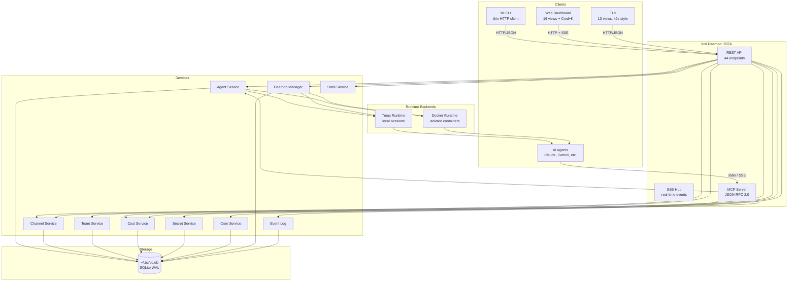
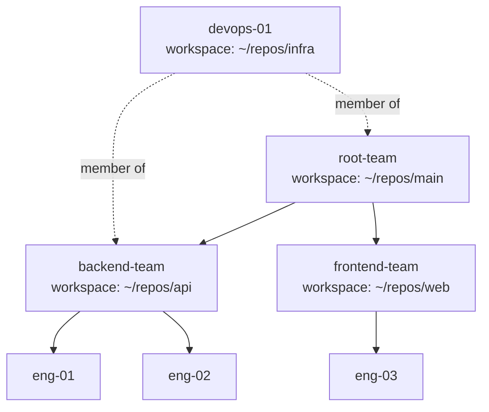
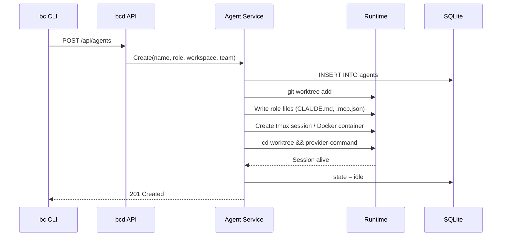
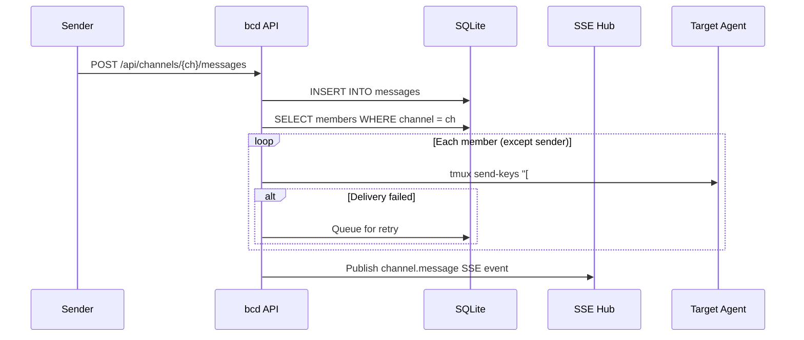
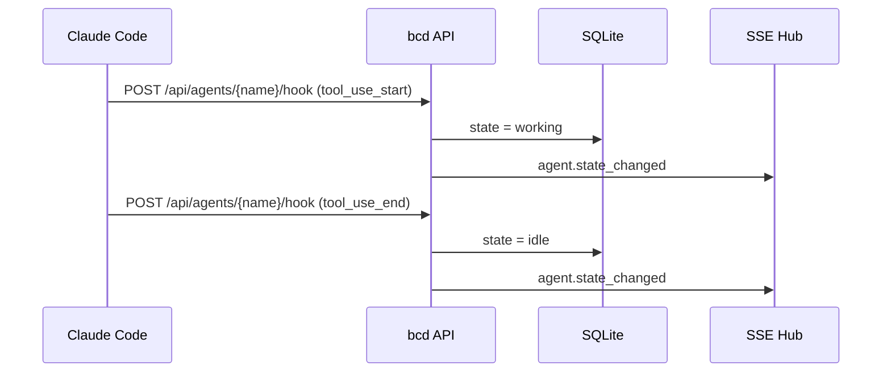

# Architecture Overview

## System Design

bc is a CLI-first orchestration system for coordinating teams of AI coding agents. The system is split into two binaries: `bc` (thin CLI client) and `bcd` (long-running daemon). The daemon manages agents across multiple git repositories from a single global installation at `~/.bc/`.

Key numbers:
- **44 REST API endpoints** across 14 resource groups
- **SQLite WAL** database with goose migrations
- **16 web dashboard views** with Cmd+K command palette
- **13 TUI views** with k9s-style keyboard navigation
- **MCP server** with JSON-RPC 2.0 over SSE + stdio transports
- **7 supported AI providers**: Claude, Gemini, Cursor, Aider, Codex, OpenCode, OpenClaw

### Global Installation

bc creates a per-project `.bc/` directory inside the workspace root:

```
project/
  .bc/
    settings.toml          # Workspace config (providers, runtime, defaults)
    agents/
      <name>/
        .claude/            # Claude config (mounted into containers)
          CLAUDE.md         # Role prompt
          settings.json     # Claude Code settings + hooks
          .mcp.json         # MCP server configs
        worktree/           # Git worktree checkout
    roles/                 # Role definitions
    channels/              # Channel data
    prompts/               # Default prompt templates
```

`bc init` initializes the per-project `.bc/` directory and starts bcd.

## Architecture Layers



## Components

### bc CLI (`cmd/bc/`)

Thin HTTP client. All commands are HTTP requests to bcd -- no direct DB/filesystem access. Opens the TUI if a workspace exists, prompts init if not, shows help in non-interactive mode.

### bcd Daemon (`cmd/bcd/`, `server/`)

Long-running HTTP server on `127.0.0.1:9374`. Single process managing all state.

| Component | Path | Purpose |
|-----------|------|---------|
| REST API | `/api/*` | CRUD for all resources (44 endpoints) |
| SSE Hub | `/api/events` | Real-time event stream |
| MCP Server | `/mcp/*` | AI agent integration (JSON-RPC 2.0 over SSE + stdio) |
| Web UI | `/` | Embedded React dashboard (16 views) |
| Health | `/health`, `/health/ready` | Liveness + readiness probes |

Middleware chain: Recovery, RequestID, CORS, Gzip, MaxBody, Routes.

### Web Dashboard

React SPA with 16 views, embedded in the bcd binary via `server/web/dist/`:

- **Dashboard** -- workspace overview with agent/channel/cost summary
- **Agents** -- list, create, start/stop, send messages, peek output
- **Agent Detail** -- per-agent terminal output, metrics, sessions
- **Channels** -- messaging, member management, search
- **Costs** -- per-agent, per-team, per-model breakdown with daily charts
- **Cron** -- scheduled jobs with enable/disable, manual trigger, logs
- **Daemons** -- long-running process management
- **Doctor** -- health checks and diagnostics
- **Logs** -- event log with type filtering
- **MCP** -- external MCP server configuration
- **Roles** -- role CRUD with prompt editor
- **Secrets** -- encrypted secret management
- **Settings** -- workspace configuration editor
- **Stats** -- system metrics (CPU, memory, disk) and workspace summary
- **Tools** -- AI tool provider configuration

Features: Cmd+K command palette, dark/light theming, responsive layout, SSE real-time updates, inline terminal output.

### TUI

React Ink terminal UI with 13 views and k9s-style keyboard navigation:

- Dashboard, Agents, Agent Detail, Channels, Costs, Logs, MCP
- Processes, Roles, Secrets, Tools, Worktrees, Help

Built with Bun, compiled to CommonJS in `tui/dist/`.

### Agents

AI coding assistants running in isolated sessions. Each agent has:
- A tmux session or Docker container (runtime backend)
- A git worktree (created and managed by bc)
- A role defining its prompt, MCP servers, and secrets
- An associated workspace (git repo path)
- Optional team membership for organizational grouping

See [backend/agents.md](backend/agents.md) for lifecycle, state machine, and runtime details.

### Teams

Hierarchical organizational groups for visualizing agents. Decoupled from agent lifecycle:



- Teams are **views**, not ownership -- agents exist independently
- Agents can appear in **multiple teams** (many-to-many via `team_members`)
- Teams form a tree via `parent_id`
- Teams can have a default workspace; agents inherit it but can override
- Deleting a team does NOT delete its agents

### Channels

SQLite-backed messaging for agent coordination:
- Group and direct channels with member management
- Message types: text, task, review, approval, merge, status
- @mentions, reactions, FTS5 search
- Delivery to agents via `tmux send-keys` with formatted context: `[#channel @sender] message`
- Auto-enrollment: agents join team channels on creation
- Retry queue for failed deliveries

### Secrets

AES-256-GCM encrypted secret store. Referenced in agent env vars as `${secret:NAME}`, resolved at runtime. Key derived via PBKDF2-SHA256 (600k iterations).

### Cost Tracking

Automatic import from Claude Code JSONL session files every 5 minutes. Per-agent, per-team, per-model breakdown with budget enforcement.

### Daemons

Long-running processes managed by bcd. Support tmux and Docker runtimes with restart policies. Used for workspace infrastructure (databases, services, etc.).

### Cron

Scheduled bash commands that run on a timer. Supports enable/disable, manual trigger, and execution log history.

### Stats

System-level metrics (CPU, memory, disk, uptime, goroutines) and workspace summary (agent counts, channel counts, cost totals, role/tool counts).

## Data Flow

### Agent Creation



### Channel Message Delivery



### Agent State via Hooks



## Key Design Decisions

| Decision | Choice | Rationale |
|----------|--------|-----------|
| Per-project `.bc/` | Per-project directory | Each workspace has its own `.bc/` directory for config, agents, and state |
| bc/bcd split | Thin CLI + daemon | CLI stays fast; daemon holds state and connections |
| SQLite WAL | Single database file | Zero-config, local-first, WAL for concurrent reads |
| Embedded web UI | Single binary | No separate web server; version-locked to API |
| SSE not WebSocket | Server-sent events | Simpler protocol, sufficient for one-way server push |
| Teams as views | Decoupled, many-to-many | No lifecycle coupling; pure organization |
| bc owns worktrees | All providers, uniform | Avoids nesting; consistent across Claude/Gemini/etc. |
| tmux send-keys | Only delivery mechanism | Hooks are one-way; no other way into agent session |
| No auth | Localhost only | Local dev tool; auth when remote access needed |
| MCP curated tools | Subset of API | Agents get key operations, not full admin |
| INTEGER timestamps | Unix millis | Faster range queries, smaller storage than TEXT ISO8601 |
| goose migrations | Versioned schema | Proper versioning, rollback support |
