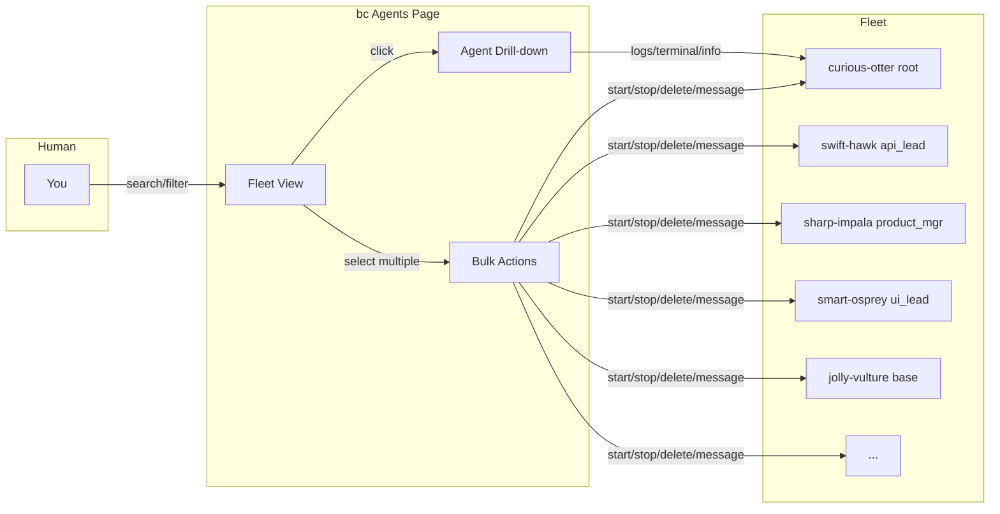

# Proposal: Agents Revamp — Fleet Command Center

> **Status:** Proposal (v1) &nbsp;|&nbsp; **Author:** zen-zebra &nbsp;|&nbsp; **Date:** 2026-04-10 &nbsp;|&nbsp; **Issue:** [#2979](https://github.com/rpuneet/bc/issues/2979)

---

## 1. What Are Agents?

Agents are the unit of work in bc. Each agent is an isolated AI assistant (Claude, Codex, Cursor, Gemini, …) running in a tmux session or Docker container, with its own git worktree and its own role. A workspace is a **fleet** of agents — some working, some idle, some stopped, some blocked on each other.

Today the Agents page lets you see them. Tomorrow it should let you **operate** them.



---

## 2. Current State (What's Broken)

The current Agents page is a flat table with a 5-tab drill-down. It works for 3 agents. It falls apart at 12 agents.

### Issues found in 2026-04-10 review (20 screenshots)

| # | Issue | Severity |
|---|-------|----------|
| 1 | Stopped agents show `0.0%` cards and empty charts instead of last-known state | **High** |
| 2 | Terminal tab is a dead screen for stopped agents | **High** |
| 3 | Stats cards + charts feel visually disconnected | Medium |
| 4 | Role tab duplicates Overview content | Medium |
| 5 | No bulk actions (start/stop/delete multiple agents) | **High** |
| 6 | Create Agent form has no task/description field | **High** |
| 7 | No search or filter on the list page | **High** |
| 8 | MCP column truncates with no popover | Low |
| 9 | Task text truncates at 50 chars with no tooltip | Low |
| 10 | No visual indicator for rows with peek expanded | Low |

### Architecture problems

- **No hierarchy view**: parent_id and children exist in the data model but the UI is flat
- **No cost context per agent**: tokens and cost are shown in Stats but there's no per-agent budget or warning
- **No activity timeline**: state changes (created → started → stopped → error) are logged but never surfaced
- **Tab sprawl**: 5 tabs for what is essentially 3 concerns (logs / terminal / everything else)
- **Reactive only**: no notifications when an agent errors, stops, or exceeds its cost threshold

---

## 3. The Vision

Turn the Agents page into a **fleet command center**. Three shifts:

1. **List → Workspace.** Search, filter, bulk select, saved views. Operate a fleet, not one agent at a time.
2. **5 tabs → 3 tabs.** Logs, Terminal, **Info** (merged Overview + Role + Stats + Activity).
3. **Static → smart.** Stopped agents show last-run context; live agents show real metrics; idle agents show hierarchy.

### Target layout

```
┌─────────────────────────────────────────────────────────────────────────┐
│ Agents (12) · 1 working · $1,469 total              [+ Create] [⚙] [⋮]  │
│ [/] Search...          [Role ▼] [State ▼] [Tool ▼]    [Flat | Tree]     │
├─────────────────────────────────────────────────────────────────────────┤
│ ☐  Name            Role          Task                 $     State      │
│ ☐  curious-otter   root          Turn complete       $1469  idle   [+] │
│ ☐  ▼ zen-zebra     root          Session ended        $0    stopped[+] │
│ ☐    ↳ jolly-vulture base        Processing prompt    —     ● working  │
│ ☐  fresh-panda     base          tool validation: 1   —     stopped[+] │
│ ☐  sharp-impala    product_mgr   Turn complete        $892  stopped[+] │
│ ...                                                                     │
├─────────────────────────────────────────────────────────────────────────┤
│ Selected: 3   [Start] [Stop] [Delete] [Message]  [Clear]                │
└─────────────────────────────────────────────────────────────────────────┘
```

### Bulk action bar

When one or more rows are selected, a bottom bar slides up with:
- **Start** (if any stopped)
- **Stop** (if any running)
- **Delete** (with confirm)
- **Message** (broadcast a message to all selected)
- **Clear** selection

### Search + filters

- `/` focuses search from anywhere on the list page
- Filters: Role, State (running/stopped/error/working/idle), Tool (claude/codex/cursor/gemini)
- URL state: filters persist in the query string (`?role=base&state=stopped`)
- Empty state when no matches: "No agents match your filters. [Clear]"

### Tree view

Toggle between **Flat** (current table) and **Tree** (parent → children indent). Default depends on the workspace:
- Flat for flat workspaces (no parents)
- Tree for hierarchical workspaces (any agent with children)

---

## 4. Drill-down — From 5 Tabs to 3

### Current: `Logs · Terminal · Overview · Stats · Role`

### New: `Logs · Terminal · Info`

**Info** is a single page that flows top to bottom:

```
┌─ zen-zebra · root · stopped · tmux ────────────────────────────────────┐
│                                                                         │
│ CURRENT TASK                                                            │
│ Session ended · 4h ago                                                  │
│                                                                         │
│ ─── STATS ──────────────────────────────────────────────────────────── │
│ CPU 0%    Memory 0 MB    Tokens 925,480    Cost $1,469.01               │
│ [1h] [6h] [12h] [24h]                                                   │
│ ┌─ CPU ──────┐  ┌─ Memory ───┐  ┌─ Tokens ────┐  ┌─ Cost ─────┐         │
│ │ (sparkline)│  │ (sparkline)│  │ (sparkline) │  │ (sparkline)│         │
│ └────────────┘  └────────────┘  └─────────────┘  └────────────┘         │
│                                                                         │
│ ─── HIERARCHY ─────────────────────────────────────────────────────── │
│ Parent: —                                                               │
│ Children: jolly-vulture, warm-raccoon (2)                               │
│                                                                         │
│ ─── ACTIVITY TIMELINE ─────────────────────────────────────────────── │
│ ● Created    2026-04-04 14:33:10                                        │
│ ● Started    2026-04-04 14:34:22                                        │
│ ● Working    2026-04-04 14:35:01  "Processing prompt..."                │
│ ● Stopped    2026-04-10 03:45:12  reason: session_ended                 │
│                                                                         │
│ ─── PATHS & METADATA ──────────────────────────────────────────────── │
│ Role file     .bc/roles/root.md                                         │
│ Session       zen-zebra                                                 │
│ Worktree      .bc/agents/zen-zebra/bc-bc-zen-zebra                      │
│ MCP servers   bc, github                                                │
│                                                                         │
└─────────────────────────────────────────────────────────────────────────┘
```

**Why merge?** Because when you are debugging an agent you are asking one question: "what is going on with this agent?" The answer involves the current task, recent metrics, hierarchy, and activity — all at once. Flipping between 3 tabs to piece this together is friction.

### Stopped-agent placeholders

When an agent is stopped, the Info tab shows **last known state**, not zeros:

```
CPU —     Memory —     Last tokens 925,480    Last cost $1,469.01
         (last run: 4h ago)
```

And the Terminal tab shows the **last captured pane** with a banner:

```
┌────────────────────────────────────────────────────────────────┐
│ ⚠ Agent is stopped. Last capture from 2026-04-10 03:45:12      │
├────────────────────────────────────────────────────────────────┤
│ > Turn complete                                                │
│ > Waiting for next prompt...                                   │
│ $                                                              │
└────────────────────────────────────────────────────────────────┘
      [Start agent to attach live terminal]
```

---

## 5. Architecture

### Data model changes

#### New table: `agent_activity`

```sql
CREATE TABLE IF NOT EXISTS agent_activity (
    id         INTEGER PRIMARY KEY AUTOINCREMENT,
    agent      TEXT NOT NULL,
    event      TEXT NOT NULL CHECK(event IN ('created', 'started', 'working', 'idle', 'stopped', 'error')),
    detail     TEXT,
    logged_at  TEXT NOT NULL DEFAULT (strftime('%Y-%m-%dT%H:%M:%SZ', 'now'))
);

CREATE INDEX IF NOT EXISTS idx_agent_activity_agent ON agent_activity(agent, id DESC);
```

The activity log is written by the agent manager on every state transition. Pruned to last 1000 entries per agent (same pattern as `notify_delivery_log`).

#### Extend `agent_stats` or use existing

Current `pkg/stats` already captures CPU/memory/token metrics. We reuse it for the Info tab's time-series charts.

### REST API additions

All existing endpoints keep working. New:

| Method | Path | Purpose |
|--------|------|---------|
| GET | `/api/agents/{name}/activity` | Return last N activity events |
| GET | `/api/agents/{name}/last-terminal` | Return last captured tmux pane |
| POST | `/api/agents/bulk/start` | `{agents: []}` — start many |
| POST | `/api/agents/bulk/stop` | `{agents: []}` — stop many |
| POST | `/api/agents/bulk/delete` | `{agents: []}` — delete many |
| POST | `/api/agents/bulk/message` | `{agents: [], message: ""}` — broadcast |

### Bulk operations implementation

Bulk ops are just loops over individual handlers, executed in parallel with a `sync.WaitGroup` and a result aggregator. No new state. Failures for individual agents are reported per-agent in the response:

```json
{
  "results": [
    {"agent": "zen-zebra", "status": "ok"},
    {"agent": "jolly-vulture", "status": "error", "error": "already running"}
  ]
}
```

### Frontend component split

```
web/src/views/Agents.tsx          (root, routing, shared state)
├── AgentsList/
│   ├── AgentsHeader.tsx          title, count, cost, [+ Create]
│   ├── AgentsSearch.tsx          / search, filters, Flat/Tree toggle
│   ├── AgentsTable.tsx           flat table (existing, enhanced)
│   ├── AgentsTree.tsx            hierarchical view (new)
│   ├── AgentsBulkBar.tsx         bottom action bar (new)
│   └── AgentRow.tsx              single row (+ selection checkbox)
└── AgentDetail/
    ├── AgentHeader.tsx           name, role, state, breadcrumb
    ├── AgentTabs.tsx              Logs / Terminal / Info
    ├── AgentLogs.tsx              SSE stream
    ├── AgentTerminal.tsx          xterm WS (live) or last-capture (stopped)
    ├── AgentInfo.tsx              merged Overview + Role + Stats + Activity
    └── AgentMessageBar.tsx        sticky bottom input
```

---

## 6. UX Details

### Keyboard shortcuts

| Key | Action |
|-----|--------|
| `/` | Focus search |
| `x` | Toggle bulk select mode |
| `a` | Select all visible |
| `Esc` | Clear selection / close detail |
| `j` / `k` | Move selection down / up |
| `Enter` | Open selected agent detail |
| `Space` | Toggle peek for selected |
| `1` / `2` / `3` | Switch tab (Logs / Terminal / Info) on detail page |
| `.` | Focus message input (detail page) |

### Peek row expansion

Current: `[+]` button on the right expands an inline terminal under the row.

New:
- **Row-level click** on the name cell also expands
- Expanded row gets a **subtle left accent bar** (same color as the agent's role)
- The `[+]` becomes `[−]` and stays as an explicit close handle
- Only one peek row open at a time by default (click another to switch)

### Task text tooltip

Hovering on the truncated Task cell shows a tooltip with the full text. Uses native `title=` attribute for minimal implementation.

### MCP column popover

Hovering on the MCP cell shows a small popover listing all MCP servers attached. Click outside to dismiss. For 1–2 servers, just show inline (no popover).

### Activity badge

Each row has a tiny badge showing the most recent activity event:

- `● working` (accent color)
- `○ idle`
- `◌ stopped`
- `✗ error` (red, with a dot pulse animation)

---

## 7. Create Agent Form — Upgrades

Current form: Name (optional), Role, Tool, Runtime. Create button.

New form adds:

- **Task** (text area, optional): the initial task to assign. If set, the agent is started immediately and the task is attached via the existing `/api/agents/{name}/send` endpoint.
- **Template** (dropdown, optional): pre-filled configs for common setups:
  - `feature-dev + claude + docker` — a standard feature branch agent
  - `reviewer + claude + tmux` — a code review agent
  - `manager + gemini + tmux` — a coordination agent
  - `blank` — current default

Templates store: `role`, `tool`, `runtime`, `prompt_template`.

- **Recent configs** (suggestion chips): "Use the same config as *smart-osprey*" — clicking pre-fills from an existing agent.

---

## 8. Build Sequence

Each phase is a separate PR to keep scope reviewable.

| Phase | Issue | Scope | Size |
|-------|-------|-------|------|
| 1 | #TBD | Bulk select + action bar + search/filter | Medium |
| 2 | #TBD | Merge Overview/Role/Stats → Info tab | Medium |
| 3 | #TBD | Tree view + hierarchy | Small |
| 4 | #TBD | Activity timeline + smart stopped-agent cards | Medium |
| 5 | #TBD | Create form upgrade (task, templates, recent configs) | Small |
| 6 | #TBD | Keyboard shortcuts + MCP/task tooltips + polish | Small |

**Total**: ~6 PRs, each reviewable in under 30 min.

### Dependencies

- Phase 1 and Phase 2 are independent, can parallelize
- Phase 3 depends on Phase 1 (tree view reuses selection state)
- Phase 4 depends on Phase 2 (Info tab hosts the timeline)
- Phase 5 and 6 are independent and can land any time after Phase 1

---

## 9. Code Impact

| | Files | Lines |
|---|-------|-------|
| **Deleted** | ~2 (RoleTab, separate StatsPanel) | ~200 |
| **Created** | ~8 (bulk, search, tree, activity, timeline components) | ~1500 |
| **Modified** | ~6 (Agents.tsx, AgentDetail, routes, API client) | ~400 net |
| **Net add** | ~12 files | ~1700 lines |

This is a **building** revamp, not a **deleting** revamp. The current code isn't broken — it's under-featured. We keep most of it and add on top.

---

## 10. Design Decisions

| # | Question | Decision | Rationale |
|---|----------|----------|-----------|
| 1 | Keep Role tab? | **No.** Merge into Info. | Duplicates Overview; no unique content. |
| 2 | Tree view default? | **Auto-detect.** Tree if any parent/child, else flat. | Respects flat workspaces; rewards hierarchical ones. |
| 3 | Bulk delete confirm? | **Yes.** Single modal for N agents. | Delete is destructive; always confirm. |
| 4 | Single peek or multiple? | **Single (default).** Users can override with a setting. | Keeps the list readable at 20+ rows. |
| 5 | Activity log retention? | **1000 entries per agent**, pruned hourly. | Same pattern as notify_delivery_log. |
| 6 | Cost budgets in v1? | **No.** Shown but not enforced. | Enforcement needs its own proposal. |
| 7 | URL state for filters? | **Yes.** `?role=base&state=stopped`. | Shareable, back-button friendly. |
| 8 | Templates in v1? | **Yes, but hardcoded.** Dynamic templates later. | Unblocks the core create-form improvement. |
| 9 | Breaking API changes? | **No.** Only additions. | Existing clients keep working. |
| 10 | New DB table? | **Yes. `agent_activity`.** | Timeline needs a durable log; derive from events infeasible. |

---

## 11. Open Questions

1. **Should `agent_activity` live in `pkg/events`** (generic event log) rather than its own table? Would let us reuse the events UI but couples agents to the event schema.
2. **Do we need an "Activity" tab separate from Info?** I argue no — the timeline fits in a single section of Info. But if the log gets long, a dedicated tab might be cleaner.
3. **Should bulk delete require typing "delete"?** Like GitHub repo delete. Overkill for agents IMO — a simple confirm is enough.
4. **How do we handle agent rename with bulk select?** Out of scope for v1. Rename stays single-agent.

---

## 12. Non-Goals

Explicitly **not** in this proposal:

- **Cost enforcement / budgets.** Separate proposal. v1 only surfaces cost, doesn't stop agents on overage.
- **Multi-workspace view.** The current page is workspace-scoped; cross-workspace is a separate feature.
- **Agent marketplace / shared templates across workspaces.** Templates are local-only in v1.
- **Dependency graph between agents.** Hierarchy is parent/child only; full DAG is out of scope.
- **Time-travel debugging.** Activity timeline is append-only, no replay.

---

## Appendix A — Screenshot Review (2026-04-10)

Findings from a 20-screenshot walkthrough of the current Agents page:

1. List page — 12 agents, looks clean, sortable columns
2. Create form — expanded, 4 fields, no task field
3. Create form detail — role/tool/runtime dropdowns work
4. Row hover on working agent — highlight works
5. Peek inline terminal — **killer feature**, live SSE
6. zen-zebra detail Logs tab — streaming output
7. zen-zebra Terminal — **dead screen** (stopped)
8. zen-zebra Overview — metadata, timestamps
9. zen-zebra Stats — **empty cards + "No data yet"** charts
10. zen-zebra Role — duplicates Overview
11. jolly-vulture (working) Logs — live stream works
12. jolly-vulture Terminal — **attached xterm**, interactive
13. jolly-vulture Overview — running state
14. jolly-vulture Stats — live CPU/Memory
15. sharp-impala product_manager Overview
16. sharp-impala Stats bottom — cost + I/O summary
17. curious-otter (925K tokens) Logs
18. curious-otter Stats — historical breakdown
19. Message input focused
20. Inline rename — double-click to edit

---

## Appendix B — Comparison to Channels Revamp

| | Channels Revamp | Agents Revamp |
|---|---|---|
| **Motivation** | Delete bad architecture | Level up good architecture |
| **Scope** | 45 files deleted, 15 created | 2 deleted, 8 created |
| **Breaking changes** | Yes (pkg/channel removed) | No (API additive only) |
| **DB schema** | 5 new tables, old dropped | 1 new table (`agent_activity`) |
| **Phases** | 7 | 6 |
| **Net LOC** | **-2,329** (deletion heavy) | **+1,700** (addition heavy) |

The Agents revamp is smaller and safer. It doesn't tear anything down — it adds the missing pieces.
