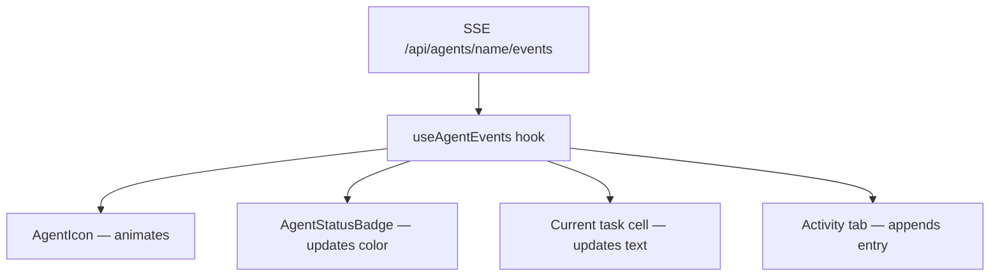
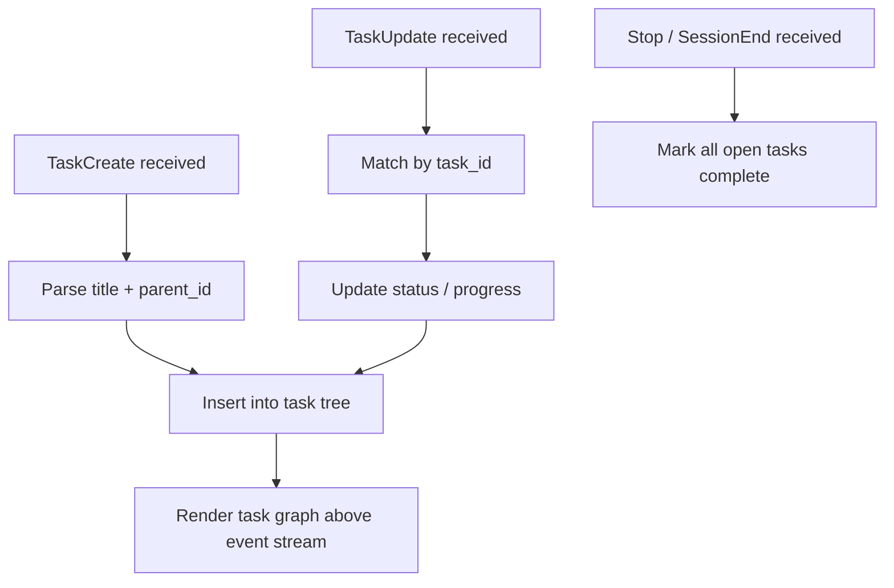
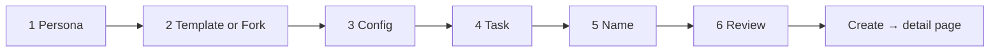
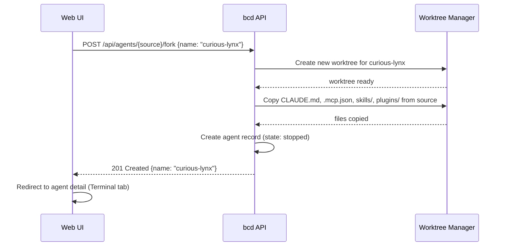

# Proposal: Agents Revamp v2 — Identity, Personality, and Fleet Command

> **Status:** Proposal (v2) &nbsp;|&nbsp; **Author:** zen-zebra &nbsp;|&nbsp; **Date:** 2026-04-10 &nbsp;|&nbsp; **Issue:** [#2979](https://github.com/rpuneet/bc/issues/2979)

---

## 1. Why v2?

The v1 revamp (PR #2988) shipped the mechanical layer: bulk select, search, tree view, Info tab merge, keyboard shortcuts, and a richer create form. That work is complete and in production.

v2 addresses something v1 deliberately deferred: **what it means to be an agent**. Right now agents are named processes. v2 makes them **named entities** — each with a persistent identity (worktree, configuration bundle, personality) that is visible and operable from a first-class UI.

Four things v1 did not solve:

| Gap | v2 Answer |
|-----|-----------|
| Agents have no visual identity — the list is a flat text table | Agent personality system: icon set, accent color, state animation |
| "Create agent" means pick a role and a provider — nothing more | Create wizard: materialized worktree bundle, template or fork |
| The drill-down Terminal tab wastes half its screen on chrome | Terminal tab goes full-screen; overlay states for attach/stopped |
| Hook events are logged but never surfaced in the UI | Activity tab: live event stream + task graph from `TaskCreate`/`TaskUpdate` |

---

## 2. What Is an Agent?

An agent is more than a tmux session or Docker container. It is an isolated AI collaborator with:

1. **A git worktree** — dedicated filesystem branch in `.bc/agents/<name>/`
2. **A configuration bundle** — a set of files materialized into that worktree at creation
3. **A role reference** — the role defines defaults; the agent can override them
4. **A personality** — icon set variant, accent color, animation set
5. **A runtime** — tmux (local) or Docker (isolated)
6. **A provider** — Claude, Codex, Gemini, Cursor, etc.

### 2.1 Configuration Bundle

On creation, bc materializes the following files into the agent's worktree. The exact files depend on runtime:

| File | tmux | docker | Purpose |
|------|------|--------|---------|
| `CLAUDE.md` | required | required | System prompt (instructions for the agent) |
| `.mcp.json` | from `~/.claude/` | in worktree | MCP server list |
| `skills/` | via provider CLI | in worktree | Skill definitions |
| `plugins/` | via provider CLI | in worktree | MCP server configs + bash tool policies |
| `.bc/role` | reference only | reference only | Role name (pointer to `.bc/roles/<role>.md`) |

For **tmux agents**: the provider CLI (`claude`, `gemini`, etc.) manages its own MCP config from `~/.claude/`. bc only writes `CLAUDE.md` and the role reference.

For **Docker agents**: bc controls everything. The full bundle is written to the worktree and mounted into the container. This is the surface where plugins, skills, and MCP lists are configured through the UI.

### 2.2 Role vs Agent

```
Role (template)                Agent (instance)
─────────────────────          ─────────────────────────────
.bc/roles/feature-dev.md  →    .bc/agents/curious-otter/CLAUDE.md
                               .bc/agents/curious-otter/.mcp.json
                               .bc/agents/curious-otter/skills/
                               .bc/agents/curious-otter/plugins/
```

The role is a read-only template. The agent instance can diverge (edit system prompt, add MCPs) without affecting the role. Forking an agent clones its instance config, not the role.

### 2.3 Agent Lifecycle

```mermaid
flowchart LR
    SPEC[spec] --> MAT[materialize]
    MAT --> START[start]
    START --> RUN[running]
    RUN --> IDLE[idle]
    IDLE --> RUN
    RUN --> STUCK[stuck]
    STUCK --> RUN
    STUCK --> STOP[stopped]
    RUN --> STOP
    IDLE --> STOP
    STOP --> START
    STOP --> ARCHIVE[archived]
    ARCHIVE --> DELETE[deleted]
    RUN --> ERROR[error]
    ERROR --> STOP

    style RUN fill:#14532d,stroke:#4ade80
    style IDLE fill:#1e3a5f,stroke:#60a5fa
    style STUCK fill:#78350f,stroke:#fbbf24
    style ERROR fill:#3b0000,stroke:#ef4444
```



| State | Definition |
|-------|-----------|
| `spec` | Agent record created, worktree not yet materialized |
| `materialize` | Config bundle written to worktree |
| `start` | tmux session / Docker container launching |
| `running` | Provider CLI active, accepting prompts |
| `idle` | Running but no tool use for > 30s |
| `stuck` | No tool use or output for > 5 min (configurable) |
| `stopped` | Session or container exited cleanly |
| `error` | Exited with non-zero or crashed |
| `archived` | Stopped, worktree retained, session removed |
| `deleted` | Worktree removed |

---

## 3. Name Generation

### 3.1 Contract

**API contract**: `POST /api/agents` with an empty or missing `name` field returns `400 Bad Request`. The server never generates names.

**Frontend responsibility**: generate a unique `verb+animal` name before the create wizard opens. The name field is pre-filled and editable. The user can accept it, regenerate with [↻ Regen], or type their own.

### 3.2 Client-Side Generation

The frontend ships a bundled word list (no network call):

- ~200 verbs: `curious`, `swift`, `sharp`, `warm`, `fresh`, `bold`, `calm`, `keen`, `bright`, `quiet`, `silent`, `agile`, `clever`, `daring`, `eager`, …
- ~200 animals: `otter`, `hawk`, `impala`, `raccoon`, `panda`, `osprey`, `vulture`, `fox`, `lynx`, `crane`, `bison`, `gecko`, `ibis`, `kite`, `lark`, …

Product: ~40,000 unique combinations. At 20 agents per workspace this is practically inexhaustible.

**Generation algorithm**:

```
1. Agent list is already loaded in React state (GET /api/agents)
2. Build Set<string> of existing names
3. Pick random verb + animal → join with "-"
4. If name is in the set, resample (max 50 retries)
5. If all 50 retries collide, append 2-digit random suffix
6. Pre-fill name field
```

### 3.3 Should the Server Expose `GET /api/agents/generate-name`?

**Decision: No.** Keep it client-side only.

| Argument for server endpoint | Why we reject it |
|------------------------------|-----------------|
| Server knows all existing names | Client already has the agent list — no extra round-trip needed |
| Consistent across CLI, TUI, web | CLI creates agents directly; TUI has its own UX. Only web needs the wizard. |
| Race condition: two clients pick same name simultaneously | Extremely unlikely at typical scale; server returns 409 on duplicate and client regenerates |

If future CLI or TUI needs name suggestions, add the endpoint then. Do not add infrastructure for a problem that does not yet exist.

---

## 4. Agent Personality System

Each agent has a persistent **persona**: an icon set variant, an accent color, and an animation set that reacts to hook events. The persona is chosen at creation and does not change.

### 4.1 Icon Set Variants

Three variants ship in v2.

| Variant | Description | Design language |
|---------|-------------|----------------|
| `geometric` | Precise shapes: hexagons, triangles, interlocking polygons. Crisp and engineered. | Vercel, Linear |
| `organic` | Fluid blobs and soft curves. Rounded, expressive. | Raycast, Notion |
| `monogram` | A bold letter (first char of agent name) on a colored field. Ultra-readable at small sizes. | Linear avatars, GitHub |

Each variant comes in 8 accent colors. The specific color is derived: `hash(agentName) % 8`. Same agent always gets the same color. The user can override the color during creation (persona picker step). Color derivation is client-side only — no server involvement.

### 4.2 Animation Spec

Animations convey state, not spectacle. All durations are short; all transitions use ease-out. Inspired by Linear's progress indicators and Vercel's deployment dots.

| Hook event / state | `geometric` | `organic` | `monogram` | Duration |
|-------------------|-------------|-----------|------------|----------|
| `idle` | Slow polygon rotation 0.05 rpm | Slow blob morph 8s loop | Letter pulse opacity 80→100% | 8s loop |
| `ToolUse` | Edge highlight on one face | Blob expands toward tool quadrant | Accent ring flashes | 400ms ease-out |
| `TaskCreate` | Concentric ring expansion from center | Ripple outward from center | Letter scales 1→1.15→1 | 600ms |
| `TaskUpdate` | Edge trace animation clockwise | Color shift 300ms | Accent ring ticks | 300ms |
| `PromptSubmit` | Scale 1→0.9→1 ("breathe in") | Blob contracts then expands | Letter shrinks then returns | 500ms |
| `Stuck` | Amber wash + slow wobble | Amber tint + oscillation 2s | Amber background + shake | 2s loop |
| `Error` | Red shake / jitter 3× | Red tint + rapid jitter | Red background + X overlay | 800ms |
| `Stopped` | Desaturate to grayscale, opacity 60% | Desaturate, opacity 60% | Gray background | instant |
| `running` (no event) | Full-color idle animation | Full-color idle animation | Full-color idle animation | — |

All animations use CSS keyframes or Framer Motion. No canvas, no WebGL — these are icon-sized (24–64px) SVG or CSS shapes.

**Performance rule**: animations run only when the component is in the viewport (`IntersectionObserver` gate). Off-screen agents do not animate.

### 4.3 `bc-agent-ui` Component Library

Internal module at `web/src/components/agent-ui/`. Not a separate npm package. Clean barrel export via `index.ts`.

| Component | Props | Purpose |
|-----------|-------|---------|
| `AgentIcon` | `name, persona, variant, state, event?, size?` | Animated icon. Reacts to `state` and `event` changes. |
| `AgentStatusBadge` | `state, size?` | Color-coded pill: `● running`, `○ idle`, `⚠ stuck`, `✗ error`, `◌ stopped` |
| `AgentPersonaPicker` | `value, onChange` | 3×8 grid of variants × colors. Used in create wizard. |
| `AgentHeroCard` | `agent, event?` | Large icon (64px) + name + role + state. Used at top of detail page. |
| `AgentRow` | `agent, selected, onSelect, onAction` | Table row with icon, name, runtime, provider, task, action buttons |
| `AgentPill` | `name, state, onClick?` | Compact name + status dot. Used in hierarchy and fork picker. |

`AgentIcon` subscribes to the hook event stream internally when an SSE connection is active. The parent component does not manage event state.



---

## 5. List Page Redesign

### 5.1 Column Layout

Columns removed from the primary list: CPU%, Memory%, Tokens, MCP. Those move to the Info tab and a hover popover.

New primary columns (left to right):

| Column | Width | Source |
|--------|-------|--------|
| Checkbox (bulk) | 32px | local state |
| Agent icon (animated) | 36px | `AgentIcon` component |
| Agent name | 160px | agent record; double-click to inline rename |
| Runtime badge | 72px | `tmux` / `docker` / `localhost` |
| Provider badge | 80px | `claude` / `codex` / `gemini` / `cursor` |
| Current task | flex (most space) | last hook event (see priority below) |
| Actions | 96px | icon buttons only: ▶ ⏸ 🗑 — tooltip on hover |

### 5.2 Current Task Column

Populated from the agent's hook event stream in priority order:

1. Active `TaskCreate` title (if a task is in progress, not yet `TaskUpdate` with `complete`)
2. Last `ToolUse.tool_name` (e.g. "Read file", "Bash command")
3. Last message preview (first 80 chars)
4. Last known state string (e.g. "Turn complete · 4h ago")

Updates live via SSE without page refresh.

### 5.3 Action Buttons

Three icon-only buttons per row. No text labels. Native `title` tooltip on hover.

| Icon | Action | Visible when |
|------|--------|-------------|
| ▶ | Start agent | `stopped` / `error` |
| ⏸ | Stop agent | `running` / `idle` / `stuck` |
| 🗑 | Delete agent (confirm modal) | always |

Clicking delete on a running agent: modal says "Agent is running. Stop and delete?" with [Cancel] [Stop & Delete].

### 5.4 List Page Mockup

```
┌────────────────────────────────────────────────────────────────────────────────────┐
│ Agents (12) · 3 running · $2,841 total                [+ Create Agent]  [⚙] [⋮]  │
│ [/] Search agents...      [Runtime ▼] [Provider ▼] [State ▼]   [Flat | Tree]     │
├──┬──────┬──────────────────┬──────────┬──────────┬─────────────────────────┬──────┤
│☐ │ Icon │ Name             │ Runtime  │ Provider │ Current task            │      │
├──┼──────┼──────────────────┼──────────┼──────────┼─────────────────────────┼──────┤
│☐ │ ●geo │ curious-otter    │ tmux     │ claude   │ PR #428 review done     │ ▶⏸🗑 │
│☐ │ ●org │ zen-zebra        │ docker   │ claude   │ Read file: main.go      │ ▶⏸🗑 │
│☐ │ ●mon │ swift-hawk       │ docker   │ codex    │ Bash: go test ./...     │ ▶⏸🗑 │
│☐ │ ◌geo │ sharp-impala     │ tmux     │ gemini   │ Turn complete · 4h ago  │ ▶ 🗑  │
│☐ │ ⚠org │ warm-raccoon     │ docker   │ claude   │ Stuck: Bash (3m)        │ ▶⏸🗑 │
│☐ │ ✗mon │ jolly-vulture    │ docker   │ cursor   │ Error: exit 1           │ ▶ 🗑  │
│ ...                                                                                │
├──┴──────┴──────────────────┴──────────┴──────────┴─────────────────────────┴──────┤
│ Selected: 3   [▶ Start]  [⏸ Stop]  [🗑 Delete]  [✉ Message]        [Clear ×]      │
└────────────────────────────────────────────────────────────────────────────────────┘
```

Icon legend: `●geo` running geometric, `●org` running organic, `●mon` running monogram, `◌geo` stopped geometric, `⚠org` stuck organic, `✗mon` error monogram.

---

## 6. Detail Page Redesign

### 6.1 Header

Replace plain name + state text with `AgentHeroCard`:

```
┌────────────────────────────────────────────────────────────────────────────────────┐
│  [←] Agents  /  zen-zebra                                                          │
│                                                                                    │
│  [64px animated organic icon]   zen-zebra                                          │
│                                 docker · claude · ● running                        │
│                                 PR #428 review · read file: main.go                │
│                                                          [▶ Start]  [⏸ Stop]       │
└────────────────────────────────────────────────────────────────────────────────────┘
```

### 6.2 Tab Order

New order — changed from v1's `Logs / Terminal / Info`:

```
[ Terminal ]  [ Activity ]  [ Info ]
```

Terminal is the default tab. The Logs tab from v1 is removed — Activity covers the same use cases with richer structure. A "Raw logs" link is available in the Info tab.

### 6.3 Keyboard Shortcuts (detail page)

| Key | Action |
|-----|--------|
| `1` | Switch to Terminal tab |
| `2` | Switch to Activity tab |
| `3` | Switch to Info tab |
| `s` | Toggle start / stop |
| `Esc` | Back to agent list |

---

## 7. Terminal Tab

Full-screen xterm. No bottom input bar. No chrome.

### 7.1 State: Running, Not Attached

```
┌────────────────────────────────────────────────────────────────────────────────────┐
│                                                                                    │
│                          [animated agent icon 48px]                                │
│                             zen-zebra is running                                   │
│                                                                                    │
│                         [ Click to attach terminal ]                               │
│                                                                                    │
│                     Last activity: Read file · 23s ago                             │
│                                                                                    │
└────────────────────────────────────────────────────────────────────────────────────┘
```

Clicking the badge connects the xterm WebSocket. The overlay disappears.

### 7.2 State: Attached

```
┌────────────────────────────────────────────────────────────────────────────────────┐
│ ● zen-zebra — attached                                           [Detach ×]        │
├────────────────────────────────────────────────────────────────────────────────────┤
│                                                                                    │
│  > Analyzing PR diff...                                                            │
│  > Read file: src/server/handler.go                                                │
│  > Bash: golangci-lint run ./...                                                   │
│  $                                                                                 │
│                                                                                    │
└────────────────────────────────────────────────────────────────────────────────────┘
```

### 7.3 State: Stopped

```
┌────────────────────────────────────────────────────────────────────────────────────┐
│ ◌ zen-zebra — stopped · last capture 2026-04-10 03:45:12       [Start agent]       │
├────────────────────────────────────────────────────────────────────────────────────┤
│                                                                                    │
│  > Turn complete                                                                   │
│  > Waiting for next prompt...                                                      │
│  $                                                                                 │
│                                                                                    │
└────────────────────────────────────────────────────────────────────────────────────┘
```

Last captured pane loaded from `GET /api/agents/{name}/last-terminal`. [Start agent] starts the agent and transitions to the "not attached" state.

---

## 8. Activity Tab

A live, filterable event stream of all hook events for this agent, plus a task graph derived from `TaskCreate` and `TaskUpdate` events.

### 8.1 Layout

```
┌────────────────────────────────────────────────────────────────────────────────────┐
│ Activity                  [/] Filter...  [Type ▼] [Tool ▼]      [Live ● | ○]      │
├────────────────────────────────────────────────────────────────────────────────────┤
│                                                                                    │
│ ACTIVE TASKS                                                                       │
│ ┌── PR #428 review ───────────────────────────────────────────────────────────┐   │
│ │  ├── Read files (4 files)                                         done ✓    │   │
│ │  ├── Run linter                                                   done ✓    │   │
│ │  └── Write review comment                                         active ●  │   │
│ └─────────────────────────────────────────────────────────────────────────────┘   │
│                                                                                    │
│ EVENT STREAM                                                                       │
│ 10:45:32  🔧 ToolUse        Bash · golangci-lint run ./...                   [↓]  │
│ 10:45:28  ✓  PostToolUse    Bash · exit 0, 3 warnings                        [↓]  │
│ 10:45:15  🔧 ToolUse        Read · src/server/handler.go                     [↓]  │
│ 10:44:58  ↻  TaskUpdate     PR #428 review · step 2/3 complete               [↓]  │
│ 10:44:20  🔧 ToolUse        Read · src/server/routes.go                      [↓]  │
│ 10:43:55  ◎  TaskCreate     PR #428 review                                   [↓]  │
│ 10:43:40  ✉  PromptSubmit   Review PR #428 and post comments                 [↓]  │
│ 10:43:38  ▶  SessionStart   zen-zebra                                        [↓]  │
│                                                                                    │
└────────────────────────────────────────────────────────────────────────────────────┘
```

`[↓]` expands the event row to show raw hook payload. `[Live ●]` toggles auto-scroll to newest.

### 8.2 Task Graph

`TaskCreate` and `TaskUpdate` events are parsed to build a live task tree:



Task graph shows only the current session's tasks. Historical tasks from previous sessions collapse under "Previous sessions".

### 8.3 Hook Event Taxonomy

| Event type | Icon | What it means | UI effect |
|-----------|------|---------------|-----------|
| `SessionStart` | ▶ | Agent session started | Lifecycle state change |
| `SessionEnd` | ⏹ | Session ended cleanly | Lifecycle state change |
| `PromptSubmit` | ✉ | Prompt sent to agent | Icon "breathe in" animation |
| `PreToolUse` | ⚡ | About to call a tool | Icon pulse (dim) |
| `ToolUse` | 🔧 | Tool called | Icon pulse + task column update |
| `PostToolUse` | ✓ | Tool returned | — |
| `TaskCreate` | ◎ | New task created | Task graph insert + icon ring |
| `TaskUpdate` | ↻ | Task progress update | Task graph update |
| `Notification` | 🔔 | Agent sent a notification | — |
| `SubagentStop` | ↙ | Child agent stopped | Hierarchy panel refresh |
| `PreCompact` | ⬡ | Context compaction starting | — |
| `Stop` | ⏹ | Stop signal received | Lifecycle state change |

Unknown event types render as a generic row showing the raw type name. No events are silently dropped.

### 8.4 Event Stream API

New SSE endpoint:

```
GET /api/agents/{name}/events
```

Each event in the stream:

```json
{
  "id": "1744282532001",
  "type": "ToolUse",
  "timestamp": "2026-04-10T10:45:32Z",
  "data": {
    "tool_name": "Bash",
    "tool_input": { "command": "golangci-lint run ./..." }
  }
}
```

Backed by the existing `pkg/events` SQLite store. On connect: replay last 100 events, then tail. Reconnect handled by the browser `EventSource` API with `Last-Event-ID`. No new DB table required.

---

## 9. Info Tab

### 9.1 Layout

```
┌────────────────────────────────────────────────────────────────────────────────────┐
│ Info                                                                               │
├────────────────────────────────────────────────────────────────────────────────────┤
│                                                                                    │
│ ─── SYSTEM PROMPT ────────────────────────────────────────────────────────────    │
│ (editable textarea — reads/writes CLAUDE.md in agent worktree)                    │
│ You are a feature-dev agent. Your role is to implement...                         │
│                                                     [Edit] → [Save]  [Cancel]    │
│                                                                                    │
│ ─── MCP SERVERS ──────────────────────────────── (docker agents only) ─────────   │
│ bc       /_mcp/zen-zebra/sse            ● connected                               │
│ github   /api/github/mcp               ● connected                               │
│ [+ Add MCP server]                                                                │
│                                                                                    │
│ ─── SKILLS ───────────────────────────────────── (docker agents only) ─────────   │
│ frontend-design    v2.1    ● enabled                                              │
│ go-testing         v1.4    ● enabled                                              │
│ [+ Add skill]                                                                     │
│                                                                                    │
│ ─── STATS ─────────────────────────────────────────────────────────────────────   │
│ Tokens 925,480   Cost $1,469   CPU 12%   Mem 340 MB   Disk 1.2 GB                │
│ [1h] [6h] [24h] [7d]    (sparkline per metric)                                   │
│                                                                                    │
│ ─── HIERARCHY ──────────────────────────────────────────────────────────────────  │
│ Parent:   [curious-otter ● root]                                                  │
│ Children: [jolly-vulture ◌ base]  [warm-raccoon ⚠ base]                           │
│                                                                                    │
│ ─── METADATA ───────────────────────────────────────────────────────────────────  │
│ Created   2026-04-04 14:33    Worktree   .bc/agents/zen-zebra/bc-bc-zen-zebra    │
│ Started   2026-04-04 14:34    Runtime    docker                                   │
│ Provider  claude              Role       feature-dev                              │
│ Raw logs  [View →]                                                                │
│                                                                                    │
│ ─── ACTIONS ────────────────────────────────────────────────────────────────────  │
│ [▶ Start]  [⏸ Stop]  [Archive]  [Clone →]  [Delete]                              │
│                                                                                    │
└────────────────────────────────────────────────────────────────────────────────────┘
```

### 9.2 Runtime-Gated Config Surface

| Config section | tmux agent | docker agent |
|----------------|-----------|-------------|
| System prompt (CLAUDE.md) | shown, editable | shown, editable |
| MCP servers (.mcp.json) | **hidden** | shown, editable |
| Skills (skills/) | **hidden** | shown, editable |
| Plugins (plugins/) | **hidden** | shown, editable |
| Stats (CPU, mem, disk, tokens) | shown | shown |
| Hierarchy (parent / children) | shown | shown |
| Metadata | shown | shown |

For tmux agents, a banner explains: "MCP, skills, and plugins for tmux agents are managed by the Claude CLI at `~/.claude/`. Edit them there directly."

**Editing system prompt**: `PATCH /api/agents/{name}/config` writes `CLAUDE.md` in the worktree. For Docker agents: effective on next prompt (no restart). For tmux: note shown — "Restart agent to apply changes".

**Editing MCP servers (docker)**: writes `.mcp.json` in worktree. Triggers a soft MCP reconnect — no container restart required.

### 9.3 Clone Action

**Clone** is a shortcut into the Fork flow: opens the create wizard pre-seeded at step 2 with this agent selected as the fork source. See section 11 for the full fork flow.

---

## 10. Create Wizard

A 6-step guided wizard. A live preview of the agent icon (animating, in its chosen variant and color) is displayed persistently in the top-right corner from step 1 onward.

### 10.1 Step Flow



### 10.2 Step 1: Persona

```
┌────────────────────────────────────────────────────────────────────────────────────┐
│  Choose your agent's look                                       [icon preview]      │
│                                                                                    │
│  ┌─────────────────────┐  ┌─────────────────────┐  ┌─────────────────────┐       │
│  │  [geometric anim]   │  │  [organic anim]      │  │  [monogram anim]    │       │
│  │                     │  │                      │  │                     │       │
│  │  Geometric          │  │  Organic             │  │  Monogram           │       │
│  │  Precise shapes     │  │  Fluid and soft      │  │  Bold initials      │       │
│  └─────────────────────┘  └─────────────────────┘  └─────────────────────┘       │
│                                                                                    │
│  Accent color  (auto-derived from name — override here)                           │
│  ○ ○ ○ ● ○ ○ ○ ○                                                                  │
│                                                                                [Next →]│
└────────────────────────────────────────────────────────────────────────────────────┘
```

### 10.3 Step 2: Template or Fork

```
┌────────────────────────────────────────────────────────────────────────────────────┐
│  Start from                                                     [icon preview]      │
│                                                                                    │
│  Templates                                                                         │
│  ○ feature-dev    claude + docker + full config bundle                             │
│  ○ reviewer       claude + tmux  + code review system prompt                      │
│  ○ manager        gemini + tmux  + orchestration system prompt                    │
│  ● blank          no preset — configure from scratch                               │
│                                                                                    │
│  — or fork existing agent —                                                        │
│  [curious-otter ▼]  inherits: CLAUDE.md, .mcp.json, skills/, plugins/              │
│                                                                                [Next →]│
└────────────────────────────────────────────────────────────────────────────────────┘
```

### 10.4 Step 3: Config

Fields differ by runtime:

**tmux:**
```
Provider  [claude ▼]     Runtime  [tmux ▼]     Role  [feature-dev ▼]

ℹ MCP, skills, and plugins are managed by the Claude CLI for tmux agents.
```

**docker:**
```
Provider  [claude ▼]     Runtime  [docker ▼]    Role  [feature-dev ▼]

MCP servers    [bc]  [github]  [+ Add]
Skills         [frontend-design]  [go-testing]  [+ Add]
Plugins        [+ Add]
```

### 10.5 Step 4: Task (optional)

```
┌────────────────────────────────────────────────────────────────────────────────────┐
│  Initial task (optional)                                        [icon preview]      │
│                                                                                    │
│  ┌──────────────────────────────────────────────────────────────────────────────┐  │
│  │ Review PR #428 and post a summary comment                                    │  │
│  └──────────────────────────────────────────────────────────────────────────────┘  │
│                                                                                    │
│  If provided, the agent starts immediately with this task.                        │
│  Leave blank to start the agent manually later.                                   │
│                                                                                [Next →]│
└────────────────────────────────────────────────────────────────────────────────────┘
```

### 10.6 Step 5: Name

```
┌────────────────────────────────────────────────────────────────────────────────────┐
│  Agent name                                                     [icon preview]      │
│                                                                                    │
│  ┌──────────────────────────────────────────────────────────────┐ [↻ Regen]       │
│  │ curious-lynx                                                  │                 │
│  └──────────────────────────────────────────────────────────────┘                 │
│                                                                                    │
│  Lowercase letters and hyphens only. Names are permanent.                         │
│                                                                                [Next →]│
└────────────────────────────────────────────────────────────────────────────────────┘
```

The name is pre-filled by the client-side generator before the wizard opens. [↻ Regen] resamples. The accent color auto-updates as the name changes (hash derivation runs live).

### 10.7 Step 6: Review & Create

```
┌────────────────────────────────────────────────────────────────────────────────────┐
│                                                                                    │
│                     [animated 64px agent icon — curious-lynx]                     │
│                           curious-lynx                                             │
│                           feature-dev · claude · docker                            │
│                                                                                    │
│  MCP servers:   bc, github                                                         │
│  Skills:        frontend-design, go-testing                                        │
│  Initial task:  Review PR #428 and post a summary comment                          │
│                                                                                    │
│                                          [← Back]    [Create agent →]             │
└────────────────────────────────────────────────────────────────────────────────────┘
```

On [Create agent →]:
1. `POST /api/agents` — creates agent record, materializes worktree
2. If initial task provided: `POST /api/agents/{name}/send`
3. Redirect to agent detail page (Terminal tab)

---

## 11. Fork Flow

Fork creates a new agent by copying an existing agent's config bundle.

### 11.1 Sequence



### 11.2 What Is Copied

| File | Copied | Notes |
|------|--------|-------|
| `CLAUDE.md` | Yes | System prompt of source agent |
| `.mcp.json` | Yes (docker source) | Skipped for tmux source |
| `skills/` | Yes (docker source) | Skipped for tmux source |
| `plugins/` | Yes (docker source) | Skipped for tmux source |
| `.bc/role` | Yes | Role reference; user can change before starting |
| Event log, stats | No | Fresh start |
| Git history | No | New worktree starts from current main HEAD |

The forked agent starts in `stopped` state. It does not start automatically.

---

## 12. Architecture

### 12.1 System Diagram

```mermaid
graph TD
    subgraph "Web UI (React)"
        LIST[AgentsList]
        DETAIL[AgentDetail]
        WIZARD[CreateWizard]
        LIB[bc-agent-ui]
    end

    subgraph "Hook Event Layer"
        SSE_EP[GET /api/agents/name/events]
        HOOK[useAgentEvents hook]
    end

    subgraph "bcd API"
        AGENTS_API[/api/agents]
        CONFIG_API[/api/agents/name/config]
        FORK_API[/api/agents/name/fork]
        TERM_API[/api/agents/name/last-terminal]
    end

    subgraph "pkg"
        PKG_AGENT[pkg/agent]
        PKG_EVENTS[pkg/events]
        PKG_WT[pkg/worktree]
        PKG_STATS[pkg/stats]
    end

    LIST --> LIB
    DETAIL --> LIB
    WIZARD --> LIB
    LIB --> HOOK
    HOOK --> SSE_EP
    SSE_EP --> PKG_EVENTS

    LIST --> AGENTS_API
    DETAIL --> CONFIG_API
    DETAIL --> TERM_API
    WIZARD --> AGENTS_API
    WIZARD --> FORK_API

    AGENTS_API --> PKG_AGENT
    AGENTS_API --> PKG_STATS
    CONFIG_API --> PKG_WT
    FORK_API --> PKG_WT
    FORK_API --> PKG_AGENT
    TERM_API --> PKG_AGENT
```

### 12.2 New API Endpoints

All existing endpoints unchanged (additive only).

| Method | Path | Purpose |
|--------|------|---------|
| `GET` | `/api/agents/{name}/events` | SSE hook event stream (replay + tail) |
| `GET` | `/api/agents/{name}/last-terminal` | Last captured tmux/docker pane |
| `PATCH` | `/api/agents/{name}/config` | Write CLAUDE.md / .mcp.json / skills |
| `POST` | `/api/agents/{name}/fork` | Fork config bundle into new agent |

### 12.3 Frontend Component Map

```
web/src/
├── views/Agents.tsx
├── views/agents/
│   ├── AgentsList/
│   │   ├── AgentsHeader.tsx
│   │   ├── AgentsSearch.tsx
│   │   ├── AgentsTable.tsx              (enhanced: new columns)
│   │   ├── AgentsTree.tsx
│   │   ├── AgentsBulkBar.tsx
│   │   └── AgentRow.tsx                 (delegates to agent-ui AgentRow)
│   ├── AgentDetail/
│   │   ├── AgentHeader.tsx              (now uses AgentHeroCard)
│   │   ├── AgentTabs.tsx                (Terminal / Activity / Info)
│   │   ├── AgentTerminal.tsx            (full-screen; 3 overlay states)
│   │   ├── AgentActivity.tsx            (event stream + task graph)
│   │   └── AgentInfo.tsx                (runtime-gated config + stats + hierarchy)
│   └── CreateWizard/
│       ├── CreateWizard.tsx
│       ├── steps/PersonaStep.tsx
│       ├── steps/TemplateStep.tsx
│       ├── steps/ConfigStep.tsx
│       ├── steps/TaskStep.tsx
│       ├── steps/NameStep.tsx
│       └── steps/ReviewStep.tsx
└── components/agent-ui/
    ├── index.ts
    ├── AgentIcon.tsx
    ├── AgentStatusBadge.tsx
    ├── AgentPersonaPicker.tsx
    ├── AgentHeroCard.tsx
    ├── AgentRow.tsx
    ├── AgentPill.tsx
    ├── hooks/useAgentEvents.ts
    ├── animations/geometric.css
    ├── animations/organic.css
    ├── animations/monogram.css
    └── utils/colorFromName.ts
```

---

## 13. Runtime Differentiation

| Feature | tmux | docker |
|---------|------|--------|
| System prompt (CLAUDE.md) | Editable in Info | Editable in Info |
| MCP servers (.mcp.json) | Hidden — `~/.claude/` owns it | Editable in Info + wizard |
| Skills (skills/) | Hidden — provider CLI owns it | Editable in Info + wizard |
| Plugins (plugins/) | Hidden — provider CLI owns it | Editable in Info + wizard |
| Terminal attach | tmux attach via xterm WS | docker exec → tmux → xterm WS |
| Config change effect | Note: restart to apply | Soft MCP reconnect, no restart |
| Last terminal capture | `tmux capture-pane` | `docker exec tmux capture-pane` |
| Stats (CPU / mem) | `top` / `ps` via tmux | Docker stats API |
| Stuck detection | Hook events from provider | Hook events from provider |

When a tmux agent's Info tab is open, a banner reads: "MCP, skills, and plugins for tmux agents are configured through the Claude CLI. Manage them via `~/.claude/claude.json`."

---

## 14. Build Sequence

Phases within a row can parallelize. Each phase is a separate PR.

| Phase | Scope | Depends on | Size |
|-------|-------|-----------|------|
| 1a | `bc-agent-ui`: `AgentIcon` (3 variants + animations), `AgentStatusBadge`, `AgentPill` | — | Medium |
| 1b | SSE endpoint `GET /api/agents/{name}/events` + `useAgentEvents` hook | — | Small |
| 2 | List page: new columns (icon, runtime, provider, task live), action icon buttons | 1a, 1b | Medium |
| 3a | Terminal tab: full-screen xterm, 3 overlay states, `last-terminal` endpoint | 1b | Medium |
| 3b | Activity tab: event stream, task graph parser, filters, search | 1b | Medium |
| 4 | Info tab: runtime-gated config editor, `PATCH /config` endpoint, clone action | 1b | Medium |
| 5 | `AgentPersonaPicker`, `AgentHeroCard` + detail page header upgrade | 1a | Small |
| 6 | Create wizard (6 steps) + `POST /fork` endpoint + fork UI + name generator | 1a, 1b, 4 | Large |
| 7 | Polish: keyboard shortcuts, IntersectionObserver animation gate, tooltips | all | Small |

**Total**: 9 PRs. Phases 1a and 1b are independent and open the parallelism for all downstream work. Phase 6 (wizard) is the largest and ships last.

---

## 15. Migration from v1

| v1 feature | v2 status | Notes |
|-----------|----------|-------|
| Bulk select + action bar | Keep as-is | — |
| Search + filters | Keep + add Runtime / Provider filters | — |
| Tree view | Keep as-is | — |
| Flat/Tree toggle | Keep as-is | — |
| Info tab (merged Overview/Role/Stats) | Redesign with config editor | Runtime gating, editable sections |
| Logs tab | **Removed** | Replaced by Activity tab; raw logs link in Info |
| Activity timeline (in Info) | **Promoted** to standalone tab | — |
| Terminal tab | **Redesign** | Full-screen, 3 overlay states, no input bar |
| Bottom message input bar | **Removed from Terminal** | Available via bulk message action on list |
| Keyboard shortcuts | Keep + add `s` for start/stop | — |
| Create form (task + templates) | **Replaced** by 6-step wizard | — |
| Peek row expansion | Keep; icon uses `AgentIcon` | — |
| AgentPill in hierarchy | Keep; replace impl with `bc-agent-ui` version | — |
| MCP popover on row | Moved to Info tab | Out of list columns |
| CPU%/Mem%/Tokens in columns | Moved to Info tab | Out of list columns |

No API endpoints are removed or changed in signature. All agent data, config, and stats carry forward.

---

## 16. Open Questions

1. **Persona persistence**: Store the `persona` field (variant + color override) in the agent record, or derive purely from name hash? Storing explicitly allows post-creation changes. Hash derivation needs no storage. **Recommendation**: store explicitly as a single JSON field (e.g., `persona: {variant: "organic", color: 3}`) in the agent's `settings.json` or the DB record.

2. **Stuck detection threshold**: The lifecycle defines `stuck` as no tool use or output for N minutes. What is N? Global default or per-agent? Needs a value before Phase 1b (the events endpoint must know when to synthesize a `Stuck` event).

3. **Activity tab vs raw logs**: v1's Logs tab streams raw stdout/stderr. The Activity tab streams structured hook events — a different data source. If users need raw output, a "Raw logs" link in Info pointing to `GET /api/agents/{name}/logs` covers it. Confirm this is acceptable before Phase 3b.

4. **MCP reconnect on config change (docker)**: When `.mcp.json` is updated via Info tab, does bcd trigger an automatic MCP reconnect, or does the user restart the agent? Needs a decision before Phase 4.

5. **Skills and plugins schema**: What is the canonical format for a skill and a plugin in the worktree? Block Phase 6 (wizard config step) until this is defined. Reference the agent-sdk proposals at `docs/proposals/agent-sdk-architecture.md`.

6. **`bc-agent-ui` for TUI**: The TUI (React/Ink) is a different environment. Should `bc-agent-ui` components be reusable there, or are they web-only? If web-only, mark clearly in the barrel export comments to avoid future confusion.

---

## 17. Non-Goals

Explicitly out of scope for v2:

- **Cost enforcement / budgets**: Stats are surfaced; agent shutdown on overage is a separate proposal.
- **Multi-workspace agent view**: The Agents page is workspace-scoped. Cross-workspace federation is out of scope.
- **Agent marketplace**: Templates are local to the workspace. Sharing templates or publishing to a registry is not in scope.
- **Real-time collaborative config editing**: Two users editing the same CLAUDE.md simultaneously is not handled. Last-write wins.
- **Replay / time-travel debugging**: Activity tab is append-only. Replaying a session is not in scope.
- **Canvas or WebGL animations**: All animations are CSS keyframes or Framer Motion on SVG/DOM. No 3D.
- **Agent-to-agent message input from Terminal tab**: The message input bar is removed. Messages can be sent via the bulk message action on the list page or by attaching the terminal directly.
- **Plugin / skill marketplace**: Adding skills and plugins is manual in v2. A browsable marketplace is not in scope.

---

## Appendix A — v1 vs v2 Comparison

| Dimension | v1 (shipped) | v2 (this proposal) |
|-----------|-------------|-------------------|
| What agents ARE | Named processes | Named entities: worktree + config bundle + personality |
| List columns | Name, Role, Task, $, State | Icon, Name, Runtime, Provider, Task (live), Actions |
| Detail tabs | Logs / Terminal / Info | Terminal / Activity / Info |
| Terminal tab | xterm + input bar | Full-screen xterm, overlay states, no input bar |
| Activity | Section inside Info | Dedicated tab with task graph |
| Create flow | Single form | 6-step wizard with persona picker |
| Visual identity | None | Persona: 3 icon variants, 8 colors, state animations |
| Hook events in UI | Not surfaced | Live event stream, task graph, drives icon animation |
| Fork agent | Not supported | Fork flow + `POST /api/agents/{name}/fork` |
| In-place config editing | Not supported | Runtime-gated CLAUDE.md + .mcp.json + skills |
| New frontend components | 0 | 6 in `bc-agent-ui` + 13 view components |
| New API endpoints | 0 | 4 endpoints (events, last-terminal, config PATCH, fork) |
| Breaking changes | None | None |