# Proposal: Channels Revamp — Notification Gateway

> **Status:** Proposal (v3) &nbsp;|&nbsp; **Author:** zen-zebra &nbsp;|&nbsp; **Date:** 2026-04-09 &nbsp;|&nbsp; **Issue:** [#2947](https://github.com/gh-curious-otter/bc/issues/2947)

---

## 1. What Are Channels?

Channels are a **bidirectional gateway** between external apps and bc agents. They let humans and agents communicate through the apps they already use.

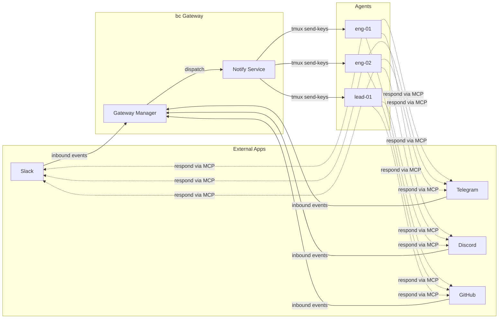

bc doesn't reinvent Slack or Telegram — it bridges them. The gateway routes notifications to the right agents and shows the activity in the web UI.

### Bidirectional Message Flow

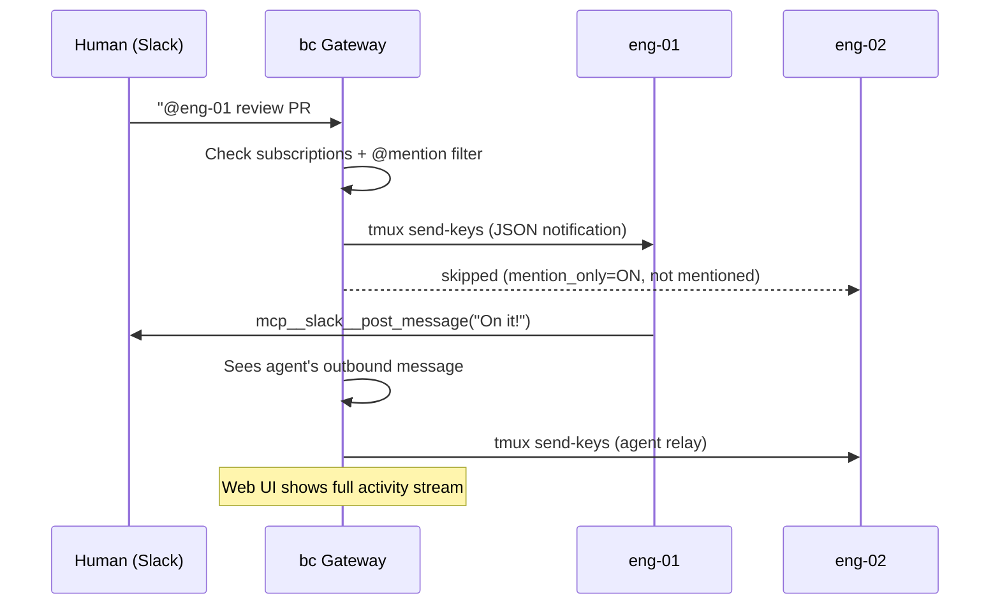

---

## 2. User Experience

### 2.1 Channels Page Layout

```
┌─────────────────┬──────────────────────────────────────────┬──────────────────────┐
│ GATEWAYS        │  slack:engineering                        │ AGENTS               │
│                 │                                          │                      │
│ ▼ Slack     (3) │  10:32  alice                            │ ● eng-01  (engineer) │
│   #engineering ←│  Can someone review PR #428?             │   [■] @mention only  │
│   #all-bc       │                                          │   [Remove]           │
│   #infra        │  10:32  bob                              │                      │
│                 │  @eng-01 take a look                     │ ● eng-02  (engineer) │
│ ▼ Telegram  (1) │  → delivered to eng-01                   │   [ ] all messages   │
│   bc-dev        │                                          │   [Remove]           │
│                 │  10:35  eng-01                            │                      │
│ ▼ Discord   (1) │  Looking now, will review                │ ○ lead-01 (lead)     │
│   #general      │  → relayed to eng-02                     │   [Add]              │
│                 │                                          │                      │
│ ▼ GitHub    (0) │  10:40  alice                            │ ○ root    (manager)  │
│   [Setup →]     │  📎 screenshot.png (240 KB)              │   [Add]              │
│                 │  → delivered to eng-01, eng-02            │                      │
│ + Connect app   │                                          │ ● = online  ○ = off  │
└─────────────────┴──────────────────────────────────────────┴──────────────────────┘
```

| Panel | Content |
|-------|---------|
| **Left sidebar** | Gateway dropdowns with channel lists. Unconnected gateways show **Setup →** link. |
| **Main area** | Chatroom-style activity feed — all messages (human + agent) with delivery status badges. |
| **Right panel** | Agent management — add/remove agents, online dots, @mention-only toggle. |

### 2.2 @Mention Toggle

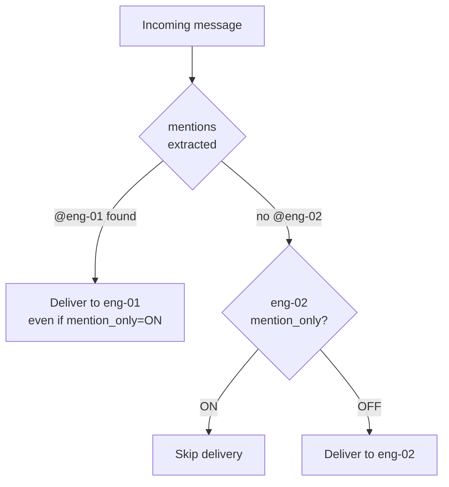

| Setting | Behavior | Use Case |
|---------|----------|----------|
| **OFF** (default) | Agent receives ALL messages in the channel | Small/focused channels |
| **ON** | Agent only receives when `@<agent-name>` in content | Noisy channels like `#all-bc` |

Per-agent, per-channel. Example: `eng-01` has @mention ON for `slack:all-bc` but OFF for `slack:engineering`.

### 2.3 Agent Management (per channel)

| Action | Description |
|--------|-------------|
| **Add** | Subscribe agent → starts receiving notifications |
| **Remove** | Unsubscribe → stops receiving |
| **Stop** | Stop the agent's tmux session (runaway agent) |
| **@mention toggle** | Switch between all-messages and mention-only |

### 2.4 Gateway Management

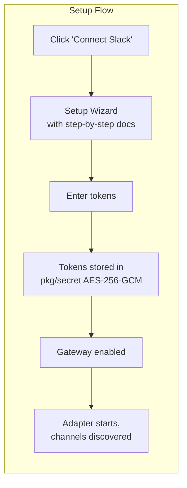

| Action | Description |
|--------|-------------|
| **Connect** | Setup wizard with platform-specific docs (see below) |
| **Update** | Rotate tokens, change settings |
| **Disconnect** | Disable adapter, remove tokens from secret store |
| **Health** | Live probe showing connection status + last activity |

**Platform setup steps:**

| Platform | Steps |
|----------|-------|
| **Slack** | Create app → Enable Socket Mode → Add scopes (`channels:read`, `chat:write`, `connections:write`) → Copy bot + app tokens → Invite bot to channels |
| **Telegram** | Message @BotFather `/newbot` → Copy token → Add bot to groups → Disable privacy mode (optional) |
| **Discord** | Create app at developer portal → Enable `MESSAGE_CONTENT` intent → Copy bot token → Generate invite URL → Add bot to server |
| **GitHub** | Create GitHub App or webhook → Configure events (PR comments, reviews, issues) → Copy token/secret |

### 2.5 What Agents Receive

```json
{
  "timestamp": "2026-04-09T10:32:15Z",
  "channel": "slack:engineering",
  "platform": "slack",
  "sender": "bob",
  "content": "@eng-01 take a look at PR #428",
  "message_id": "1712657535.000200",
  "mentions": ["eng-01"],
  "attachments": []
}
```

### 2.6 File & Image Handling

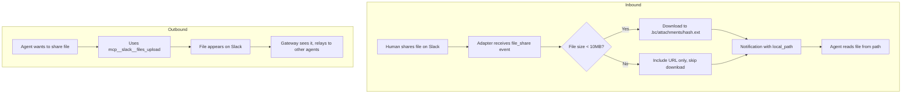

File notification payload:

```json
{
  "channel": "slack:engineering",
  "sender": "alice",
  "content": "[shared a file]",
  "attachments": [{
    "filename": "screenshot.png",
    "mime_type": "image/png",
    "size": 245760,
    "url": "https://files.slack.com/...",
    "local_path": ".bc/attachments/a1b2c3d4.png"
  }]
}
```

> For Docker agents: `.bc/attachments/` is mounted as a shared volume.

### 2.7 Empty State

When no gateways are connected:

```
┌──────────────────────────────────────────────┐
│                                              │
│        Connect your first app                │
│                                              │
│   ┌────────┐  ┌──────────┐  ┌─────────┐    │
│   │ Slack  │  │ Telegram │  │ Discord │    │
│   └────────┘  └──────────┘  └─────────┘    │
│   ┌────────┐  ┌──────────┐                  │
│   │ GitHub │  │  Gmail   │                  │
│   └────────┘  └──────────┘                  │
│                                              │
│   Click to connect and start receiving       │
│   notifications in your agents.              │
└──────────────────────────────────────────────┘
```

---

## 3. Architecture

### 3.1 System Overview

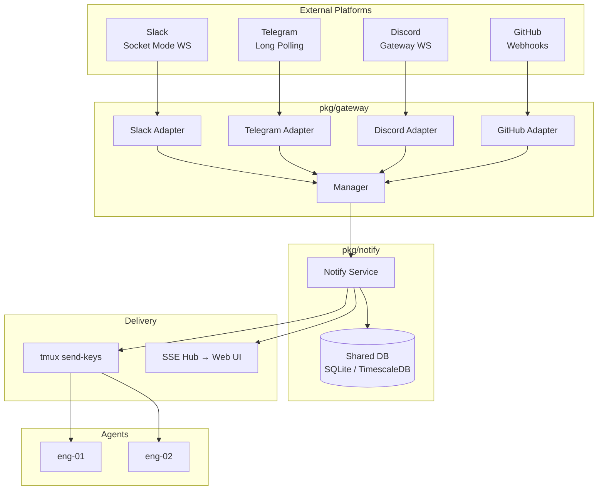

### 3.2 Adapter Interface

```go
type Adapter interface {
    Name() string                                          // "slack"
    Start(ctx context.Context, handler EventHandler) error // blocks until ctx done
    Stop(ctx context.Context) error
    Channels(ctx context.Context) ([]ExternalChannel, error)
    Health(ctx context.Context) error                      // MUST be live API call
    Status() AdapterStatus                                 // connection state for UI
}

type EventHandler interface {
    OnMessage(msg InboundMessage)
    OnFile(msg InboundMessage, att Attachment)
}

type AdapterStatus struct {
    Connected     bool
    LastMessageAt time.Time
    Error         string
}
```

**Current adapter comparison:**

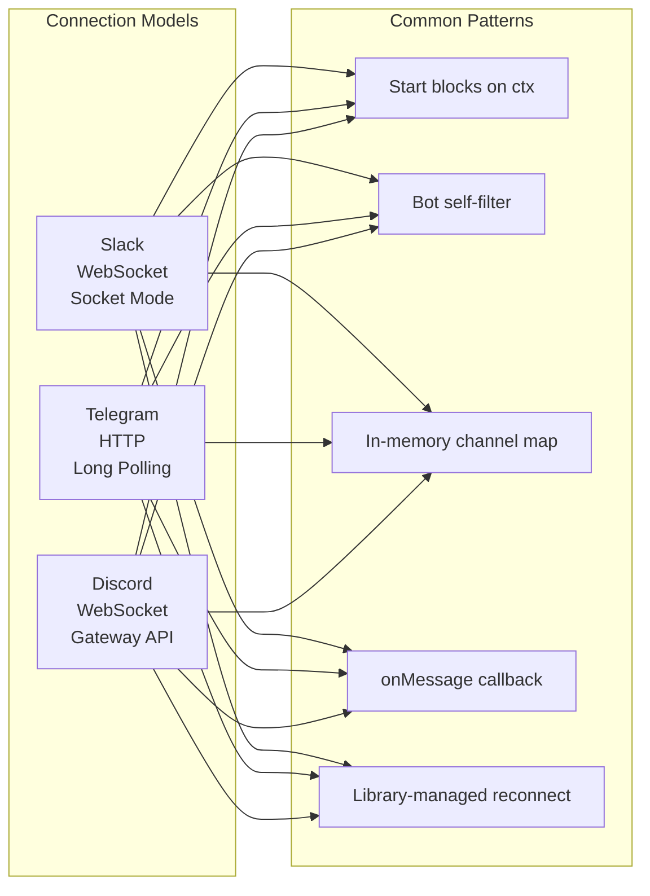

| Capability | Slack | Telegram | Discord | New Contract |
|-----------|-------|----------|---------|-------------|
| Tokens | 2 (bot+app) | 1 (bot) | 1 (bot) | Via `pkg/secret` |
| Discovery | API call at start | Lazy (first msg) | READY event | `Channels()` |
| Health | nil-check | nil-check | nil-check | **Live API probe** |
| Status | N/A | N/A | N/A | **`Status()` added** |
| Files | FileSender | No | No | **`OnFile()` handler** |
| Timestamp | Not set | Set | Set | **Required** |

### 3.3 Adding a New Gateway

```go
type GitHubAdapter struct { /* ... */ }

func (a *GitHubAdapter) Name() string { return "github" }
func (a *GitHubAdapter) Start(ctx context.Context, h gateway.EventHandler) error {
    // Listen for webhooks or poll GitHub API
    // Call h.OnMessage() for PR comments, review requests, etc.
}
```

Each adapter owns its own: connection mode, reconnection, rate limiting, user resolution, bot self-filtering.

---

## 4. Storage

### 4.1 Shared DB Pattern

All stores use the `db.SharedWrapped()` singleton — no separate files:

```go
func OpenStore(workspacePath string) (*Store, error) {
    driver := db.SharedDriver()  // "sqlite" or "timescale"
    if driver == "timescale" {
        pg := NewPostgresStore(db.Shared())
        _ = pg.InitSchema()
        return &Store{pg: pg}, nil
    }
    return &Store{db: db.SharedWrapped()}, nil
}

func (s *Store) Close() error { return nil } // no-op: shared DB
```

### 4.2 Schema

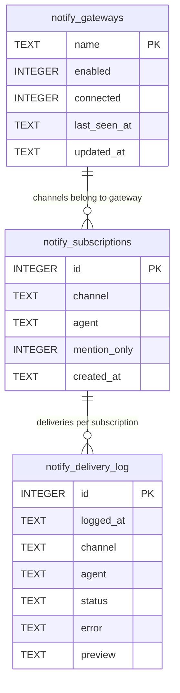

```sql
CREATE TABLE IF NOT EXISTS notify_subscriptions (
    id           INTEGER PRIMARY KEY AUTOINCREMENT,
    channel      TEXT NOT NULL,          -- "slack:engineering"
    agent        TEXT NOT NULL,
    mention_only INTEGER NOT NULL DEFAULT 0,
    created_at   TEXT NOT NULL DEFAULT (strftime('%Y-%m-%dT%H:%M:%SZ', 'now')),
    UNIQUE(channel, agent)
);

CREATE TABLE IF NOT EXISTS notify_delivery_log (
    id        INTEGER PRIMARY KEY AUTOINCREMENT,
    logged_at TEXT NOT NULL DEFAULT (strftime('%Y-%m-%dT%H:%M:%SZ', 'now')),
    channel   TEXT NOT NULL,
    agent     TEXT NOT NULL,
    status    TEXT NOT NULL CHECK(status IN ('delivered', 'failed', 'pending')),
    error     TEXT,
    preview   TEXT  -- first 120 chars, for debugging
);

CREATE TABLE IF NOT EXISTS notify_gateways (
    name         TEXT PRIMARY KEY,
    enabled      INTEGER NOT NULL DEFAULT 0,
    connected    INTEGER NOT NULL DEFAULT 0,
    last_seen_at TEXT,
    updated_at   TEXT NOT NULL DEFAULT (strftime('%Y-%m-%dT%H:%M:%SZ', 'now'))
);
```

> Tables prefixed `notify_` to avoid collision during migration. Delivery log pruned to last 1000 entries per channel.

### 4.3 What's NOT Stored

| Not Stored | Why |
|-----------|-----|
| Message content | Platforms keep their own history |
| Reactions | Agents react via MCP |
| FTS indexes | No search needed |
| File content | Stored in `.bc/attachments/`, not DB |

---

## 5. Token & Secret Management

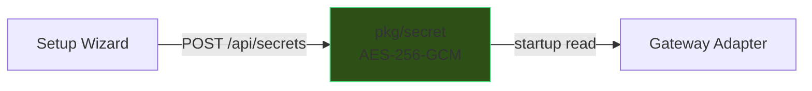

| Gateway | Secrets |
|---------|---------|
| Slack | `GATEWAY_SLACK_BOT_TOKEN`, `GATEWAY_SLACK_APP_TOKEN` |
| Telegram | `GATEWAY_TELEGRAM_BOT_TOKEN` |
| Discord | `GATEWAY_DISCORD_BOT_TOKEN` |
| GitHub | `GATEWAY_GITHUB_TOKEN` |

**No settings.json. No plaintext tokens. No manual file editing.**

---

## 6. REST API

```
# Gateway management
GET    /api/gateways                                             — list + status
POST   /api/gateways                                             — connect
PATCH  /api/gateways/{gateway}                                   — update tokens/settings
DELETE /api/gateways/{gateway}                                   — disconnect
GET    /api/gateways/{gateway}/health                            — live probe
GET    /api/gateways/{gateway}/setup                             — setup instructions

# Channels
GET    /api/gateways/{gateway}/channels                          — discovered channels
GET    /api/gateways/{gateway}/channels/{channel}                — detail + agents

# Agent management
POST   /api/gateways/{gateway}/channels/{channel}/agents         — add agent
DELETE /api/gateways/{gateway}/channels/{channel}/agents/{agent}  — remove agent
PATCH  /api/gateways/{gateway}/channels/{channel}/agents/{agent}  — toggle mention_only

# Activity
GET    /api/gateways/{gateway}/channels/{channel}/activity       — delivery log
```

**Frontend routes mirror API:** `/channels/slack/engineering` → `/api/gateways/slack/channels/engineering`

---

## 7. Web UI Components

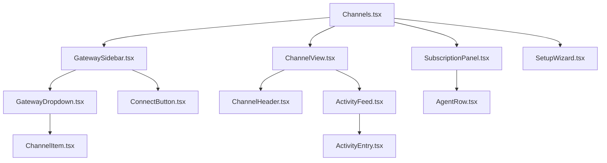

| Component | Responsibility |
|-----------|---------------|
| `GatewaySidebar` | Collapsible gateway sections with channel lists |
| `ActivityFeed` | Chatroom-style messages, polls 5s + live WebSocket |
| `SubscriptionPanel` | Agent list with online dots, role badges, @mention toggle |
| `SetupWizard` | Platform-specific token input + step-by-step docs |

**WebSocket events** (via existing SSE hub):

| Event | Trigger |
|-------|---------|
| `gateway.message` | New message → append to activity feed |
| `gateway.delivery` | Delivery status update |
| `gateway.connected` | Gateway connected |
| `gateway.disconnected` | Gateway lost connection |

---

## 8. CLI

```
bc channel list         — all channels across gateways with subscriber counts
bc channel subscribe    — subscribe agent to channel  
bc channel unsubscribe  — unsubscribe agent
bc channel status       — gateway connection status + health
```

> Down from 14 commands. Everything else (gateway setup, @mention toggle) is done through the web UI.

---

## 9. Dispatch Flow

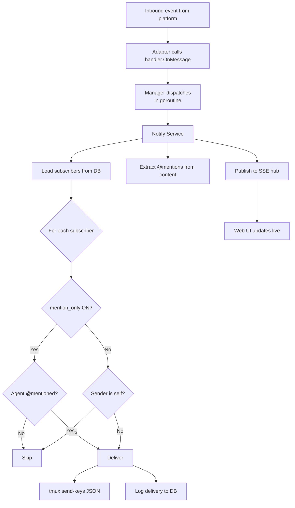

---

## 10. Build Sequence

```mermaid
gantt
    title Implementation Phases
    dateFormat X
    axisFormat %s
    
    section Backend
    pkg/notify (types, store, service)     :p1, 0, 2
    pkg/gateway (interface, adapters)      :p2, 0, 2
    Server handlers + wiring               :p3, after p1 p2, 3
    Delete pkg/channel + cleanup           :p4, after p3, 2
    
    section CLI
    Rewrite channel.go (14→4)              :p5, after p3, 1
    
    section Frontend
    Gateway sidebar + activity feed        :p6, after p3, 4
    
    section Files
    Attachment handling                    :p7, after p2, 2
    
    section QA
    Integration testing                    :p8, after p4 p5 p6 p7, 1
```

| Phase | Issue | Scope | Size |
|-------|-------|-------|------|
| 1 | [#2948](https://github.com/gh-curious-otter/bc/issues/2948) | `pkg/notify/` — types, store, service, tests | Small |
| 2 | [#2949](https://github.com/gh-curious-otter/bc/issues/2949) | `pkg/gateway/` — EventHandler, Status(), live Health() | Small |
| 3 | [#2950](https://github.com/gh-curious-otter/bc/issues/2950) | Server handlers + notify wiring | Medium |
| 4 | [#2951](https://github.com/gh-curious-otter/bc/issues/2951) | Delete `pkg/channel/` + config cleanup | Medium |
| 5 | [#2952](https://github.com/gh-curious-otter/bc/issues/2952) | CLI rewrite (14→4 commands) | Small |
| 6 | [#2953](https://github.com/gh-curious-otter/bc/issues/2953) | Frontend — sidebar, feed, subscriptions, wizard | Large |
| 7 | [#2954](https://github.com/gh-curious-otter/bc/issues/2954) | File/attachment handling | Medium |
| 8 | — | Integration testing | Small |

---

## 11. Impact

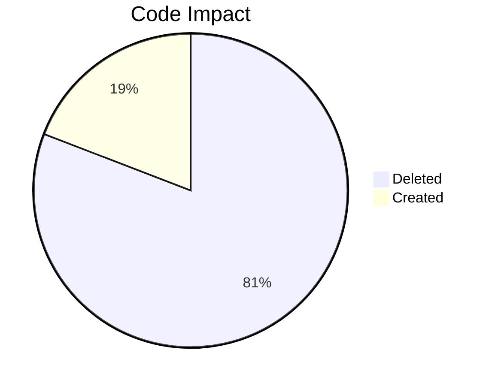

| | Files | Lines |
|---|---|---|
| **Deleted** | ~45 | ~7,600 |
| **Created** | ~15 | ~1,800 |
| **Net reduction** | **~30** | **~5,800** |

---

## 12. Current System Problems

<details>
<summary><strong>26+ documented bugs and issues (click to expand)</strong></summary>

**Architecture:**
- Fundamental mismatch: built as messaging system, used as notification pipe
- Two parallel communication systems (`bc send` vs `bc channel send`) with no guidance
- MCP SSE delivery attempted and abandoned — caused agent hangs
- OnMessage hook too limited (no type/metadata access)

**Bugs:**
- Missing `Close()` on Store — resource leaks
- Silent error swallowing in 7+ locations (`LastInsertId`, `RowsAffected`, `time.Parse`)
- Reaction methods incompatible with SQLite backend
- Duplicate Slack events from Socket Mode redelivery
- Agent identity loss (`?agent=` query param dropped)
- MCP route conflict (`/mcp` prefix intercepted browser requests)
- SQLite `database is closed` under load
- FTS availability flag set inconsistently

**Dead code (~3,500 lines):**
- Message type system (223 lines) — inferred but never displayed
- Approval automation (220 lines) — rarely used
- Query system (199 lines) — never exposed in CLI/TUI
- `Store.Load()`/`Store.Save()` — no-ops
- `MigrateFromJSON()` — completed migration
- `mentions` table — implemented, never called from service layer
- `last_read_msg_id` — in schema, never written

**Config problems (10 documented):**
- Tokens in plaintext in settings.json
- Tokens leaked in chat channels (P0 #2775)
- Gateway config lost on DB migration
- Silent failures on config errors (6+ debugging exchanges)
- TOML vs JSON format confusion
- Field name mismatches (`TELEGRAM_CHANNEL_ID` vs `TELEGRAM_CHAT_ID`)
- Tokens visible in web dashboard SSE events

</details>

---

## 13. Decisions

| # | Question | Decision |
|---|----------|----------|
| 1 | Keep `bc send <agent>`? | **No.** Remove it. All communication goes through channels. |
| 2 | GitHub adapter timing | **Defer.** Create an open issue, implement after core gateway is stable. |
| 3 | TUI channels tab | **Keep in sync.** TUI, CLI, and Web UI all map to the same `/api/` endpoints. No separate logic. |
| 4 | Migration path | **Clean slate.** Drop old `channels`/`messages`/`reactions`/`mentions` tables. No migration script. |
