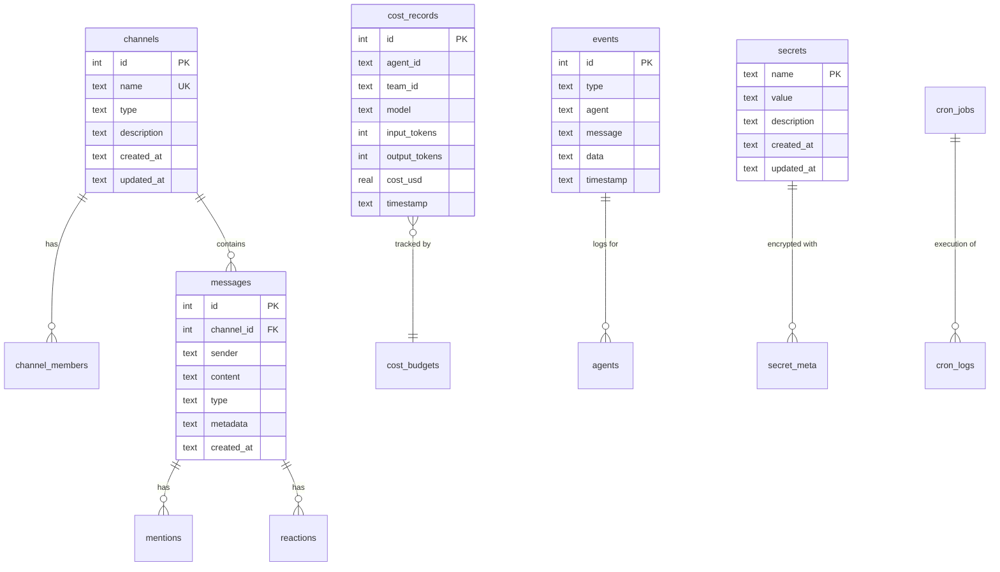
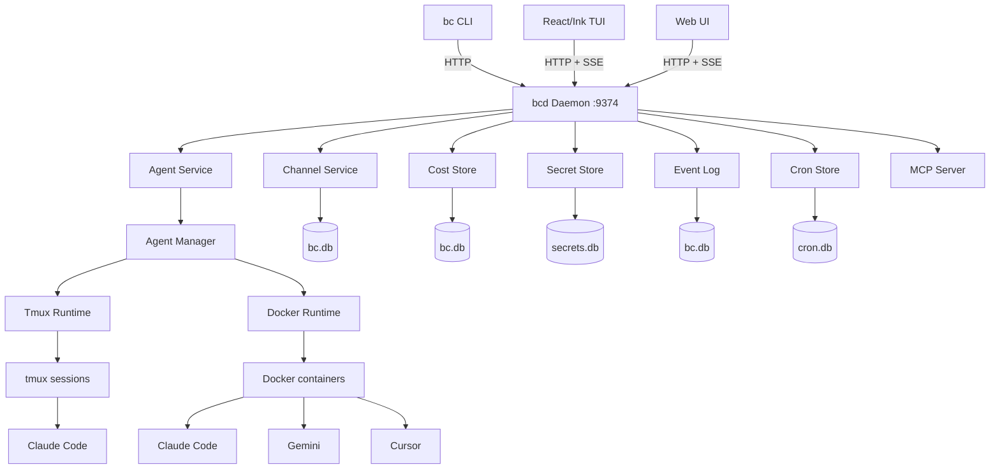

# Backend Engineering Review

**Date:** 2026-03-21 (updated)
**Repo:** gh-curious-otter/bc
**Stack:** Go 1.25.1, SQLite (mattn/go-sqlite3), PostgreSQL (pgx/v5), Cobra CLI, net/http stdlib, SSE, Docker, tmux
**Backend Maturity Score:** 5/10
**Deployment Model:** Local-only (single user, localhost). Auth is explicitly out of scope for now.
**Project Status:** Pre-release — no semver tags yet, all changes in `[Unreleased]` changelog.

## Executive Summary

bc is a Go CLI and daemon for AI agent orchestration, built in ~6 weeks (Feb 7 – Mar 21, 2026), largely by its own AI agents (dogfooding). The project went through two major architecture phases: v1 (CLI directly accessing SQLite/filesystem) and v2 (bcd server-first with HTTP API, web UI, MCP). The v2 pivot happened Mar 16-18 and is partially complete.

The biggest **functional bugs** are in channel message delivery (#2164 — messages from web UI don't reach agents, MCP polling breaks after 100 messages) and agent lifecycle management (#2165 — create/start/stop/delete code is fragmented, delete doesn't clean up Docker containers or worktrees). The HTTP daemon lacks **request body size limits**, **panic recovery**, and **handler-level tests** (0 files in server/handlers/). The data layer went through 3 migrations (JSON → bc.db → bc.db) and still has 5 stores bypassing pkg/db.

19 of 21 backend PRs were merged without review comments. Only #2041 (channel delivery) and #1967 (cron) received feedback. This explains why integration bugs compound.

Since the tool is local-only, API authentication is not a current priority.

## Development History

### Timeline (from 1026 GitHub issues + 21 backend PRs)

| Phase | When | Key PRs | What happened |
|-------|------|---------|---------------|
| v2 kickoff | Feb 7-8 | — | 170 issues filed. Beads + queue designed then deprecated within days — channels replaced both |
| Channels + agents | Feb 8-10 | — | SQLite channel backend, agent lifecycle, memory system |
| Channel crisis | Feb 11-13 | — | Channels completely broken — JSON/SQLite split-brain, messages stored but never delivered |
| Ink TUI | Feb 13-18 | — | 5-phase TUI built. Channel UI rewritten 5 times. 29 separate 80x24 layout bugs |
| Feature expansion | Feb 18-22 | — | 14 TUI views, multi-provider, cost budgets, OSS prep |
| v0.0.1 tracker | Mar 5-6 | #1933, #1934 | 15 EPICs filed. Concurrent agent crash fix. Agent state migrated from JSON to SQLite (bc.db) |
| Agent reliability | Mar 6-9 | #1954, #1956 | Runtime abstraction solidified. 62-file cleanup PR removed 1800 lines. Agent service layer added |
| v2 architecture | Mar 16-18 | #1953, #1974, #1988, #1991 | bcd daemon, MCP server, encrypted secrets, cron, tools, roles — all shipped in 2 days |
| Thin client + DB | Mar 18 | #2010, #2017, #2020, #2022 | CLI migrated to HTTP client (partial — 17 files still direct). 9 DBs consolidated to bc.db |
| Integration fixes | Mar 18-19 | #2039, #2041 | Agent store fixed to use bc.db. Channel delivery partially fixed with OnMessage callback |
| Reviews | Mar 20-21 | — | Backend/frontend/infra reviews. 80+ issues filed. Lint cleanup (115 issues fixed) |

### Database Evolution

```
agents.json ──→ bc.db (#1934) ──→ bc.db (#2017, #2039)
                                      ↑
channels.json ──→ bc.db ────────┘ (partially — channel store still opens own connection)
                                      ↑
bc.db, cron.db, secrets.db, ───────┘ (consolidated in #2017, but 5 stores still bypass pkg/db)
mcp.db, tools.db, daemons.db
```

No migration tool exists for workspaces with old separate DB files.

### Architecture Evolution

```
v1 (Feb 7 – Mar 15):
  User → CLI (Cobra) → pkg/ (direct store access) → SQLite + filesystem + tmux

v2 (Mar 16 – present):
  User → CLI (thin client) → bcd daemon (HTTP API) → stores → SQLite/Postgres
  User → Web UI (React)   → bcd daemon (HTTP + SSE)
  AI   → MCP (stdio/SSE)  → bcd daemon (JSON-RPC 2.0)
```

v2 migration is ~30% complete: bcd serves API, but 17 CLI files still import pkg/ directly (#2023). Postgres backend built but nothing connects to it.

## API Surface Map

| Method | Path | Auth | Validation | Rate Limited | Issues |
|--------|------|------|------------|--------------|--------|
| GET | /health | None | N/A | No | Shallow - no dependency checks |
| GET | /api/events | None | N/A | No | SSE - no auth on event stream |
| GET | /api/agents | None | Minimal | No | No pagination |
| POST | /api/agents | None | Minimal | No | No body size limit, weak validation |
| GET | /api/agents/{name} | None | Name only | No | - |
| POST | /api/agents/{name}/start | None | None | No | Can start any agent |
| POST | /api/agents/{name}/stop | None | None | No | Can stop any agent |
| POST | /api/agents/{name}/send | None | None | No | Can inject commands into agents |
| DELETE | /api/agents/{name} | None | None | No | Can delete any agent |
| POST | /api/agents/{name}/hook | None | Minimal | No | Can manipulate agent state |
| GET | /api/agents/{name}/stats | None | limit param | No | Unbounded if no limit |
| POST | /api/agents/{name}/rename | None | None | No | - |
| GET | /api/agents/{name}/peek | None | lines param | No | Can read agent output |
| GET | /api/agents/{name}/sessions | None | None | No | - |
| POST | /api/agents/generate-name | None | N/A | No | - |
| POST | /api/agents/broadcast | None | None | No | Can broadcast to all agents |
| POST | /api/agents/send-role | None | None | No | - |
| POST | /api/agents/send-pattern | None | None | No | Pattern not sanitized |
| POST | /api/agents/stop-all | None | None | No | Can stop all agents |
| GET | /api/channels | None | None | No | No pagination |
| POST | /api/channels | None | Minimal | No | No body size limit |
| GET | /api/channels/{name} | None | None | No | - |
| PATCH | /api/channels/{name} | None | None | No | - |
| DELETE | /api/channels/{name} | None | None | No | - |
| GET | /api/channels/{name}/history | None | limit/offset | No | limit not capped |
| POST | /api/channels/{name}/messages | None | Minimal | No | No body size limit |
| POST/DELETE | /api/channels/{name}/members | None | Minimal | No | - |
| GET | /api/costs | None | None | No | - |
| GET | /api/costs/agents | None | None | No | No pagination |
| GET | /api/costs/teams | None | None | No | No pagination |
| GET | /api/costs/models | None | None | No | No pagination |
| GET | /api/costs/daily | None | days param | No | days not capped |
| POST | /api/costs/sync | None | None | No | Can trigger import |
| GET | /api/secrets | None | None | No | **Lists all secret metadata** |
| POST | /api/secrets | None | Minimal | No | **Can create secrets** |
| GET | /api/secrets/{name} | None | None | No | - |
| PUT | /api/secrets/{name} | None | Minimal | No | **Can update secrets** |
| DELETE | /api/secrets/{name} | None | None | No | **Can delete secrets** |
| GET | /api/cron | None | None | No | No pagination |
| POST | /api/cron | None | Minimal | No | - |
| GET/DELETE | /api/cron/{name} | None | None | No | - |
| POST | /api/cron/{name}/enable | None | None | No | - |
| POST | /api/cron/{name}/disable | None | None | No | - |
| POST | /api/cron/{name}/run | None | None | No | Can trigger jobs |
| GET | /api/cron/{name}/logs | None | last param | No | last not capped |
| GET | /api/daemons | None | None | No | No pagination |
| POST | /api/daemons | None | Minimal | No | **Can run arbitrary commands** |
| GET | /api/daemons/{name} | None | None | No | - |
| POST | /api/daemons/{name}/stop | None | None | No | - |
| POST | /api/daemons/{name}/restart | None | None | No | - |
| DELETE | /api/daemons/{name} | None | None | No | - |
| GET | /api/tools | None | None | No | No pagination |
| GET/PUT/DELETE | /api/tools/{name} | None | Minimal | No | - |
| POST | /api/tools/{name}/enable | None | None | No | - |
| GET | /api/mcp | None | None | No | - |
| POST | /api/mcp | None | Minimal | No | - |
| GET/DELETE | /api/mcp/{name} | None | None | No | - |
| GET | /api/logs | None | tail param | No | **Unbounded without tail** |
| GET | /api/logs/{agent} | None | None | No | **Unbounded** |
| GET | /api/workspace | None | None | No | Leaks root_dir path |
| GET | /api/roles | None | None | No | - |
| POST | /api/workspace/up | None | None | No | Can start workspace |
| POST | /api/workspace/down | None | None | No | Can stop all agents |
| GET | /api/doctor | None | None | No | - |

## Data Model Overview



## Critical Issues — Functional Bugs

| # | Issue | File/Location | Category | Impact |
|---|-------|--------------|----------|--------|
| 1 | **Channel messages not delivered to agents** | `server/server.go:101`, `server/mcp/tools.go:169` | channels | #2164 — MCP standalone bypasses delivery, poll breaks after 100 msgs, no auto-enrollment |
| 2 | **Agent lifecycle fragmented** | `pkg/agent/agent.go` (1900+ lines) | agent | #2165 — delete doesn't clean up Docker/worktree, create/start overloaded, RefreshState blocks all ops |
| 3 | **SessionID overloaded** | `pkg/agent/agent.go:705` | agent | #2169 — tmux names stored as session IDs cause `--continue` crash on fresh start |
| 4 | **No request body size limits** | All POST/PUT handlers | resilience | DoS via memory exhaustion with large payloads |
| 5 | **Unbounded event log read** | `pkg/events/store_sqlite.go:72` | performance | `Read()` returns ALL events, no LIMIT |
| 6 | **No panic recovery middleware** | `server/server.go` | resilience | Unhandled panic crashes entire daemon |

## Security Notes (localhost-only context)

The following were initially flagged as critical but are **acceptable for the local-only deployment model**:
- No API authentication — bcd binds to 127.0.0.1, intended for single-user local use
- CORS `*` — safe on loopback for the current use case
- RBAC unenforced at API layer — will matter if/when multi-user or remote access is added
- `--dangerously-skip-permissions` in default config — by design for agent orchestration

## Major Issues (quality & scalability)

| # | Issue | File/Location | Category | Impact |
|---|-------|--------------|----------|--------|
| 9 | **No handler tests** (0 files in server/handlers/) | `server/handlers/` | testing | All API routes untested |
| 10 | **Multiple separate SQLite databases** with duplicated setup | `pkg/channel/sqlite.go:76`, `pkg/cost/cost.go:137` | data-layer | 5+ separate DB files, duplicated pragma config |
| 11 | **No pagination on list endpoints** | All list handlers | api | Will break with 1000+ agents/channels/records |
| 12 | **No rate limiting on any endpoint** | `server/server.go` | api | DoS vector |
| 13 | **Health check is shallow** — doesn't check dependencies | `server/server.go:82` | infra | Returns "ok" even if DB/Docker/tmux are down |
| 14 | **No request ID middleware** | `server/server.go` | observability | Can't correlate requests to logs |
| 15 | **No panic recovery middleware** | `server/server.go` | error-handling | Unhandled panic crashes entire daemon |
| 16 | **Agent `send` endpoint injects raw text into tmux** | `pkg/agent/agent.go` | security | Could inject shell commands via tmux send-keys |
| 17 | **ToggleReaction is not atomic** (check-then-act race) | `pkg/channel/sqlite.go:825` | data-layer | Concurrent toggles can double-add |
| 18 | **Channel history limit not capped** | `server/handlers/channels.go:124` | performance | `?limit=999999999` returns entire history |
| 19 | **Docker network=host by default** | `settings.toml:113` | security | Containers share host network stack |

## Minor Issues & Improvements

| # | Issue | File/Location | Category | Impact |
|---|-------|--------------|----------|--------|
| 20 | `contains()` reimplements `strings.Contains` | `server/handlers/workspace.go:123` | dx | Unnecessary custom code |
| 21 | `trimPrefix()` reimplements `strings.TrimPrefix` | `server/handlers/events.go:75` | dx | Unnecessary custom code |
| 22 | No structured logging with request context | `pkg/log/log.go` | observability | Hard to trace requests |
| 23 | Cost `days` parameter not capped | `server/handlers/costs.go:88` | performance | `?days=99999` scans full table |
| 24 | Agent stats `limit` not capped | `server/handlers/agents.go:202` | performance | `?limit=999999` unbounded |
| 25 | Missing `Content-Type` validation on POST requests | All POST handlers | api | Accepts any content type |
| 26 | No response compression (gzip) | `server/server.go` | performance | Large JSON responses uncompressed |
| 27 | FTS trigger errors silently ignored | `pkg/channel/sqlite.go:203` | data-layer | FTS can silently fall out of sync |
| 28 | SSE hub drops events for slow clients silently | `server/ws/hub.go:131` | error-handling | No backpressure notification |
| 29 | Workspace status leaks `root_dir` absolute path | `server/handlers/workspace.go:49` | security | Information disclosure |
| 30 | `up` handler silently ignores body decode errors | `server/handlers/workspace.go:84` | error-handling | Malformed JSON accepted |

## What's Done Well

1. **Clean package architecture** — cmd imports pkg, never vice versa. Clear separation between CLI, daemon, and reusable packages.
2. **Comprehensive pkg-level test suite** — 90+ test files covering agent, channel, cost, cron, events, workspace, etc. Includes benchmarks.
3. **Proper SQLite configuration** — WAL mode, busy timeouts, single-writer connection pools, foreign keys enabled.
4. **Good error wrapping** — Consistent use of `fmt.Errorf("context: %w", err)` throughout.
5. **Graceful shutdown** — Signal handling with 10s timeout, deferred resource cleanup in bcd main.
6. **Secret encryption** — AES-256-GCM with PBKDF2-SHA256 (600k iterations per OWASP 2023), proper salt/nonce generation.
7. **Agent name validation** — `IsValidAgentName()` prevents path traversal via agent names.
8. **Idempotent schema creation** — All `CREATE TABLE IF NOT EXISTS` patterns.
9. **SSE implementation** — Clean hub pattern with subscriber management and buffer overflow handling.
10. **Transaction usage** — Channel deletion properly wraps multi-table cleanup in a transaction.

## Architecture Diagram



## Scalability Assessment

**Current bottleneck: SQLite single-writer model**

- **10x scale (50 agents):** Likely fine. SQLite WAL handles concurrent reads well. The 30s busy timeout prevents lock contention failures.
- **100x scale (500 agents):** Will break. Multiple SQLite databases mean multiple lock contention points. The `RefreshState()` call on every GET /api/agents lists all agents and reconciles with tmux/Docker — O(n) subprocess calls. No caching layer.
- **1000x scale:** Need PostgreSQL (already supported in code), proper connection pooling, caching layer, and async state reconciliation.

**Fix first:**
1. Consolidate SQLite databases into single bc.db (partially done for channels)
2. Add caching for agent state (currently polls tmux/Docker on every request)
3. Add pagination to all list endpoints
4. Cap query parameters (limit, days, lines)

## PR Review Patterns

19 of 21 backend PRs merged without review comments. Key observations:

- **Only 2 PRs received feedback:** #2041 (channel delivery — rpuneet caught silently swallowed error) and #1967 (cron — author self-fixed 4 issues including a deadlock)
- **Large PRs merged unreviewed:** #1956 (62 files, -4261 lines), #1991 (bcd server + web UI + Docker), #2017 (25 files, DB consolidation)
- **Regressions introduced silently:**
  - #2017 consolidated DBs but left no migration for existing workspaces
  - #2022 changed default port from 4880 to 9374
  - #2010 made CLI commands dependent on bcd running (was previously standalone)
  - #1934 introduced `bc.db` name immediately replaced by `bc.db` in #2017
- **Incomplete migrations shipped:** #2010/#2020 migrated some CLI commands to thin client but left 17 files using direct pkg/ access (#2023)

## Known Documentation Issues

Several docs are stale (from the Mar 1 / Mar 18 batches):
- `QUICKSTART.md`, `TROUBLESHOOTING.md` — Go version listed as 1.22+ (should be 1.25.1+)
- `index.md`, `README.md`, `COMMANDS.md` — reference missing `PLUGINS.md` and `MCP.md`
- `COMMANDS.md` — `bc queue`/`bc issue` commands tied to deprecated `bd`/beads system
- `TROUBLESHOOTING.md` — references commands not in `COMMANDS.md` (`bc config reset`, `bc memory rebuild-index`)
- `CHANGELOG.md` — all changes in `[Unreleased]`, no versioned releases
- `AGENTS.md` — references `bd` (beads) which is deprecated

## Action Plan

### Phase 1: Fix Functional Bugs (immediate)
- Fix channel message delivery end-to-end (#2164)
- Fix agent delete cleanup — Docker containers, worktrees, branches (#2038, #2165)
- Fix SessionID overload with proper UUID check (#2169 — in review)
- Add request body size limits (http.MaxBytesReader)
- Add panic recovery middleware

### Phase 2: Complete v2 Migration (week 1)
- Finish CLI thin client migration — 17 files still use direct pkg/ (#2023)
- Finish DB consolidation — 5 stores still bypass pkg/db (#2026)
- Remove duplicate server package — server/ vs pkg/server/ (#2029)
- Remove legacy JSON file storage code (#2031)
- Add DB migration tool for existing workspaces

### Phase 3: Error Handling & Resilience (week 2)
- Add request ID middleware
- Make health check verify downstream dependencies
- Cap all query parameters (limit, days, lines)
- Fix ToggleReaction atomicity
- Replace context.TODO() with proper context propagation (#2105)

### Phase 4: Performance (week 3)
- Add pagination to all list endpoints
- Fix Manager lock held during slow Docker/tmux I/O (#2106)
- Fix PipePane unbounded memory growth (#2107)
- Cap unbounded queries (events Read, history limit)

### Phase 5: Testing & Release (week 4)
- Add handler integration tests (0 files in server/handlers/)
- Add security scanning to CI (govulncheck)
- Fix stale docs (Go version, missing pages, deprecated commands)
- Cut v0.1.0 release with proper semver
